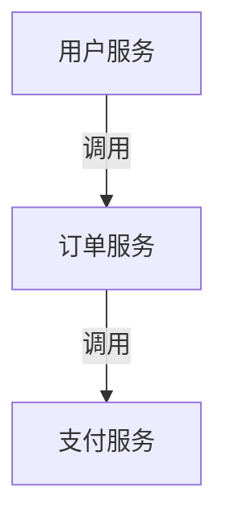

# SkyWalking 告警策略设计

## 介绍
SkyWalking是一个开源的APM（应用性能监控）系统，其告警功能可以帮助开发者及时发现系统异常。告警策略设计是SkyWalking的核心功能之一，通过定义规则和触发条件，可以在指标异常时通知相关人员。本章将介绍如何设计高效的告警策略。

## 告警核心概念
SkyWalking告警包含以下关键组件：
1. **规则（Rules）**：定义触发告警的条件。
2. **钩子（Hooks）**：告警触发后的通知方式（如Webhook、邮件等）。
3. **指标（Metrics）**：监控的指标数据（如响应时间、错误率等）。

## 告警规则配置
告警规则通过YAML文件配置，以下是一个典型示例：

```yaml
rules:
  - name: service_resp_time_rule
    expression: avg(service_resp_time) > 1000
    period: 10
    silence-period: 5
    message: 服务 {name} 平均响应时间超过1秒
    tags:
      severity: CRITICAL
```

:::note 参数说明
- `expression`: 告警触发表达式（支持PromQL语法）
- `period`: 评估周期（分钟）
- `silence-period`: 静默期（分钟）
:::

## 实际案例：电商系统告警设计
假设我们需要监控一个电商系统的以下场景：



### 关键告警规则
1. **服务响应时间异常**：
   ```yaml
   - name: high_response_time
     expression: service_resp_time > 3000 and service_resp_time < 10000
     message: 服务 {name} 响应时间超过3秒
   ```

2. **错误率飙升**：
   ```yaml
   - name: high_error_rate
     expression: service_error_rate / service_call_total > 0.05
     message: 服务 {name} 错误率超过5%
   ```

## 通知渠道配置
通过`webhooks.yml`配置通知：

```yaml
webhooks:
  - name: slack_webhook
    uri: https://hooks.slack.com/services/xxx
    text-template: |
      {
        "text": "SkyWalking告警: {{.message}}"
      }
```

:::tip 最佳实践
- 为不同严重级别配置不同通知渠道
- 生产环境建议设置分级告警（如P0/P1/P2）
:::

## 测试与验证
使用SkyWalking提供的`alarm-settings.yml`测试工具：

```bash
# 验证配置文件语法
swctl alarm verify --file alarm-settings.yml
```

## 总结
有效的告警策略应包含：
1. 明确的指标阈值
2. 合理的静默期设置
3. 分级通知机制
4. 定期规则评审

## 扩展练习
1. 为你的项目设计一个CPU使用率告警规则
2. 配置一个邮件通知渠道
3. 测试规则是否能在模拟负载下正确触发

## 附加资源
- [SkyWalking官方告警文档](https://skywalking.apache.org/docs/)
- [PromQL查询语法参考](https://prometheus.io/docs/prometheus/latest/querying/basics/)