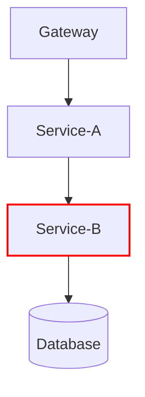

## 引言

SkyWalking作为分布式系统的APM（应用性能监控）工具，其排障能力是核心价值之一。本指南将系统讲解如何利用SkyWalking快速定位和解决微服务环境中的各类问题，适合刚接触SkyWalking的开发者。

## 基础排查流程

### 1. 确认监控覆盖范围
首先检查SkyWalking Agent是否已正确部署到所有目标服务：
```bash
# 检查Agent日志（示例）
tail -f /path/to/agent/logs/skywalking-api.log
```
正常情况应输出类似内容：
```
DEBUG 2023-05-01 12:00:00 SkyWalkingAgent Agent started, agent_version: 9.4.0
```

### 2. 拓扑图分析
通过拓扑图识别异常节点：



:::note
红色节点表示高延迟或错误率，应优先排查
:::

## 核心排查手段

### 追踪(Trace)分析
典型异常追踪特征：
- 长跨度(>500ms)的本地方法
- 大量重复错误日志的跨度

示例追踪片段：
```
[Service-C] 处理订单 (1200ms)
├── [DB] 查询订单 (1100ms) ← 异常点
└── [Cache] 获取用户信息 (5ms)
```

### 指标(Metrics)诊断
关键指标对照表：

| 指标类型       | 正常范围      | 异常表现        |
|----------------|---------------|-----------------|
| 请求成功率     | `>99%`          | `<95%`            |
| JVM堆内存      | `<70%利用率`    | `持续>80%`        |
| 平均响应时间   | `<200ms`        | `突增>500ms`      |

## 实战案例

### 案例1：数据库连接泄漏
**现象**：服务响应时间逐渐变长，最终超时

**排查步骤**：
1. 在SkyWalking中观察到数据库调用耗时增长曲线
2. 检查对应服务的JVM线程数：
```java
// 通过SkyWalking的JVM监控发现
Thread.count: 250 (正常应<100)
```
3. 最终定位到未关闭的JDBC连接

### 案例2：缓存雪崩
**现象**：整点时段接口大量超时

**SkyWalking证据链**：
1. 拓扑图显示多个服务同时变红
2. 追踪显示大量请求卡在缓存获取阶段
3. 指标面板显示Redis连接数暴增

## 高级技巧

### 日志关联分析
配置日志框架与TraceID集成：
```properties
# logback-spring.xml示例
<pattern>%d %-5level [%X{tid}] %logger{36} - %msg%n</pattern>
```

### 报警规则配置
示例阈值报警规则：
```yaml
rules:
  service_resp_time_rule:
    metrics-name: service_resp_time
    op: ">"
    threshold: 1000
    period: 10
    count: 3
```

## 总结与练习

### 关键要点
1. 遵循"拓扑图→追踪→指标"的排查顺序
2. 关注黄金指标：错误率、响应时间、吞吐量
3. 善用对比功能（时间对比、版本对比）

### 练习建议
1. 在测试环境故意制造线程泄漏，观察SkyWalking监控变化
2. 尝试配置一个当HTTP 500错误率>5%时触发的报警规则

## 扩展阅读
- SkyWalking官方文档：Troubleshooting Guide
- 《分布式系统观测实战》第5章
