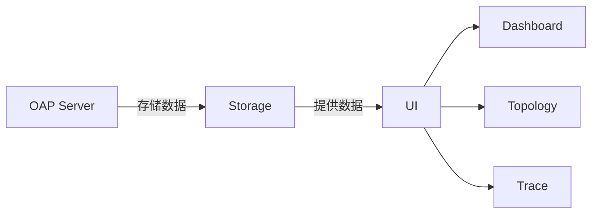
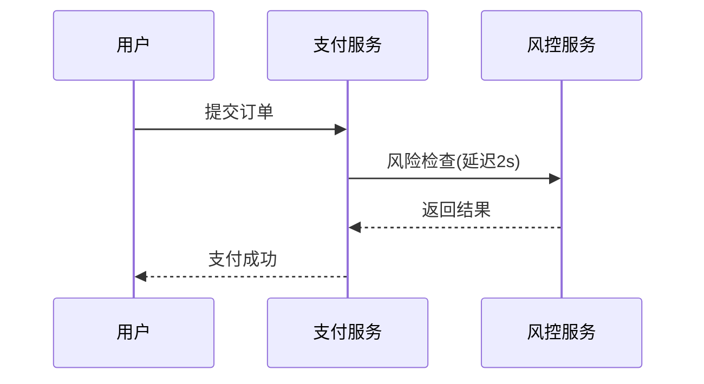

## 引言

SkyWalking作为一款分布式系统的应用性能监控（APM）工具，其数据可视化功能能帮助开发者直观理解系统运行状态。本章将介绍如何配置和优化SkyWalking的可视化界面，并通过实际案例展示关键指标的分析方法。

---

## 基础概念

### 1. SkyWalking数据组成
SkyWalking采集的数据主要包括：
- **Traces**：分布式请求链路追踪
- **Metrics**：系统/服务性能指标（如CPU、响应时间）
- **Topology**：服务间依赖关系图

### 2. 可视化核心组件


---

## 仪表盘配置实践

### 1. 默认仪表盘解析
SkyWalking UI默认提供以下视图：
- **Global Heatmap**：全局响应时间热力图
- **Service Apdex**：服务满意度评分
- **Endpoint Response Time**：API端点性能

### 2. 自定义仪表盘示例
通过修改`configuration/ui.yml`添加自定义指标：
```yaml
dashboard:
  templates:
    - name: "My Custom View"
      metrics: 
        - name: "service_resp_time"
          label: "Service Response(ms)"
          unit: "ms"
```

:::tip
使用变量`${service}`可以创建动态过滤的仪表盘
:::

---

## 关键指标解读

### 1. 黄金指标
| 指标名称          | 健康阈值       | 说明                  |
|-------------------|----------------|----------------------|
| 请求成功率        | `>99%`           | 5xx错误率应低于1%     |
| 平均响应时间      | `<500ms`         | 根据业务场景调整      |
| 请求吞吐量        | -              | 突降可能预示故障      |

### 2. 慢查询分析
在Trace页面使用过滤条件：
```sql
endpoint:/api/orders and latency>1000
```
将显示所有耗时超过1秒的订单API请求。

---

## 实际案例

### 电商系统监控场景
1. **问题现象**：支付接口成功率骤降
2. **排查步骤：
   - 在Topology页面发现支付服务到风控服务的延迟增加
   - 检查关联的数据库指标，发现锁等待时间上升
   - 最终定位到未优化的SQL查询



---

## 高级技巧

### 1. 对比分析
使用`Time Range Compare`功能对比不同时段数据：
1. 选择当前时间范围
2. 点击"Compare"选择历史同期数据
3. 分析指标变化趋势

### 2. 告警集成
配置`alarm-settings.yml`实现可视化告警：
```yaml
rules:
  service_resp_time_rule:
    metrics-name: service_resp_time
    threshold: 1000
    op: ">"
```

:::warning
生产环境建议设置渐进式告警（如持续5分钟超阈值再触发）
:::

---

## 总结与练习

### 核心要点
- 掌握默认仪表盘的快速导航方法
- 理解RED（Request-Error-Duration）指标体系
- 学会通过拓扑图定位性能瓶颈

### 推荐练习
1. 创建一个包含DB查询时间的自定义仪表盘
2. 分析某服务过去24小时的错误率变化
3. 配置当JVM内存使用率>80%时触发的告警

### 扩展阅读
- SkyWalking官方文档：Dashboard模块
- 《Observability Engineering》第5章