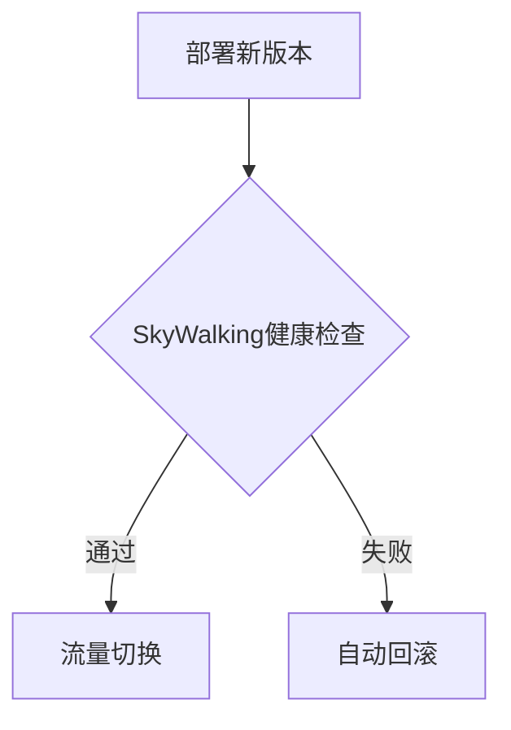

## 介绍

SkyWalking作为一款分布式系统的应用性能监控（APM）工具，与DevOps理念的结合可以显著提升软件交付和运维效率。本章将介绍如何将SkyWalking集成到DevOps流程中，包括CI/CD流水线、告警自动化、以及与常见DevOps工具的协作。

:::tip 关键概念
DevOps强调开发（Dev）和运维（Ops）的协作，而SkyWalking提供的实时监控和数据可视化能力，正是这种协作的重要支撑。
:::

---

## 基础集成步骤

### 1. 在CI/CD中嵌入SkyWalking Agent
在构建阶段自动注入SkyWalking Agent，使应用在部署后立即具备监控能力。

**示例（Jenkins Pipeline）**:
```groovy
pipeline {
    agent any
    stages {
        stage('Build') {
            steps {
                sh 'mvn clean package -Dskywalking.agent.service_name=my_app'
            }
        }
    }
}
```

### 2. 与基础设施即代码（IaC）工具集成
通过Terraform或Ansible自动部署SkyWalking后端。

**Terraform示例**:
```hcl
resource "docker_container" "skywalking_oap" {
  name  = "skywalking-oap"
  image = "apache/skywalking-oap-server:9.4.0"
  ports = ["11800:11800", "12800:12800"]
}
```

---

## 进阶实践

### 监控驱动部署（Monitoring-Driven Deployment）
利用SkyWalking的指标数据作为金丝雀发布的决策依据：



### 告警自动化
配置SkyWalking告警规则并联动DevOps工具：

1. **告警规则配置**（`alarm-settings.yml`）:
```yaml
rules:
  - name: high_error_rate
    expression: endpoint_cpm > 100 && endpoint_success_rate < 80%
    actions:
      - type: webhook
        target: http://devops-tool/alert
```

2. **与Slack集成**:
```python
# 示例Webhook处理器
@app.route('/alert', methods=['POST'])
def handle_alert():
    alert_data = request.json
    slack.post_message(channel="#alerts", text=str(alert_data))
```

---

## 真实案例：电商平台实践

**场景**：某电商在黑色星期五期间：
1. 通过SkyWalking实时发现支付服务延迟上升
2. 自动触发扩容流程（Kubernetes HPA）
3. 同时通知开发团队通过Argo Rollouts回滚有问题的版本

**结果**：故障响应时间从30分钟缩短至2分钟，零人工干预。

---

## 总结与资源

### 核心价值
- 实现从"监控发现问题"到"自动修复"的闭环
- 将运维数据反哺开发流程，形成正向循环

### 延伸学习
1. [SkyWalking官方文档 - 告警配置](https://skywalking.apache.org/docs/)
2. 实验：尝试在本地Minikube环境中搭建SkyWalking+Prometheus+Alertmanager的完整监控链
3. 思考题：如何设计一个基于SkyWalking数据的自动扩缩容策略？

:::caution 注意事项
- 生产环境建议逐步验证自动化策略
- 警惕告警风暴，建议设置合理的静默期
:::