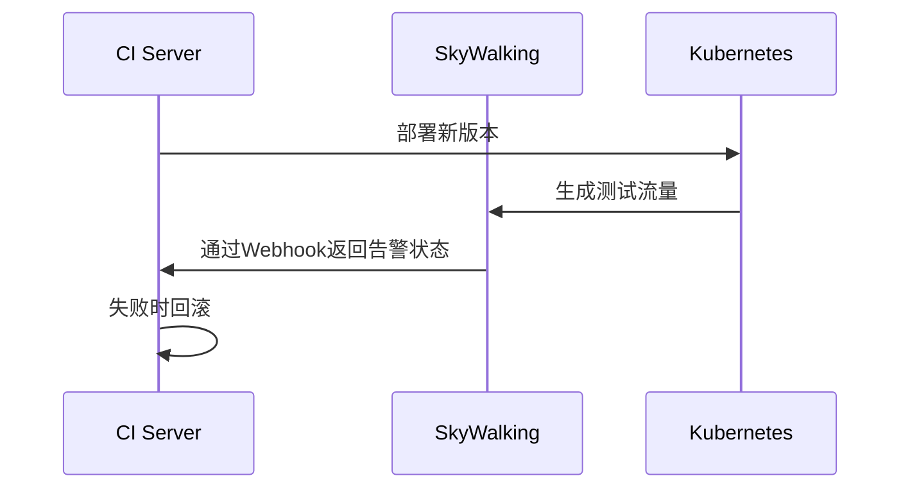

## 介绍

在现代软件开发中，持续集成和持续交付（CI/CD）已成为快速交付高质量软件的核心实践。将SkyWalking集成到CI/CD流程中，可以在部署前或部署后自动验证服务的性能指标、追踪链路和告警规则，确保新版本不会引入性能退化或错误。本指南将逐步介绍如何实现这一集成。

## 为什么需要集成？

1. **早期发现问题**：在CI阶段捕获性能瓶颈或错误。
2. **自动化验证**：通过预设的SLA（如响应时间阈值）自动拦截不合格版本。
3. **可视化反馈**：将监控数据直接反馈到CI/CD工具（如Jenkins、GitLab CI）。

---

## 集成方案

### 方案1：通过SkyWalking CLI工具
SkyWalking提供了命令行工具（`swctl`），可直接在CI脚本中调用API查询指标。

#### 示例：Jenkins Pipeline集成
```groovy
stage('Performance Validation') {
    steps {
        script {
            def latency = sh(returnStdout: true, script: 'swctl metrics get service_resp_time --service-name=payment-service --latest 5m')
            if (latency.toDouble() > 500) {
                error("性能不达标: 平均延迟 ${latency}ms > 500ms阈值")
            }
        }
    }
}
```

### 方案2：通过Webhook触发告警
在SkyWalking中配置告警规则，当CI部署完成后自动触发测试流量并监听告警。



---

## 实际案例：电商服务集成

### 场景描述
一个电商团队在每次部署`cart-service`时，需要验证：
1. 平均响应时间 `< 300ms`
2. 错误率 `< 0.1%`

### 实现步骤
1. **准备验证脚本**：
```bash
#!/bin/bash
RESP_TIME=$(swctl metrics get service_resp_time --service-name=cart-service --latest 2m)
ERROR_RATE=$(swctl metrics get service_error_rate --service-name=cart-service --latest 2m)

if (( $(echo "$RESP_TIME > 300" | bc -l) )); then
    exit 1
fi
if (( $(echo "$ERROR_RATE > 0.001" | bc -l) )); then
    exit 1
fi
```

2. **GitLab CI配置**：
```yaml
performance_test:
  stage: verify
  script:
    - chmod +x skywalking_validation.sh
    - ./skywalking_validation.sh || exit 1
```

:::tip
建议在Canary Deployment中结合SkyWalking的[流量标记功能](https://skywalking.apache.org/docs/)，先验证少量流量再全量发布。
:::

---

## 常见问题

### Q1: 如何避免测试流量影响生产监控？
- 使用SkyWalking的[业务标签](https://skywalking.apache.org/docs/)区分测试流量
- 在测试环境单独部署OAP Server

### Q2: 集成时如何认证？
```bash
# 在CI环境中预先配置
swctl config set oap_server http://skywalking:12800
swctl config set auth_token YOUR_SW_TOKEN
```

---

## 总结

通过将SkyWalking集成到CI/CD流程：
- ✅ 实现部署前的自动化性能门禁
- ✅ 快速定位版本相关的性能退化
- ✅ 减少人工监控成本

## 扩展练习
1. 尝试在本地使用Docker Compose搭建SkyWalking + Jenkins的演示环境
2. 为你的项目编写一个验证P99延迟的CI脚本

## 附加资源
- [SkyWalking CLI官方文档](https://skywalking.apache.org/docs/skywalking-cli/next/readme/)
- 《DevOps监控实战》第7章