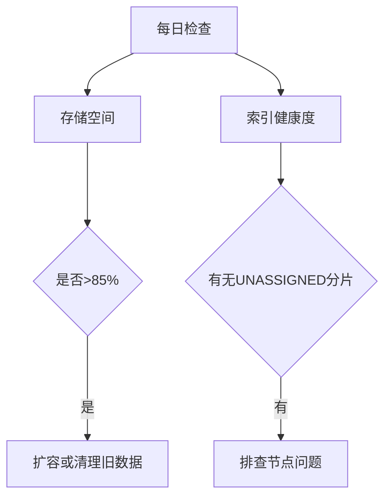
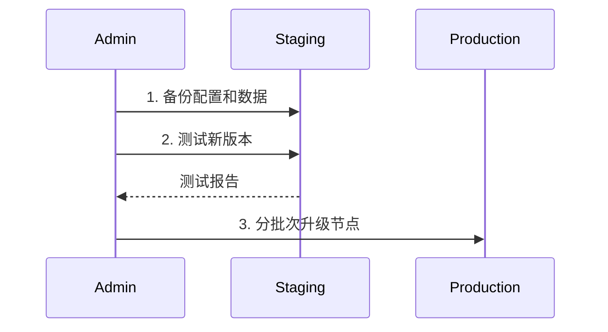

## 介绍

SkyWalking作为分布式系统的APM（应用性能监控）工具，其运维管理是保障监控系统稳定运行的关键。本章将详细介绍日常运维中的标准操作流程，帮助初学者建立系统化的运维思维。

## 核心运维流程

### 1. 服务健康检查
每日需验证SkyWalking各组件的运行状态：

```bash
# 检查OAP服务状态（假设使用systemd）
systemctl status skywalking-oap-server

# 预期输出示例
● skywalking-oap-server.service - SkyWalking OAP Server
   Loaded: loaded (/usr/lib/systemd/system/skywalking-oap-server.service; enabled)
   Active: active (running) since Mon 2023-08-14 09:00:00 CST; 1h ago
```

:::tip
建议配置监控告警规则，当以下指标异常时触发通知：
- OAP服务JVM内存使用率 >80%
- 存储层写入延迟 >500ms
:::

### 2. 存储管理
根据使用的存储类型（Elasticsearch/H2/MySQL等）执行维护：



对于Elasticsearch用户，定期执行索引维护：
```bash
# 清理30天前的指标数据
curl -X POST "localhost:9200/skywalking_metrics-*/_delete_by_query" -H 'Content-Type: application/json' -d'
{
  "query": {
    "range": {
      "time_bucket": {
        "lt": "now-30d"
      }
    }
  }
}'
```

### 3. 配置管理
典型配置更新流程：

1. 修改 `config/application.yml`
2. 验证配置语法：
   ```bash
   ./bin/oapService.sh check
   ```
3. 滚动重启服务：
   ```bash
   systemctl restart skywalking-oap-server
   ```

:::caution
生产环境建议使用配置管理工具（Ansible/Puppet）批量操作，避免人工失误
:::

### 4. 版本升级
安全升级步骤示例：



## 实战案例

**场景**：某电商平台大促前容量评估

1. **问题发现**：通过日常巡检发现ES集群磁盘使用率达82%
2. **处理流程**：
   - 调整数据保留策略：将链路数据从30天改为15天
   - 扩展ES集群节点从5个到8个
   - 验证查询性能：
     ```bash
     # 采样测试查询延迟
     curl -o /dev/null -s -w '%{time_total}s\n' \
     'http://localhost:12800/graphql?query={queryTraces{traces{operationName}}}'
     ```
3. **结果**：磁盘使用率降至65%，P99查询延迟从1200ms降至400ms

## 总结与资源

**关键要点**：
- 建立定时巡检机制（建议每日/每周/每月不同粒度）
- 所有变更遵循"测试-预发-生产"流程
- 重要操作前必须备份配置和数据

**延伸学习**：
1. [SkyWalking官方运维文档](https://skywalking.apache.org/docs/)
2. 练习：使用`jstack`分析OAP服务的线程状态
3. 模拟故障场景：手动停止Storage服务观察系统行为

``` 

注：实际使用时请移除最外层的