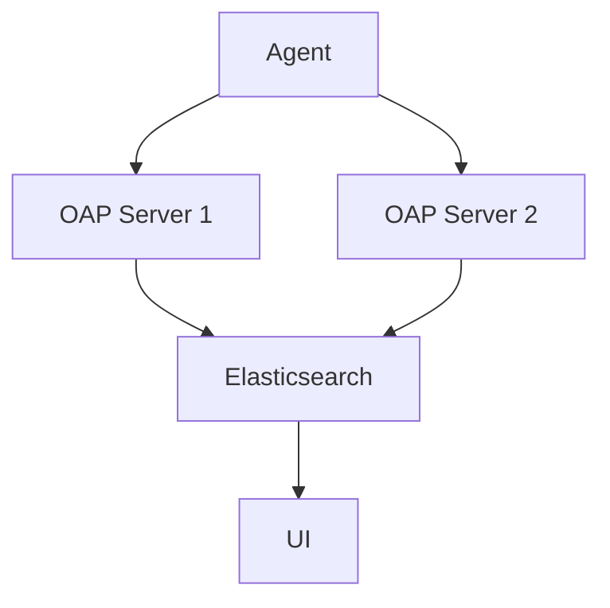

# SkyWalking 集群管理

## 介绍

SkyWalking是一个开源的分布式系统性能监控工具，支持集群部署以提高可用性和扩展性。集群管理是SkyWalking运维中的核心部分，涉及节点配置、负载均衡、数据同步和故障恢复等关键任务。本指南将详细介绍如何设置和管理SkyWalking集群。

## 集群架构

SkyWalking集群由以下组件构成：

1. **OAP Server**：负责数据收集、分析和存储。
2. **Storage**：支持Elasticsearch、MySQL等后端存储。
3. **UI**：提供可视化界面。



## 配置集群

### 1. 节点配置

每个OAP节点需要配置集群协调器（如Zookeeper、Kubernetes）和存储后端。以下是`application.yml`的示例配置：

```yaml
cluster:
  selector: ${SW_CLUSTER:standalone}
  standalone:
  zookeeper:
    nameSpace: ${SW_NAMESPACE:""}
    hostPort: ${SW_CLUSTER_ZK_HOST_PORT:localhost:2181}
storage:
  selector: ${SW_STORAGE:elasticsearch}
  elasticsearch:
    nameSpace: ${SW_NAMESPACE:""}
    clusterNodes: ${SW_STORAGE_ES_CLUSTER_NODES:localhost:9200}
```

### 2. 高可用性

通过部署多个OAP节点和存储副本实现高可用性。例如，使用Elasticsearch的副本分片：

```yaml
elasticsearch:
  indexShardsNumber: ${SW_STORAGE_ES_INDEX_SHARDS_NUMBER:2}
  indexReplicasNumber: ${SW_STORAGE_ES_INDEX_REPLICAS_NUMBER:2}
```

## 实际案例

### 场景：动态扩展OAP节点

1. **初始状态**：2个OAP节点，连接到一个Elasticsearch集群。
2. **扩展步骤**：
   - 启动新的OAP节点，配置相同的Zookeeper地址。
   - 新节点自动加入集群，负载均衡生效。

:::tip
使用`kubectl scale`（Kubernetes）或手动启动新节点实现扩展。
:::

## 故障排除

### 常见问题

1. **节点无法加入集群**：
   - 检查Zookeeper连接和命名空间配置。
   - 验证网络连通性。

2. **数据不一致**：
   - 确保存储后端（如Elasticsearch）的集群健康。
   - 检查OAP节点的时钟同步。

## 总结

SkyWalking集群管理是确保监控系统稳定运行的关键。通过合理配置节点、存储和高可用性设置，可以构建一个健壮的监控环境。

## 附加资源

1. [SkyWalking官方文档](https://skywalking.apache.org/docs/)
2. 练习：尝试在本地使用Docker部署一个2节点的SkyWalking集群。