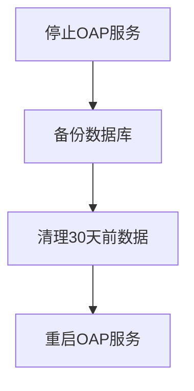

## 介绍

SkyWalking提供了一系列运维脚本工具，帮助管理员简化日常维护工作。这些脚本主要位于SkyWalking发行包的`bin`目录下，涵盖服务启停、配置检查、数据清理等常见运维场景。本章将详细介绍这些工具的使用方法和最佳实践。

## 核心运维脚本

### 1. 服务管理脚本

#### oapService.sh / oapService.bat
用于启动/停止/重启OAP服务：

```bash
# Linux/MacOS示例
./bin/oapService.sh start      # 启动服务
./bin/oapService.sh stop       # 停止服务
./bin/oapService.sh restart    # 重启服务
```

:::tip
Windows用户应使用`.bat`版本，命令参数相同。
:::

#### webappService.sh
管理UI服务的脚本：

```bash
./bin/webappService.sh start   # 启动Web UI
```

### 2. 初始化脚本

#### init_oap_db.sh
用于初始化数据库表结构（适用于MySQL/PostgreSQL等关系型数据库）：

```bash
./bin/init_oap_db.sh -m mysql -h localhost -p 3306 -u root -p password
```

参数说明：
- `-m`: 数据库类型（mysql/postgresql）
- `-h`: 数据库地址
- `-p`: 数据库端口
- `-u`: 用户名
- `-p`: 密码（最后一个-p）

### 3. 数据维护脚本

#### oapCleanup.sh
清理过期监控数据：

```bash
./bin/oapCleanup.sh --days 7  # 清理7天前的数据
```

:::caution
执行清理前建议先备份数据库！
:::

## 高级运维工具

### 配置检查工具

```bash
./bin/checkConfiguration.sh config/oap.yml
```

输出示例：
```
[INFO] Storage configuration is valid
[WARN] No alarm rules configured
```

### 批量操作脚本示例

以下是一个自动备份和清理的复合脚本示例：

```bash
#!/bin/bash
# backup_and_clean.sh
DATE=$(date +%Y%m%d)
mysqldump -h localhost -u skywalking -p password sw_data > backup_$DATE.sql
./bin/oapCleanup.sh --days 30
```

## 实际应用案例

**场景**：每周维护窗口执行以下操作：
1. 停止服务
2. 备份数据库
3. 清理旧数据
4. 重启服务



对应脚本：
```bash
./bin/oapService.sh stop
./bin/init_oap_db.sh --backup > backup_$(date +%s).sql
./bin/oapCleanup.sh --days 30
./bin/oapService.sh start
```

## 最佳实践

1. **定时任务配置**：使用cron定期执行清理
   ```bash
   0 3 * * * /path/to/skywalking/bin/oapCleanup.sh --days 7
   ```

2. **脚本权限管理**：
   ```bash
   chmod 750 bin/*.sh  # 限制执行权限
   ```

3. **日志监控**：检查脚本执行的日志输出
   ```bash
   tail -f logs/oap.log
   ```

## 总结

SkyWalking的运维脚本工具提供了：
- 标准化的服务管理接口
- 数据库维护能力
- 自动化运维支持

:::note 扩展学习
1. 尝试编写自定义维护脚本组合多个操作
2. 研究`bin/tools`目录下的诊断工具
3. 查阅官方文档获取完整的参数列表
:::