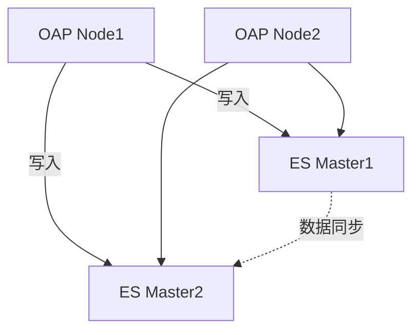

## 概述

SkyWalking作为分布式系统的APM（应用性能监控）工具，其自身的高可用性直接关系到整个系统的监控稳定性。本章将介绍如何通过**集群部署**、**数据冗余**和**故障自动恢复**等机制，确保SkyWalking在节点故障时仍能持续提供服务。

:::note 什么是高可用？
高可用（High Availability, HA）指系统通过设计减少停机时间，确保服务持续可用。通常通过冗余和自动故障转移实现。
:::

---

## 核心策略

### 1. 集群化部署
SkyWalking的OAP（Observability Analysis Platform）服务支持多节点集群部署，避免单点故障。

#### 配置示例
修改 `config/application.yml` 启用集群模式：
```yaml
cluster:
  selector: ${SW_CLUSTER:standalone} # 改为zookeeper/kubernetes等
  zookeeper:
    hostPort: ${SW_CLUSTER_ZK_HOST_PORT:localhost:2181}
    namespace: ${SW_CLUSTER_ZK_NAMESPACE:/skywalking}
```

:::tip 节点角色
- **Receiver节点**：负责接收Agent数据（可水平扩展）
- **Aggregator节点**：处理聚合计算（需保持奇数个以维持选举）
:::

### 2. 存储层高可用
SkyWalking依赖的存储系统（如Elasticsearch）需单独配置高可用：



### 3. 前端负载均衡
使用Nginx分发UI请求：
```nginx
upstream oap_servers {
  server oap1:12800;
  server oap2:12800 backup;
}

server {
  listen 80;
  location / {
    proxy_pass http://oap_servers;
  }
}
```

---

## 实战案例

### 场景：OAP节点故障恢复
1. **初始状态**：3节点集群（OAP1、OAP2、OAP3）通过ZooKeeper协调
2. **故障发生**：OAP1因硬件问题下线
3. **自动恢复**：
   - ZooKeeper在30秒内检测到节点丢失
   - 剩余节点重新分配任务
   - 新数据自动写入存活的OAP2/OAP3

:::warning 注意
确保存储层（如ES）的副本数 ≥2，否则节点故障可能导致数据丢失！
:::

---

## 验证高可用

### 测试故障转移
1. 部署两个OAP节点
2. 停止主节点：
   ```bash
   docker stop oap-leader
   ```
3. 观察日志：
   ```log
   [ClusterManager] Current role is FOLLOWER -> LEADER (OAP2接管)
   ```

---

## 总结

| 策略                | 实现方式                      | 效果                     |
|---------------------|-----------------------------|-------------------------|
| 多节点集群           | ZooKeeper/K8s协调            | 消除单点故障             |
| 数据冗余             | ES副本/MySQL主从             | 防止数据丢失             |
| 负载均衡             | Nginx/Haproxy               | 请求均匀分发             |

---

## 扩展学习

1. **推荐练习**：
   - 使用Docker Compose部署3节点SkyWalking集群
   - 模拟节点故障并观察指标收集是否中断

2. **进阶阅读**：
   - [SkyWalking官方集群文档](https://skywalking.apache.org/docs/)
   - 《分布式系统：概念与设计》中高可用章节
