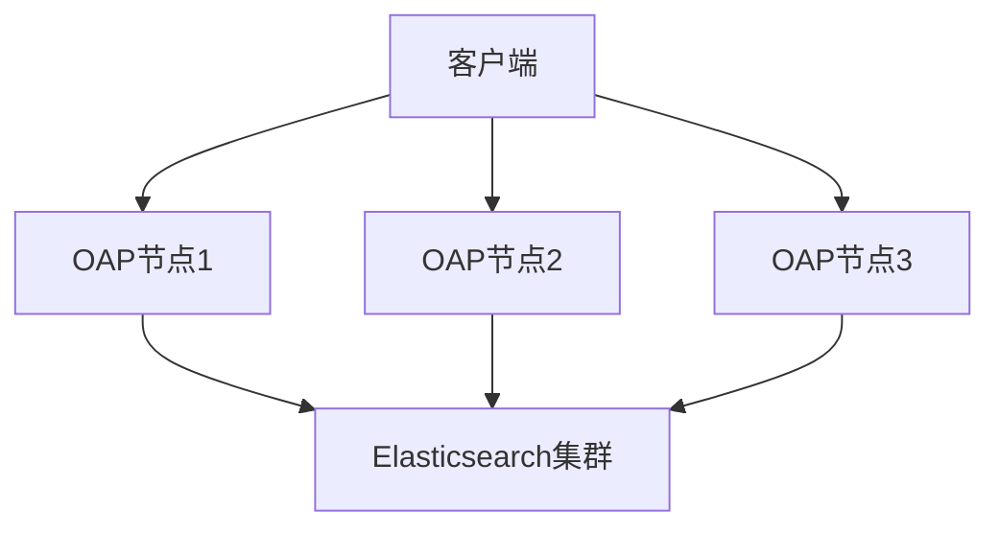

# SkyWalking 灾难恢复计划

## 介绍

灾难恢复计划（Disaster Recovery Plan, DRP）是确保SkyWalking监控系统在遭遇硬件故障、数据损坏或自然灾害等意外情况时，能够快速恢复服务的关键策略。对于运维团队而言，一个完善的灾难恢复计划可以最小化停机时间，保障监控数据的完整性。本章将指导初学者从零开始制定SkyWalking的灾难恢复方案。

## 核心概念

### 1. 灾难恢复目标
- **RTO（Recovery Time Objective）**：系统允许的最大恢复时间（例如1小时）。
- **RPO（Recovery Point Objective）**：数据允许的最大丢失量（例如最近15分钟的数据）。

### 2. 关键组件备份
SkyWalking的灾难恢复依赖以下组件的备份：
- **OAP（Observability Analysis Platform）集群**：存储和分析数据的核心。
- **Storage（Elasticsearch/MySQL等）**：监控数据的持久化存储。
- **UI配置**：前端界面的自定义设置。

## 实施步骤

### 步骤1：定期备份配置与数据
#### 备份OAP配置
```bash
# 备份OAP的配置文件（假设使用Kubernetes部署）
kubectl cp skywalking-oap-0:/skywalking/config /local/backup/oap-config
```

#### 备份存储数据（以Elasticsearch为例）
```bash
# 创建Elasticsearch快照
PUT /_snapshot/skywalking_backup
{
  "type": "fs",
  "settings": {
    "location": "/mnt/backup/skywalking"
  }
}
```

### 步骤2：建立冗余架构
通过多节点部署避免单点故障：


### 步骤3：自动化恢复流程
编写恢复脚本示例：
```bash
#!/bin/bash
# 恢复Elasticsearch数据
curl -X POST "localhost:9200/_snapshot/skywalking_backup/snapshot_1/_restore"
# 重新部署OAP服务
kubectl apply -f skywalking-oap-deployment.yaml
```

## 实际案例

### 案例：云服务中断恢复
**场景**：AWS区域故障导致SkyWalking不可用。<br />
**解决方案**：
1. 从S3存储桶恢复最新的Elasticsearch快照。
2. 在备用区域启动新的OAP集群。
3. 更新DNS记录指向新集群。

:::tip 最佳实践
- 每周测试恢复流程的有效性。
- 使用基础设施即代码（IaC）工具（如Terraform）快速重建环境。
:::

## 总结

SkyWalking的灾难恢复计划需要：
1. 明确RTO和RPO目标。
2. 定期备份关键组件。
3. 设计冗余架构。
4. 自动化恢复流程。

## 附加资源
- [SkyWalking官方文档：集群部署](https://skywalking.apache.org/docs/)
- 《Site Reliability Engineering》第16章：灾难恢复
