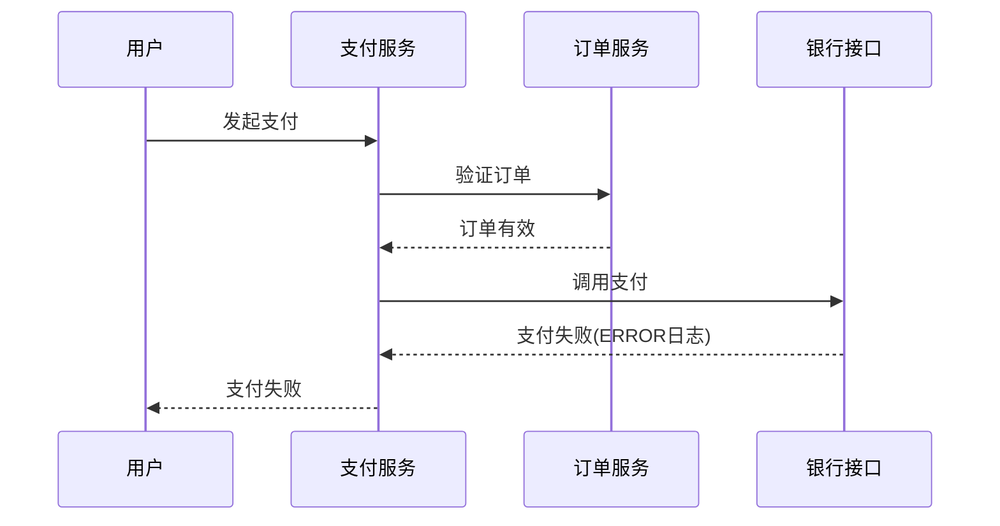

# SkyWalking 日志管理

日志管理是分布式系统运维中至关重要的一环。SkyWalking作为一款优秀的APM（应用性能监控）工具，提供了强大的日志收集、存储和分析能力。本章将带你全面了解SkyWalking的日志管理功能。

## 日志管理概述

SkyWalking的日志管理系统主要包含三个核心组件：

1. **日志收集**：从各种来源收集应用日志
2. **日志存储**：高效存储大量日志数据
3. **日志分析**：提供查询和可视化分析能力


## 日志收集配置

SkyWalking支持多种日志收集方式，最常见的是通过Agent自动收集。

### 通过Agent收集日志

修改agent配置（`agent.config`）：

```properties
# 启用日志收集
plugin.toolkit.log.grpc.reporter.server_host=${SW_GRPC_LOG_SERVER_HOST:127.0.0.1}
plugin.toolkit.log.grpc.reporter.server_port=${SW_GRPC_LOG_SERVER_PORT:11800}
plugin.toolkit.log.grpc.reporter.max_message_size=${SW_GRPC_LOG_MAX_MESSAGE_SIZE:10485760}
```

:::tip
生产环境中建议将日志发送到SkyWalking OAP服务器，而不是直接存储在本地。
:::

## 日志存储配置

SkyWalking默认使用Elasticsearch作为日志存储后端。修改OAP配置（`application.yml`）：

```yaml
storage:
  selector: ${SW_STORAGE:elasticsearch}
  elasticsearch:
    nameSpace: ${SW_NAMESPACE:""}
    clusterNodes: ${SW_STORAGE_ES_CLUSTER_NODES:localhost:9200}
    protocol: ${SW_STORAGE_ES_HTTP_PROTOCOL:"http"}
    trustStorePath: ${SW_STORAGE_ES_SSL_JKS_PATH:""}
    trustStorePass: ${SW_STORAGE_ES_SSL_JKS_PASS:""}
    dayStep: ${SW_STORAGE_DAY_STEP:1} # 存储天数
```

## 日志查询与分析

SkyWalking UI提供了强大的日志查询界面。你可以：

1. 按服务/实例过滤日志
2. 按时间范围查询
3. 使用关键词搜索
4. 按日志级别过滤

示例查询语法：
```
service:payment-service AND level:ERROR AND message:"timeout"
```

## 实际案例：电商系统日志管理

假设我们有一个电商系统，包含以下服务：
- 用户服务
- 商品服务
- 订单服务
- 支付服务

当用户投诉支付失败时，我们可以：

1. 在SkyWalking UI中选择"支付服务"
2. 设置时间范围为投诉发生时段
3. 过滤ERROR级别日志
4. 搜索关键词"payment failed"



## 高级功能：日志采样

在高流量场景下，你可能需要配置日志采样以减少存储压力：

```yaml
# 在OAP配置中设置采样率
receiver-sharing-server:
  default:
    # 采样率10%
    sampleRate: ${SW_LOGGING_SAMPLE_RATE:10} 
```

## 总结

SkyWalking的日志管理系统提供了：
- 多种日志收集方式
- 灵活的存储配置
- 强大的查询分析功能
- 生产级的高可用方案

## 进一步学习

1. 尝试在你的开发环境中配置SkyWalking日志收集
2. 模拟不同级别的日志消息，观察它们在UI中的表现
3. 实验不同的存储后端(H2/MySQL/ES)
4. 研究日志采样对系统性能的影响

:::note
记住：良好的日志管理习惯是运维工作的基础。合理配置日志级别、格式和存储策略，可以大大降低故障排查的难度。
:::