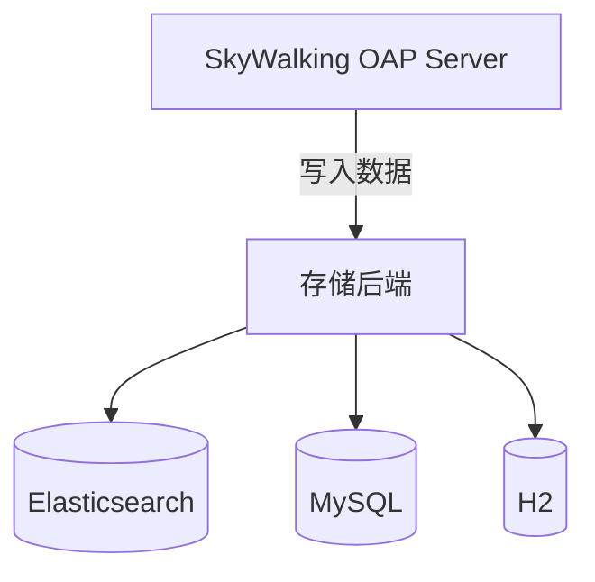

## 介绍

在运维SkyWalking时，备份和恢复策略是确保监控数据安全的关键环节。无论是因为硬件故障、人为误操作还是其他意外情况，都可能造成数据丢失。通过制定合理的备份恢复策略，可以最小化这些风险带来的影响。

本指南将介绍SkyWalking中常见的备份恢复方法，包括配置备份、存储数据备份以及如何从备份中恢复。

## 为什么需要备份恢复策略？

SkyWalking作为分布式系统的监控工具，收集了大量的性能指标、链路追踪数据和服务拓扑信息。这些数据对于系统运维和故障排查至关重要。如果数据丢失，可能会导致：

- 无法追溯历史性能问题
- 丢失关键的业务监控数据
- 影响容量规划和趋势分析

## SkyWalking 数据存储架构

在开始备份之前，了解SkyWalking的数据存储架构非常重要。SkyWalking支持多种存储后端：

1. **H2**（内置，适合测试环境）
2. **Elasticsearch**（生产推荐）
3. **MySQL**、**TiDB**、**PostgreSQL**等关系型数据库



## 备份策略

### 1. 配置备份

SkyWalking的配置文件主要位于`config/`目录下，最重要的文件包括：

- `application.yml` - 主配置文件
- `log4j2.xml` - 日志配置
- `alarm-settings.yml` - 告警规则

建议将这些文件纳入版本控制系统（如Git），或定期手动备份。

### 2. 存储数据备份

根据不同的存储后端，备份方法有所不同：

#### Elasticsearch备份

对于生产环境，Elasticsearch是最常用的存储后端。可以使用Elasticsearch的snapshot API进行备份：

```bash
# 创建备份仓库
PUT _snapshot/my_backup
{
  "type": "fs",
  "settings": {
    "location": "/mnt/backups/skywalking"
  }
}

# 创建快照
PUT _snapshot/my_backup/snapshot_1?wait_for_completion=true
{
  "indices": "sw_*",
  "ignore_unavailable": true,
  "include_global_state": false
}
```

#### 关系型数据库备份

对于MySQL等关系型数据库，可以使用标准的数据库备份工具：

```bash
# MySQL备份示例
mysqldump -u username -p skywalking > skywalking_backup.sql
```

### 3. 定期备份计划

建议设置自动化的备份计划：

- 每日增量备份
- 每周全量备份
- 备份保留1-3个月（根据存储容量调整）

可以使用cron任务实现自动化：

```bash
# 每天凌晨2点执行备份
0 2 * * * /path/to/backup_script.sh
```

## 恢复策略

### 1. 配置恢复

如果只是配置文件损坏或丢失，只需从备份中恢复相应文件并重启OAP服务：

```bash
cp /backup/config/application.yml /path/to/skywalking/config/
./bin/oapService.sh restart
```

### 2. 存储数据恢复

#### Elasticsearch恢复

```bash
# 从快照恢复
POST _snapshot/my_backup/snapshot_1/_restore
{
  "indices": "sw_*",
  "ignore_unavailable": true,
  "include_global_state": false
}
```

#### 关系型数据库恢复

```bash
# MySQL恢复示例
mysql -u username -p skywalking < skywalking_backup.sql
```

## 实际案例

**案例：意外删除指标数据**

某公司运维人员误执行了删除操作，导致过去一周的监控数据丢失。由于实施了每日备份策略，他们能够：

1. 确认问题影响范围
2. 从最近的备份中恢复数据
3. 仅丢失了最后一次备份后的少量数据（约4小时）

恢复步骤：

1. 停止SkyWalking OAP服务
2. 从备份恢复Elasticsearch索引
3. 验证数据完整性
4. 重启服务

## 最佳实践

1. **测试恢复流程**：定期测试备份文件是否能成功恢复
2. **监控备份状态**：设置告警监控备份任务是否成功执行
3. **多地存储**：将备份文件存储在不同地理位置或云存储中
4. **文档记录**：详细记录备份恢复流程，确保团队成员都了解

:::tip
对于生产环境，建议至少保留3份不同时间点的备份，以应对各种意外情况。
:::

## 总结

SkyWalking的备份恢复策略是确保监控数据安全的重要保障。通过本文，你学习了：

- 不同存储后端的备份方法
- 如何从备份中恢复数据
- 实际应用案例和最佳实践

## 附加资源

1. [Elasticsearch官方备份恢复文档](https://www.elastic.co/guide/en/elasticsearch/reference/current/snapshot-restore.html)
2. [MySQL备份恢复最佳实践](https://dev.mysql.com/doc/refman/8.0/en/backup-and-recovery.html)
3. [SkyWalking官方文档](https://skywalking.apache.org/docs/)

## 练习

1. 为你的SkyWalking实例设置一个简单的每日备份任务
2. 尝试从备份中恢复一小部分测试数据
3. 记录完整的备份恢复流程文档