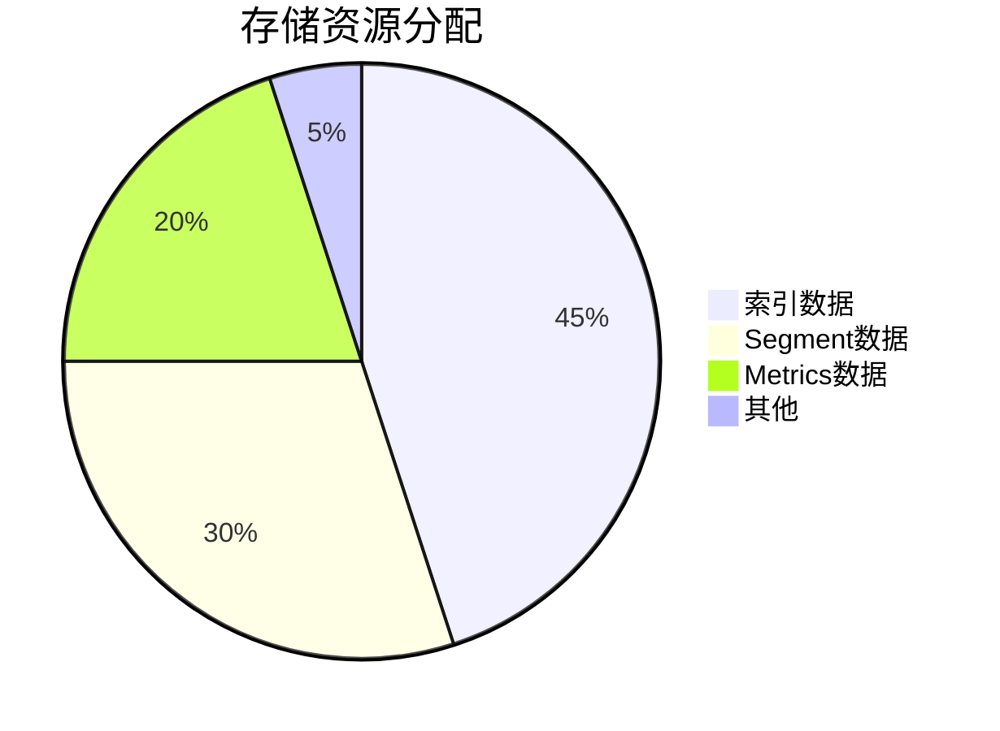

## 概述

SkyWalking作为分布式系统的APM（应用性能监控）工具，在生产环境中需要合理的容量规划来保证其稳定性和性能。容量规划主要涉及计算所需的存储空间、内存、CPU资源以及网络带宽，以满足预期的监控数据量和查询负载。

## 容量规划的关键因素

### 1. 数据量估算
SkyWalking的数据量主要由以下因素决定：
- **服务数量**：被监控的微服务或应用的数量
- **实例数量**：每个服务的运行实例数
- **采样率**：监控数据的采集频率
- **数据保留周期**：监控数据在存储中的保留时间

### 2. 存储需求
SkyWalking使用Elasticsearch、MySQL或其他存储后端，存储需求可通过以下公式估算：
```
总存储需求 = 每日数据量 × 数据保留天数 × 冗余系数(通常1.2-1.5)
```

### 3. 计算资源
- **OAP Server**：处理监控数据的核心组件，需要足够的CPU和内存
- **Storage**：存储后端的资源需求取决于数据量和查询负载

## 容量规划步骤

### 步骤1：评估监控规模
收集以下信息：
- 预计监控的服务数量
- 每个服务的平均实例数
- 预期的采样率（如每10秒一个Span）

### 步骤2：计算每日数据量
使用SkyWalking提供的估算工具或公式：
```bash
# 示例：计算每日Span数量
总Span/日 = 服务数 × 实例数 × (86400/采样间隔) × 平均每个请求的Span数
```

### 步骤3：存储规划


### 步骤4：硬件资源配置
根据数据量选择适当的硬件配置：
- **小型部署**（`<50服务`）：2-4核CPU，8-16GB内存
- **中型部署**（`50-200服务`）：4-8核CPU，16-32GB内存
- **大型部署**（`>200服务`）：需要集群化部署

## 实际案例

### 案例：电商平台监控
**场景**：
- 100个微服务
- 每个服务平均5个实例
- 采样率：10秒/次
- 数据保留30天

**计算**：
```
总Span/日 = 100 × 5 × (86400/10) × 3 ≈ 12,960,000
存储需求 ≈ 12,960,000 × 0.5KB × 30 × 1.3 ≈ 250GB
```

**配置建议**：
- OAP Server：8核CPU，32GB内存 × 3节点
- Elasticsearch：数据节点 × 5（32GB内存，2TB SSD）

## 性能调优建议

:::tip
1. 对于高负载环境，考虑启用OAP集群模式
2. 调整Elasticsearch的索引分片数量（建议每个分片20-30GB）
3. 对热数据进行SSD存储，冷数据可迁移到HDD
:::

## 总结

SkyWalking容量规划是确保监控系统稳定运行的关键步骤。通过合理估算数据量、规划存储和计算资源，可以避免性能瓶颈和资源浪费。记住要：
- 定期评估实际数据量与预估的差异
- 监控系统资源使用情况
- 根据业务增长调整资源配置

## 扩展学习

1. SkyWalking官方文档中的[部署建议](https://skywalking.apache.org/docs/)
2. Elasticsearch容量规划指南
3. 实践练习：使用不同配置部署测试环境，观察资源使用情况