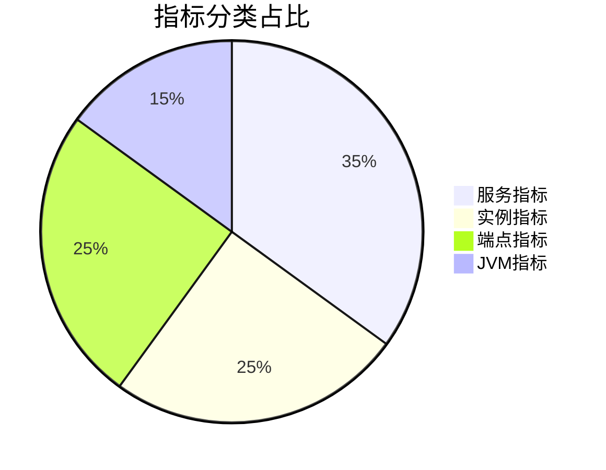
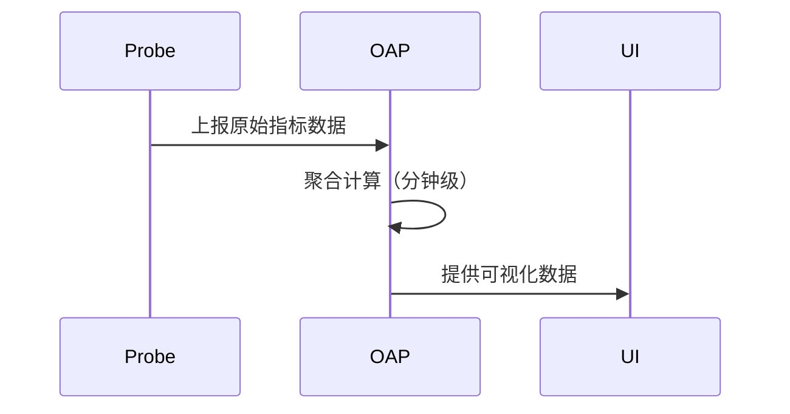

## 概述

SkyWalking作为分布式系统的APM（应用性能管理）工具，通过丰富的监控指标帮助开发者观察系统运行状态。这些指标覆盖了从基础设施到应用逻辑的多层次数据，是运维管理的核心依据。

## 核心指标分类

SkyWalking的监控指标主要分为以下四类：



### 1. 服务级指标
反映整个微服务的健康状态：
- **成功率**：HTTP状态码成功率（如2xx/5xx比例）
- **吞吐量**：每分钟请求数（RPM）
- **延迟**：P50/P90/P99响应时间

示例查询语句：
```sql
SELECT percentiles(duration, 50, 75, 90, 95) 
FROM service_resp_time 
WHERE service = 'order-service' 
  AND time >= NOW() - 1h
```

### 2. 实例级指标
单个服务实例的运行数据：
- **CPU/Memory**：资源占用率
- **线程数**：活跃线程/阻塞线程
- **GC次数**：Young GC/Full GC统计

:::tip 实践建议
实例指标突然波动往往是故障先兆，建议设置阈值告警。
:::

### 3. 端点指标
API接口粒度的性能数据：
```json
// 典型端点指标数据结构
{
  "endpoint": "/api/v1/orders",
  "latency": 120,
  "status": true,
  "traces": ["traceId-12345"]
}
```

### 4. JVM深度指标
Java应用的详细运行时数据：
- **堆内存**：Eden/Survivor/Old区使用量
- **类加载**：已加载/未加载类计数
- **线程状态**：RUNNABLE/BLOCKED计数

## 指标采集原理

SkyWalking通过探针自动采集指标，数据流如下：



## 实战案例：电商系统监控

假设某电商平台出现订单提交缓慢问题：

1. **服务指标**显示`order-service`的P99延迟从200ms升至1200ms
2. **实例指标**发现某个Pod的CPU持续90%+
3. **端点指标**定位到`/submit`接口成功率下降至85%
4. **JVM指标**显示该实例频繁Full GC

最终定位到数据库连接池配置不当导致的问题。

## 常用监控策略

1. **基线告警**：对比历史同期数据
   ```groovy
   // 基线告警规则示例
   rule {
     metric = "service_resp_time"
     threshold = historical_avg * 1.5
   }
   ```

2. **关联分析**：结合拓扑图分析上下游影响

3. **黄金指标**（RED）：
   - **R**equest rate
   - **E**rror rate
   - **D**uration

## 总结

关键要点：
- 监控指标是系统可观测性的基础
- 需要结合不同层级指标综合分析
- 指标异常通常早于用户投诉出现

扩展学习：
- 官方指标文档：[SkyWalking Metrics Guide](https://skywalking.apache.org/docs/)
- 实践练习：在Demo环境中重现案例场景