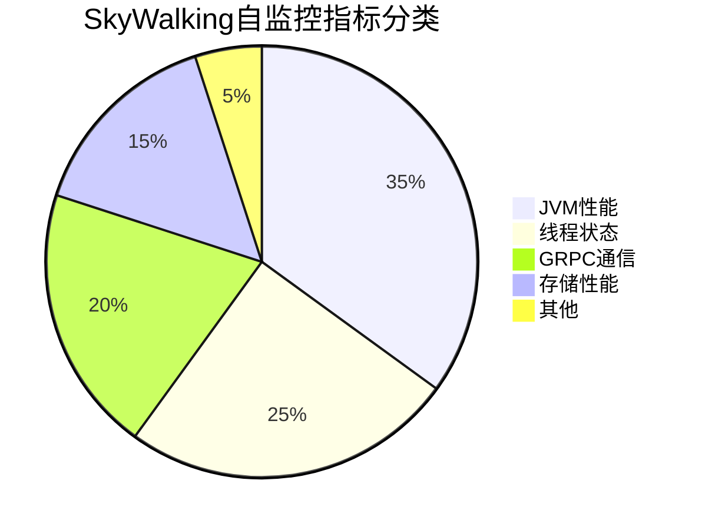

# SkyWalking 自监控配置

## 概述

SkyWalking作为一款优秀的APM（应用性能监控）工具，不仅能监控其他应用，还能监控自身运行状态。自监控（Self-Observability）功能让运维人员可以实时掌握SkyWalking各组件的健康状况、性能指标和潜在问题，确保监控系统本身的可靠性。

:::tip 为什么需要自监控？
当SkyWalking出现性能瓶颈或故障时，如果没有自监控数据，排查问题将变得异常困难。自监控就像给监控系统装上了"健康检测仪"。
:::

## 基础配置

### 1. 启用自监控

在SkyWalking的配置文件 `application.yml` 中启用自监控模块：

```yaml
telemetry:
  prometheus:
    host: 0.0.0.0
    port: 1234
    sslEnabled: false
```

关键参数说明：
- `host`: 暴露指标的IP地址（0.0.0.0表示所有网络接口）
- `port`: Prometheus抓取指标的端口
- `sslEnabled`: 是否启用SSL加密

### 2. 配置指标采集频率

在 `oap-server` 的配置中调整自监控数据采集频率：

```yaml
core:
  default:
    # 每10秒收集一次OAP自身指标
    selfObservabilityLevel: INFO
    selfObservabilityInterval: 10
```

## 核心监控指标

SkyWalking自监控主要关注以下几类指标：



### 关键指标示例

1. **JVM指标**：
   - `jvm_memory_used_bytes`: 各内存区域使用量
   - `jvm_gc_collection_seconds`: GC耗时

2. **线程指标**：
   - `process_cpu_usage`: CPU使用率
   - `thread_count`: 线程数量

3. **GRPC指标**：
   - `grpc_server_requests_total`: 请求总数
   - `grpc_server_handled_seconds`: 处理耗时

## 实战配置案例

### 场景：监控OAP服务器性能

1. 首先确保Prometheus已配置抓取SkyWalking指标：

```yaml
# prometheus.yml 配置示例
scrape_configs:
  - job_name: 'skywalking-oap'
    metrics_path: '/metrics'
    static_configs:
      - targets: ['skywalking-oap:1234']
```

2. 在Grafana中导入SkyWalking官方提供的[自监控仪表板](https://grafana.com/grafana/dashboards/12815)，你将看到类似这样的监控视图：

:::note 典型监控面板包含
- JVM内存/线程图表
- GRPC请求吞吐量和延迟
- 存储层读写性能
- 告警规则触发状态
:::

## 高级配置技巧

### 自定义监控指标

通过SkyWalking的Meter System API可以添加自定义业务指标：

```java
// 示例：在OAP扩展插件中添加自定义指标
MeterSystem meterSystem = SharedInstances.getMeterSystem();
meterSystem.gauge("custom_metric", () -> {
    // 返回你的自定义指标值
    return getYourBusinessValue();
}, Tags.of("tag1", "value1"));
```

### 告警规则配置

在 `alarm-settings.yml` 中添加针对自监控的告警规则：

```yaml
rules:
  - name: oap_high_cpu
    expression: process_cpu_usage > 0.8
    duration: 2m
    silence-period: 5m
    message: "OAP CPU使用率超过80%持续2分钟"
```

## 常见问题排查

:::caution 自监控数据缺失？
1. 检查端口是否被防火墙拦截
2. 验证Prometheus是否能访问/metrics端点
3. 查看OAP日志是否有相关错误
:::

:::warning 性能影响
自监控会带来约3-5%的性能开销，在资源紧张的环境中可适当降低采集频率。
:::

## 总结与扩展

通过合理配置SkyWalking自监控，你可以：

- 实时掌握监控系统自身状态
- 快速定位性能瓶颈
- 预防潜在的系统故障

**推荐练习**：
1. 尝试在测试环境中部署自监控并模拟高负载场景
2. 基于自监控数据创建一个自定义告警规则
3. 对比不同采集频率对系统性能的影响

**延伸阅读**：
- SkyWalking官方文档中的[Telemetry配置指南](https://skywalking.apache.org/docs/)
- Prometheus监控指标类型详解
- JVM性能监控最佳实践