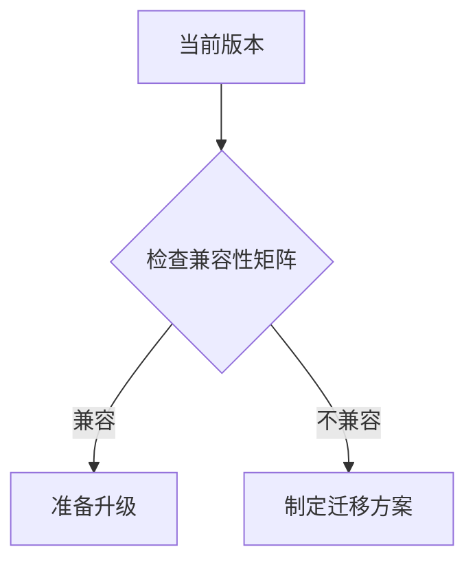

## 简介

SkyWalking作为一款分布式系统的APM（应用性能监控）工具，其版本迭代会带来性能优化、新功能和安全补丁。版本升级是运维管理中的重要环节，需要谨慎操作以避免服务中断或数据丢失。本文将详细介绍从旧版本升级到新版本的完整流程。

## 升级前准备

### 1. 版本兼容性检查
- 查阅[官方发布说明](https://skywalking.apache.org/release-notes/)确认新旧版本兼容性
- 特别注意存储层（如Elasticsearch/H2/MySQL）的版本要求变化



### 2. 备份关键数据
```bash
# 备份配置文件
cp -r /path/to/skywalking/config /backup/skywalking_config_$(date +%Y%m%d)

# 如使用嵌入式存储，备份数据目录
cp -r /path/to/skywalking/data /backup/skywalking_data_$(date +%Y%m%d)
```

### 3. 环境检查
确保：
- 磁盘空间足够（至少保留当前数据量2倍的空间）
- JVM版本符合新要求
- 系统资源（CPU/内存）满足新版需求

## 升级步骤

### 标准升级流程（以8.4.0 → 8.9.0为例）

:::note
以下示例假设使用官方压缩包安装方式
:::

1. 停止旧版本服务
```bash
# 停止OAP服务
/path/to/skywalking/bin/oapService.sh stop

# 停止WebUI
/path/to/skywalking/bin/webappService.sh stop
```

2. 下载并解压新版本
```bash
wget https://archive.apache.org/dist/skywalking/8.9.0/apache-skywalking-apm-8.9.0.tar.gz
tar -zxvf apache-skywalking-apm-8.9.0.tar.gz -C /opt/
```

3. 迁移配置文件
```bash
# 复制自定义配置
cp /backup/skywalking_config_20230101/application.yml /opt/apache-skywalking-apm-8.9.0/config/
```

4. 执行数据库迁移（如需要）
```sql
-- 对于MySQL存储，可能需要执行升级脚本
mysql -u skywalking -p < /opt/apache-skywalking-apm-8.9.0/oap-libs/skywalking-mysql-migration-8.9.0.jar
```

5. 启动新版本服务
```bash
# 启动OAP
/opt/apache-skywalking-apm-8.9.0/bin/oapService.sh start

# 启动WebUI
/opt/apache-skywalking-apm-8.9.0/bin/webappService.sh start
```

## 验证升级

1. 检查服务状态
```bash
curl http://localhost:12800/version
# 期望输出：{"version":"8.9.0"}
```

2. 验证数据连续性
- 确认历史监控数据可查询
- 检查新数据持续入库

3. 功能测试
- 追踪链路是否完整
- 告警规则是否正常触发
- UI各项功能是否可用

## 实际案例

**某电商平台升级经验：**
- 问题：从7.0.0升级到8.0.0时，Elasticsearch存储方案有重大变更
- 解决方案：
  1. 先在新环境部署8.0.0并配置新ES集群
  2. 使用SkyWalking的[数据迁移工具](https://skywalking.apache.org/docs/main/latest/en/setup/backend/backend-storage/#data-migration)同步历史数据
  3. 切换流量到新集群

:::warning
大版本升级（如7.x → 8.x）可能需要停机维护，建议在业务低峰期进行
:::

## 常见问题处理

1. **版本回滚**：
```bash
# 恢复备份的配置文件和数据
cp -r /backup/skywalking_config_20230101/* /path/to/skywalking/config/
cp -r /backup/skywalking_data_20230101/* /path/to/skywalking/data/

# 重启旧版本服务
```

2. **UI不兼容错误**：
- 确保OAP和WebUI版本一致
- 清除浏览器缓存

3. **指标缺失**：
- 检查collector和agent的版本兼容性
- 验证探针配置是否正确

## 总结

SkyWalking版本升级的关键步骤包括：
1. 全面的升级前评估
2. 完整的数据备份
3. 分步执行升级操作
4. 彻底的升级后验证

:::tip
建议先在测试环境验证升级流程，再在生产环境实施
:::

## 扩展资源

1. [官方升级指南](https://skywalking.apache.org/docs/main/latest/en/FAQ/backend-upgrade/)
2. [版本变更日志](https://github.com/apache/skywalking/blob/master/CHANGES.md)
3. 社区支持：
   - 邮件列表：dev@skywalking.apache.org
   - Slack频道：#skywalking

## 练习

1. 在测试环境尝试从8.8.0升级到8.9.0
2. 编写一个升级检查清单脚本，自动验证：
   - 服务状态
   - 版本号
   - 关键指标收集状态
```bash
#!/bin/bash
# 示例检查脚本框架
check_version() {
  local version=$(curl -s http://localhost:12800/version | jq -r .version)
  [ "$version" == "8.9.0" ] && echo "OK" || echo "FAIL"
}
```