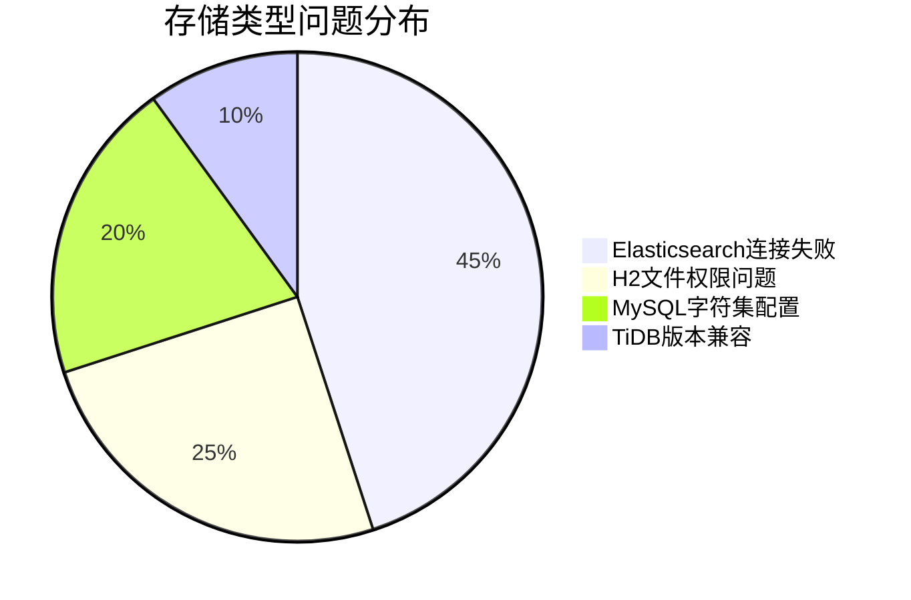
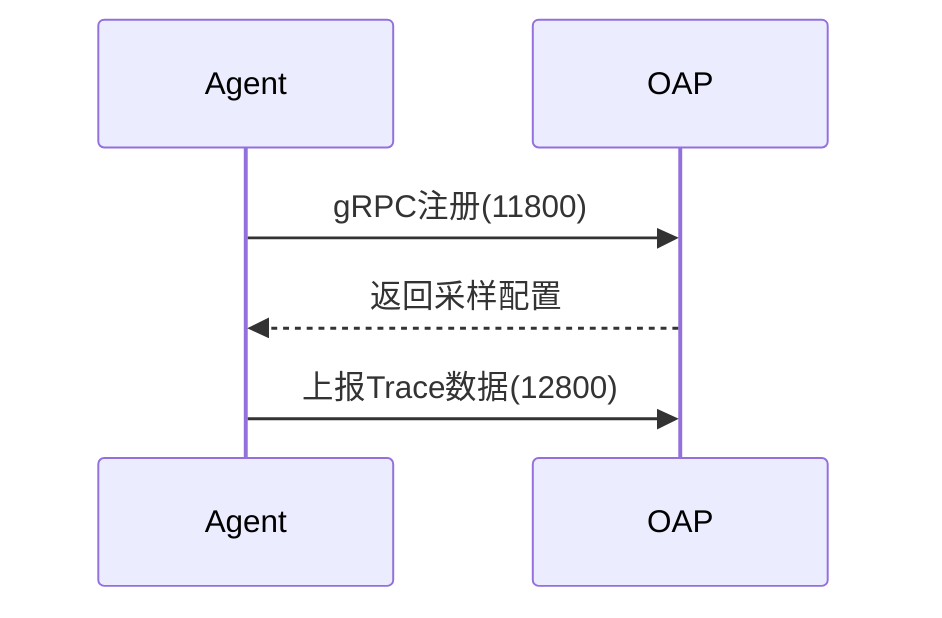

## 介绍

SkyWalking作为分布式系统的APM工具，在运维过程中可能会遇到配置错误、存储异常、性能瓶颈等问题。本章将系统讲解这些常见问题的现象、排查思路和解决方案，帮助初学者快速定位并处理运维故障。

## 常见问题分类

### 1. 服务启动失败

#### 现象
- OAP服务无法启动
- WebUI无法连接后端
- 日志报端口冲突或配置错误

#### 解决方案
```bash
# 检查端口占用（默认11800/12800）
netstat -tulnp | grep 11800

# 验证配置文件（以application.yml为例）
cat config/application.yml | grep -A 5 "core"
```

典型配置问题示例：
```yaml
# 错误配置（缩进错误）
storage:
  elasticsearch:
nameSpace: ${SW_NAMESPACE:""}
    clusterNodes: ${SW_STORAGE_ES_CLUSTER_NODES:localhost:9200}

# 正确配置
storage:
  elasticsearch:
    nameSpace: ${SW_NAMESPACE:""}
    clusterNodes: ${SW_STORAGE_ES_CLUSTER_NODES:localhost:9200}
```

:::caution 注意
YAML文件对缩进敏感，建议使用2空格缩进（不要用Tab）
:::

### 2. 数据存储异常

#### 存储类型对比



#### 典型错误处理
```bash
# Elasticsearch连接问题检查
curl -XGET 'http://localhost:9200/_cluster/health?pretty'

# 输出应包含：
{
  "cluster_name" : "elasticsearch",
  "status" : "green",
  ...
}
```

:::note 存储配置要点
- Elasticsearch：检查`clusterNodes`和`nameSpace`
- MySQL：确保使用`utf8mb4`字符集
- H2：保证数据目录可写权限
:::

### 3. 性能问题排查

#### 性能指标监控
| 指标                | 正常范围       | 异常处理建议          |
|---------------------|---------------|----------------------|
| CPU使用率           | `<70%`          | 检查采样率配置        |
| JVM堆内存           | `<80%` of `Xmx`   | 调整JVM参数          |
| 收集延迟            | `<5秒`          | 优化Agent配置        |

#### JVM调优示例
```bash
# 修改OAP启动参数（bin/oapService.sh）
export SW_OAP_JVM_OPTS="-Xms4G -Xmx4G -XX:+UseG1GC"
```

### 4. Agent连接问题

#### 通信架构


#### 常见错误
```log
ERROR 2023-01-01 12:00:00 SkyWalkingAgent : Failed to connect to backend...
```
处理步骤：
1. 检查网络连通性 `telnet oap-server 11800`
2. 验证Agent配置 `agent.config`：
```properties
# 关键配置项
collector.backend_service=${SW_AGENT_COLLECTOR_BACKEND_SERVICES:127.0.0.1:11800}
```

## 真实案例

### 案例：K8s环境下的DNS解析问题

**现象**：<br />
Agent日志持续报"UnknownHostException"

**解决方案**：
```yaml
# Kubernetes Deployment配置示例
env:
- name: SW_AGENT_COLLECTOR_BACKEND_SERVICES
  value: "skywalking-oap.skywalking.svc.cluster.local:11800"
```

:::tip K8s环境建议
- 使用Service名称代替IP
- 配置readinessProbe检查OAP状态
:::

## 总结

通过本章学习，你应该能够：

✓ 诊断服务启动失败的根本原因<br />
✓ 解决存储相关的配置问题<br />
✓ 进行基本的性能调优<br />
✓ 排查Agent与OAP的通信故障

## 扩展练习

1. 故意修改`application.yml`缩进，观察启动错误
2. 模拟Elasticsearch宕机，记录OAP日志变化
3. 使用`jstat`命令监控OAP的GC情况

## 附加资源

- [SkyWalking官方故障排查指南](https://skywalking.apache.org/docs/)
- [Elasticsearch健康检查API文档](https://www.elastic.co/guide/en/elasticsearch/reference/current/cluster-health.html)