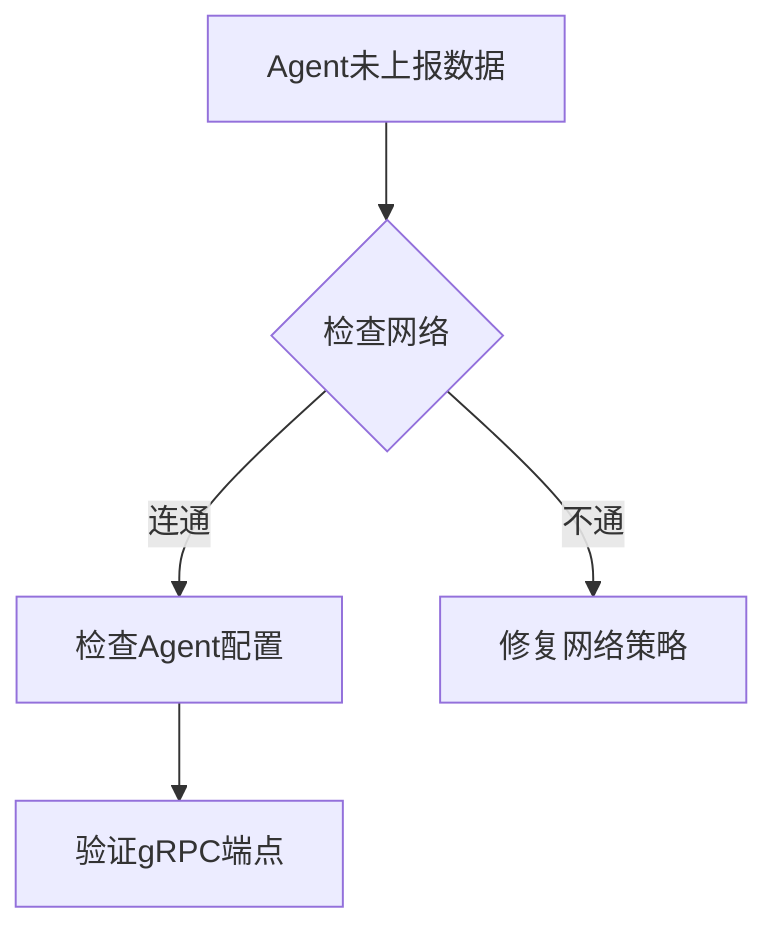

## 简介

SkyWalking作为分布式系统的APM工具，在运维过程中可能遇到数据采集异常、存储问题或UI显示错误等情况。本手册将系统性地介绍故障排查方法论，并通过实际案例演示如何快速定位和解决问题。

## 基础排查流程

### 1. 检查服务状态
使用以下命令确认各组件运行状态：
```bash
# 检查OAP服务
kubectl logs -f deployment/skywalking-oap

# 检查UI服务
curl http://localhost:8080/healthz
```

### 2. 日志级别调整
临时提升日志级别获取详细信息：
```yaml
# oap-server.yaml
receiver-sharing-server:
  default:
    logging:
      level: DEBUG
```

:::tip
建议在复现问题时动态调整日志级别，避免长期使用DEBUG模式影响性能
:::

## 常见问题分类

### 数据采集失败


典型错误示例：
```log
ERROR 2023-01-01 12:00:00 InstMethodsInter : No available gRPC server 
```

解决方案：
1. 确认Agent与OAP网络连通性
2. 检查`agent.config`中的`collector.backend_service`配置

### 存储异常
Elasticsearch连接问题处理步骤：
1. 检查OAP日志中的ES连接错误
2. 验证ES集群健康状态：
```bash
curl -XGET 'http://localhost:9200/_cluster/health?pretty'
```
3. 调整bulk处理参数（如出现`BulkProcessor`错误）

:::caution
存储空间不足会导致监控数据丢失，建议设置磁盘使用率告警
:::

## 实战案例

### 案例1：拓扑图缺失服务
**现象**：UI中部分服务未显示在拓扑图中<br />
**排查过程**：
1. 确认Agent已安装且无报错
2. 检查OAP服务的`receiver-service`日志
3. 发现存在`IllegalArgumentException`异常
4. 最终定位到服务名包含非法字符`@`

**解决方案**：
```java
// 修改服务命名规则
@Bean
public ServiceNameMappings serviceNameMappings() {
    return new ServiceNameMappings(Collections.singletonList("[^a-zA-Z0-9-]", "-"));
}
```

### 案例2：指标数据跳跃
**现象**：CPU监控图表出现异常峰值<br />
**根本原因分析**：
1. 排除真实流量波动
2. 发现OAP重启期间存在数据间隙
3. 确认metrics聚合策略配置

**优化配置**：
```yaml
core:
  default:
    enableDataKeeperExecutor: true
    dataKeeperExecutePeriod: 5
```

## 高级技巧

### 性能诊断工具
使用内置Profile功能分析慢请求：
1. 启用线程分析：
```bash
jcmd <OAP_PID> Thread.print
```
2. 生成火焰图：
```bash
async-profiler/profiler.sh -d 60 -f /tmp/flamegraph.html <OAP_PID>
```

### 内存泄漏排查
1. 定期检查堆内存：
```bash
jstat -gcutil <OAP_PID> 1000
```
2. 发现内存增长时触发堆转储：
```bash
jmap -dump:live,format=b,file=/tmp/heap.hprof <OAP_PID>
```

## 总结与资源

### 关键点回顾
- 掌握"从外到内"的排查顺序：网络 → 配置 → 代码
- 善用日志级别动态调整
- 建立基准性能指标用于对比

### 延伸学习
1. [SkyWalking官方故障排查指南](https://skywalking.apache.org/docs/)
2. 练习：搭建测试环境并模拟Agent断连场景
3. 推荐工具：Arthas、VisualVM

### 自我检查清单
- [ ] 能够解释OAP服务的健康检查机制
- [ ] 掌握至少三种日志过滤技巧
- [ ] 熟悉存储组件的监控指标