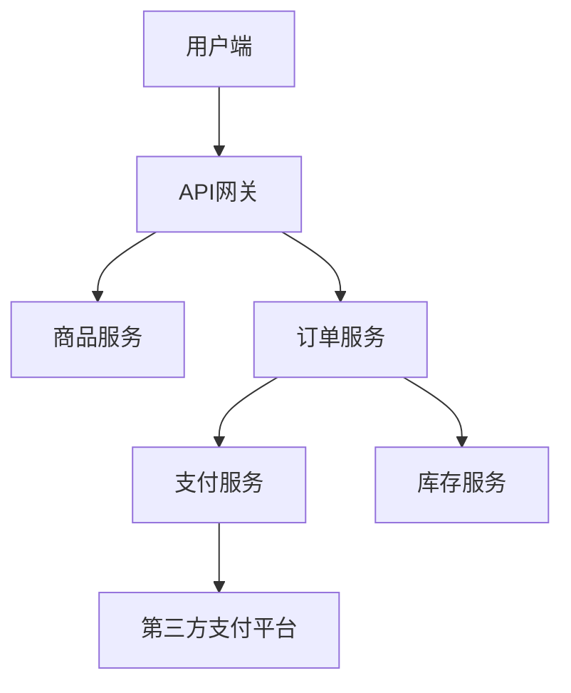
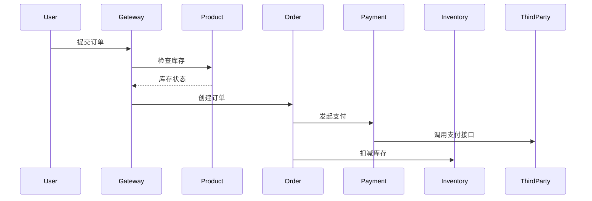
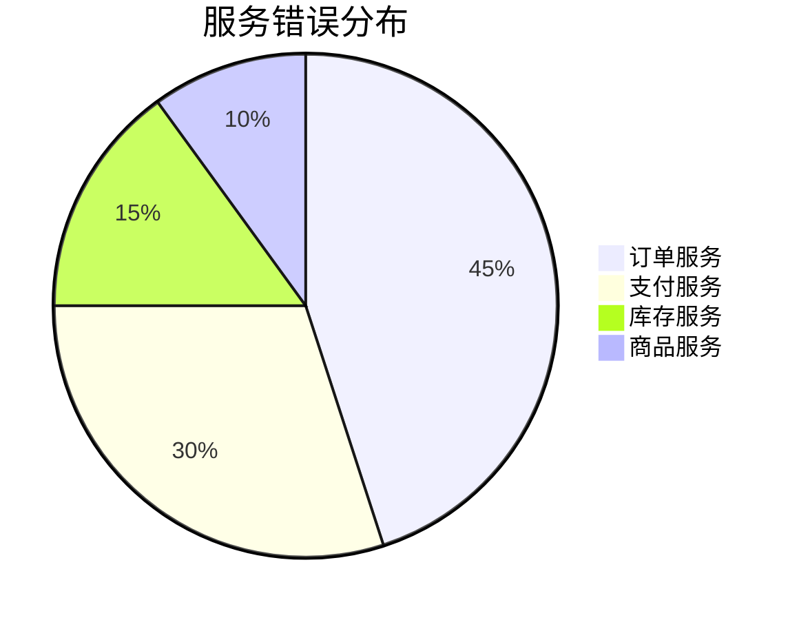

## 介绍

在本案例中，我们将模拟一个电商平台的监控场景，展示如何使用SkyWalking收集、分析和可视化关键性能指标。电商平台通常包含多个微服务（如订单服务、支付服务、库存服务等），是学习分布式系统监控的理想案例。

:::note 为什么选择电商平台？
1. 典型的多服务交互场景
2. 包含高并发和复杂调用链
3. 需要实时监控关键业务指标
:::

## 案例架构

我们的示例电商平台包含以下服务：



## 环境准备

### 1. 安装SkyWalking

```bash
# 下载SkyWalking
wget https://archive.apache.org/dist/skywalking/9.4.0/apache-skywalking-apm-9.4.0.tar.gz
tar -zxvf apache-skywalking-apm-9.4.0.tar.gz
cd apache-skywalking-apm-bin/

# 启动OAP服务
bin/oapService.sh
```

### 2. 配置Java Agent

为每个服务添加JVM参数：

```bash
-javaagent:/path/to/skywalking-agent.jar
-Dskywalking.agent.service_name=product-service 
-Dskywalking.collector.backend_service=localhost:11800
```

## 关键监控场景

### 场景1：订单创建链路追踪

当用户下单时，系统会依次调用：
1. 商品服务（检查库存）
2. 订单服务（创建订单）
3. 支付服务（处理支付）
4. 库存服务（扣减库存）

在SkyWalking UI中可以看到完整的调用链：



### 场景2：慢查询分析

假设支付服务响应变慢，我们可以：

1. 在拓扑图中发现支付服务节点变红
2. 查看端点响应时间百分位图
3. 分析相关日志和堆栈信息

```java
// 示例：支付服务中的慢SQL
@RestController
public class PaymentController {
    @GetMapping("/pay")
    public String pay(@RequestParam String orderId) {
        // 模拟慢查询
        List<Payment> payments = paymentRepository.findByOrderId(orderId); // 未加索引
        return "success";
    }
}
```

:::warning 性能陷阱
未优化的数据库查询是电商平台常见性能瓶颈，SkyWalking可以捕获：
- SQL执行时间
- 调用频率
- 错误率
:::

### 场景3：服务依赖分析

通过SkyWalking的拓扑图功能，我们可以发现：

1. 支付服务严重依赖第三方支付平台
2. 库存服务是订单服务的关键依赖
3. API网关是系统单点

## 告警配置示例

配置当订单失败率超过5%时触发告警：

```yaml
# alarm-settings.yml
rules:
  service_order_failure_rule:
    metrics-name: service_resp_time
    op: ">"
    threshold: 500
    period: 10
    count: 3
    silence-period: 5
    message: "订单服务响应时间超过500ms"
```

## 可视化仪表板

创建电商专属监控面板，包含：

1. 实时订单量
2. 支付成功率
3. 平均响应时间
4. 服务健康状态



## 总结

通过本案例，我们学会了：

1. 如何在电商环境中部署SkyWalking
2. 关键业务场景的监控方法
3. 性能问题的诊断流程
4. 自定义告警和可视化配置

## 扩展练习

1. 模拟高并发场景，观察SkyWalking的监控数据变化
2. 为商品服务添加自定义埋点，跟踪特定业务指标
3. 尝试配置企业微信/钉钉告警通知

## 附加资源

- [SkyWalking官方文档](https://skywalking.apache.org/docs/)
- [电商系统监控最佳实践](https://example.com/ecommerce-monitoring)
- [分布式追踪原理详解](https://example.com/distributed-tracing)