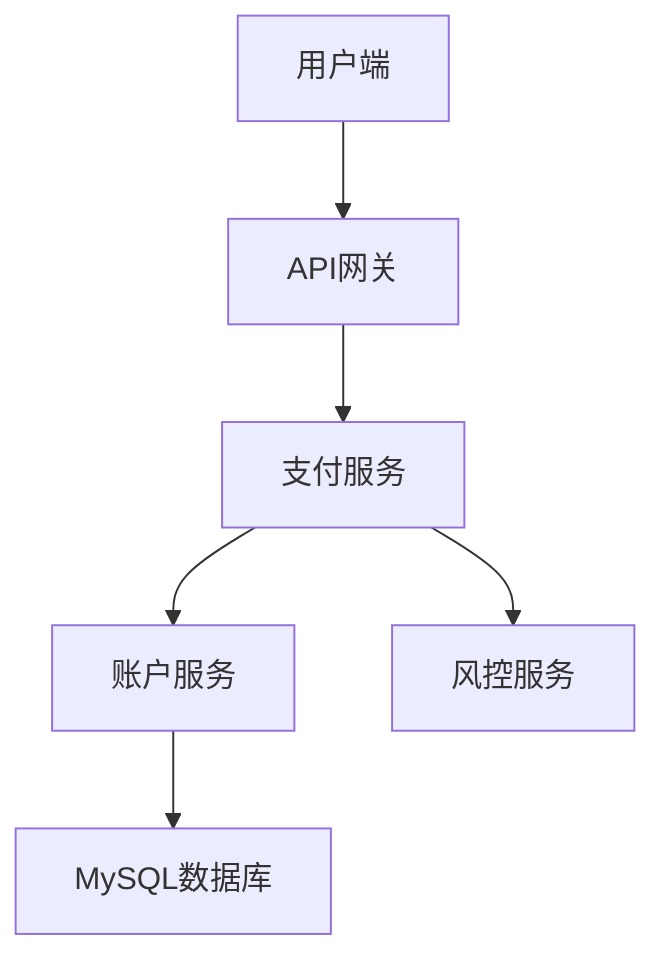
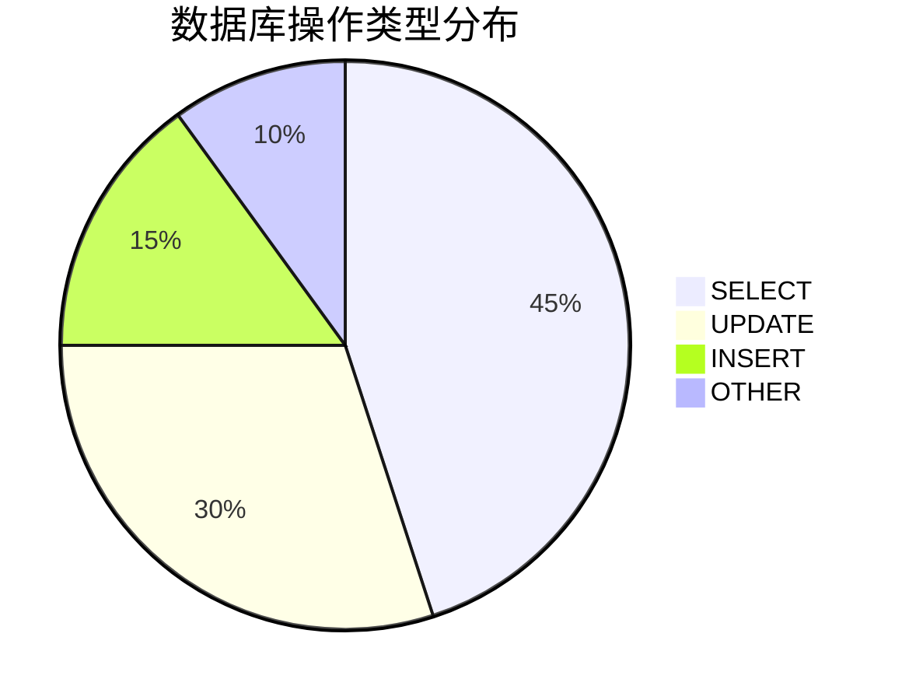

# SkyWalking 金融系统监控实践

## 引言

在金融系统中，高可用性和低延迟是核心需求。SkyWalking作为一款分布式系统监控工具，能够帮助开发者实时追踪交易链路、识别性能瓶颈，并快速定位异常。本章将通过一个模拟的金融支付系统案例，展示如何利用SkyWalking实现以下目标：

1. 端到端交易链路追踪
2. 数据库慢查询监控
3. 异常交易告警配置

## 案例背景

假设我们有一个简化的金融系统架构：



## 关键实践步骤

### 1. 部署SkyWalking Agent

在Java服务中通过Agent启动参数接入SkyWalking：

```bash
# 支付服务的启动命令示例
java -javaagent:/path/to/skywalking-agent.jar \
     -Dskywalking.agent.service_name=payment-service \
     -Dskywalking.collector.backend_service=127.0.0.1:11800 \
     -jar payment-service.jar
```

:::tip
对于金融系统，建议在测试环境验证Agent性能影响后再上生产环境
:::

### 2. 交易链路追踪

典型支付请求的Span信息示例：

```json
{
  "operationName": "/payment/create",
  "traceId": "3d7c1a5b-2e8f-4a6d...",
  "spans": [
    {
      "operationName": "MySQL/Account/updateBalance",
      "startTime": 1620000001000,
      "endTime": 1620000001500,
      "tags": {
        "db.type": "mysql",
        "db.instance": "account_db"
      }
    }
  ]
}
```

### 3. 配置告警规则

在SkyWalking OAP的`alarm-settings.yml`中添加金融特有规则：

```yaml
rules:
  payment_error_rate:
    metrics-name: endpoint_percent
    op: ">"
    threshold: 5
    period: 10
    count: 1
    silence-period: 5
    message: "支付服务错误率超过5%"
  slow_transaction:
    metrics-name: endpoint_avg
    op: ">"
    threshold: 2000
    period: 5
    message: "交易平均响应时间超过2秒"
```

### 4. 数据库监控实践

通过SkyWalking的JDBC插件捕获慢查询：

```java
// 原始代码
@Repository
public class AccountDao {
    @Autowired
    private JdbcTemplate jdbcTemplate;
    
    public void updateBalance(String accountId, BigDecimal amount) {
        jdbcTemplate.update(
            "UPDATE accounts SET balance = balance + ? WHERE account_id = ?",
            amount, accountId);
    }
}
```

在SkyWalking UI中可以看到生成的拓扑图和慢查询统计：



## 实际案例分析

**场景**：某次促销活动期间出现交易成功率下降

1. 通过SkyWalking发现风控服务平均响应时间从50ms飙升到1200ms
2. 追踪链路显示80%的延迟发生在风险评估接口
3. 进一步分析发现是第三方征信查询接口超时
4. 解决方案：
   - 增加征信查询缓存
   - 设置熔断超时时间

:::warning
金融系统监控要特别注意：
- 敏感数据脱敏
- 监控数据保留策略符合合规要求
- 生产环境使用加密通信
:::

## 总结与练习

### 核心收获
- SkyWalking可以可视化金融系统的服务依赖关系
- 通过TraceID可以快速定位故障点
- 自定义告警规则能提前发现潜在风险

### 扩展练习
1. 模拟一个分布式事务场景，观察SkyWalking的追踪效果
2. 尝试配置当账户余额变更失败时的告警规则
3. 使用SkyWalking的JVM监控功能观察服务内存使用情况

### 后续学习资源
- SkyWalking官方文档的Advanced Tracing章节
- OpenTelemetry金融行业最佳实践
- 分布式系统监控模式相关书籍