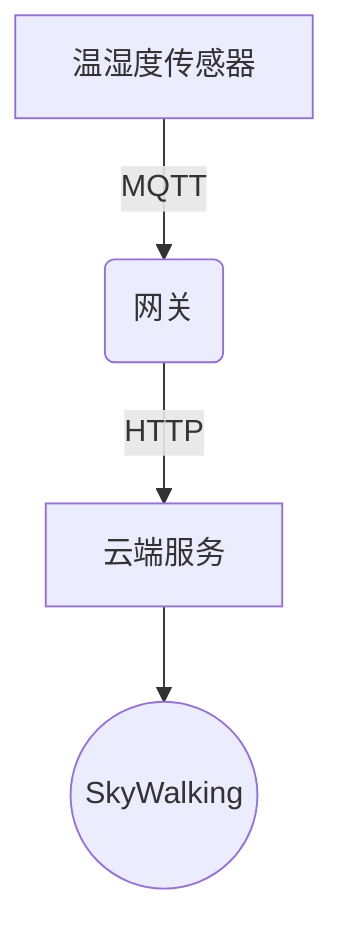

# SkyWalking 物联网应用监控

## 介绍

物联网(IoT)应用通常由大量分布式设备组成，这些设备生成海量数据并依赖实时通信。监控这类系统的性能、可用性和数据流至关重要。SkyWalking作为一款分布式系统监控工具，能够帮助开发者追踪IoT设备间的通信链路、分析性能瓶颈并确保系统稳定性。

在本章节中，你将学习：
- SkyWalking如何适配物联网场景
- 关键监控指标（如设备连接状态、消息吞吐量）
- 通过实际案例实现端到端监控

---

## 物联网监控的核心挑战

IoT系统通常面临以下监控难点：
1. **设备异构性**：不同协议（MQTT/CoAP/HTTP）和硬件规格
2. **网络不可靠**：高延迟、间歇性断连
3. **海量数据**：需处理设备生成的时间序列数据流

SkyWalking通过以下特性应对这些挑战：
- 支持多协议探针（如MQTT探针）
- 分布式追踪与指标聚合
- 动态服务拓扑映射

---

## 实战案例：智能农业监控系统

### 场景描述
假设一个基于MQTT协议的温室监控系统，包含：
- 50个温湿度传感器（每10秒上报数据）
- 1个中央控制网关（聚合数据并转发至云端）
- 云端分析服务（处理历史数据）

### 步骤1：部署SkyWalking探针

在网关服务中安装SkyWalking Java探针：
```bash
# 启动网关服务时附加探针
java -javaagent:/path/skywalking-agent.jar \
     -Dskywalking.agent.service_name=iot-gateway \
     -Dskywalking.collector.backend_service=127.0.0.1:11800 \
     -jar gateway.jar
```

### 步骤2：配置MQTT监控

创建自定义监控规则（`agent.config`）：
```properties
# 监控MQTT主题订阅/发布
plugin.mqtt.trace.topic_pattern=greenhouse/#
plugin.mqtt.ignore_topic=status/heartbeat
```

### 步骤3：验证数据上报

在SkyWalking UI中检查：
1. 服务拓扑图应显示设备→网关→云服务的连接
2. 指标面板应包含：
   - 消息吞吐量（条/分钟）
   - 端到端延迟（设备→云端）
   - 设备在线率



---

## 关键指标分析

在IoT场景中需特别关注：

| 指标                | 健康阈值       | 异常处理建议          |
|---------------------|----------------|-----------------------|
| 设备连接成功率      | `>98%`           | 检查网络信号强度      |
| 消息平均延迟        | `<500ms`         | 优化网关转发策略      |
| 数据包丢失率        | `<0.1%`          | 验证MQTT QoS等级      |

:::tip
使用SkyWalking的告警规则配置：
```yaml
rules:
  - name: high_device_disconnect_rate
    expression: endpoint_success_rate < 95%
    duration: 5m
    level: WARNING
```
:::

---

## 进阶：边缘计算场景

对于边缘节点离线运行的情况，SkyWalking支持：

1. **本地缓存**：探针在断网时暂存数据
2. **批量上报**：网络恢复后压缩传输历史数据
3. **轻量级分析**：通过OAP的`lal`脚本预处理原始数据

示例边缘节点配置：
```properties
agent.service_name=edge-node-${HOSTNAME}
agent.buffer_size=50000  # 本地缓存容量
```

---

## 总结

通过本案例你已学会：
- 在IoT系统中部署SkyWalking探针
- 监控MQTT等物联网专用协议
- 分析关键设备连接指标

### 扩展练习
1. 尝试为模拟的100个设备生成负载，观察SkyWalking的拓扑图变化
2. 配置当设备离线超过1小时时触发短信告警

### 延伸阅读
- [SkyWalking官方文档 - 自定义探针开发](https://skywalking.apache.org/docs/)
- 《物联网系统性能优化实战》第4章