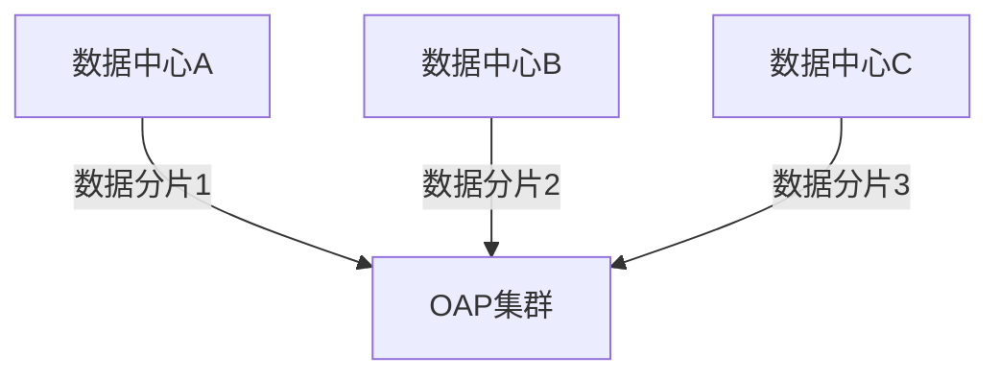

## 概述

在现代分布式系统中，服务往往部署在多个数据中心（Data Center）以实现高可用和低延迟。SkyWalking作为一款优秀的APM（应用性能监控）工具，提供了对多数据中心环境的监控支持。本章将介绍如何配置和使用SkyWalking监控跨数据中心的微服务架构。

:::note 什么是多数据中心监控？
当你的服务部署在多个地理位置独立的数据中心时，需要：
1. 统一收集各中心的监控数据
2. 建立跨中心的调用链路追踪
3. 实现全局的性能指标聚合
:::

## 核心概念

### 1. OAP集群部署模式
SkyWalking的OAP（Observability Analysis Platform）服务支持集群部署，关键配置包括：

```yaml
# cluster.yml 配置片段
cluster:
  selector: ${SW_CLUSTER:standalone}
  standalone:
  kubernetes:
    namespace: ${SW_KUBERNETES_NAMESPACE:default}
    labelSelector: ${SW_KUBERNETES_LABEL:app=collector,release=skywalking}
```

### 2. 数据分片策略
多数据中心场景推荐使用`Sharding`策略：



## 实战配置

### 案例1：跨数据中心链路追踪

假设我们有两个数据中心（DC1和DC2），各运行着相同的微服务：

1. **Agent配置**（以Java为例）：
```properties
# agent.config
agent.namespace=dc1_serviceA  # 数据中心标识
collector.backend_service=oap-server:11800
```

2. **OAP服务器配置**：
```yaml
# application.yml
receiver-sharing-server:
  default:
    acceptMultipleServers: true
    gRPCHost: ${SW_GRPC_HOST:0.0.0.0}
    gRPCPort: ${SW_GRPC_PORT:11800}
```

### 案例2：全局指标聚合

在`storage-elasticsearch.yml`中配置全局存储：

```yaml
storage:
  selector: ${SW_STORAGE:elasticsearch}
  elasticsearch:
    nameSpace: ${SW_NAMESPACE:""}
    clusterNodes: ${SW_STORAGE_ES_CLUSTER_NODES:elasticsearch:9200}
    indexShardsNumber: ${SW_STORAGE_ES_INDEX_SHARDS_NUMBER:3}  # 对应数据中心数量
```

## 实际应用场景

**电商平台多活架构**：
- 北京、上海、广州三地数据中心
- 订单服务调用库存服务可能跨数据中心
- 需要监控：
  - 跨中心调用延迟
  - 数据中心间网络质量
  - 区域性故障影响范围

:::tip 最佳实践
1. 为每个数据中心分配独立的服务组（Service Group）
2. 使用`EndpointRelation`分析跨中心调用
3. 设置差异化的告警阈值（如跨中心延迟允许更高）
:::

## 常见问题解决

**问题**：跨中心链路不完整<br />
**解决方案**：
1. 检查各数据中心NTP时间同步
2. 确认所有Agent使用相同的`traceIgnorePath`配置
3. 验证网络防火墙是否放行OAP通信端口

```bash
# 验证网络连通性示例
telnet oap-server 11800
```

## 总结与扩展

通过本章学习，你应该掌握：
- 多数据中心监控的核心配置方法
- 跨数据中心链路追踪的实现原理
- 全局性能指标的聚合策略

**扩展练习**：
1. 在本地用Docker模拟两个"数据中心"环境
2. 配置SkyWalking追踪服务跨容器调用
3. 在UI中观察跨"数据中心"的拓扑图

**进一步学习**：
- SkyWalking官方文档的[跨集群部署指南](https://skywalking.apache.org/docs/)
- 分布式追踪的[上下文传播协议](https://www.w3.org/TR/trace-context/)