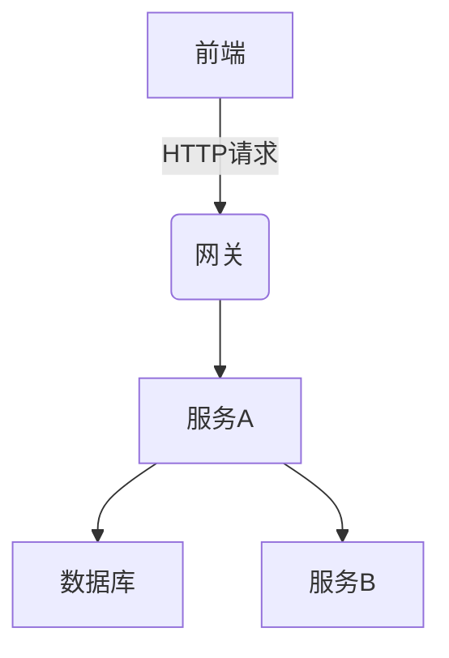

## 概述

SkyWalking是一款开源的**全栈分布式应用性能监控系统**，能够对微服务架构中的各个组件进行链路追踪、指标收集和可视化分析。本教程将通过实际案例演示如何实现从前端到后端的全栈监控，帮助初学者快速掌握核心概念。

## 核心概念

全栈监控需要覆盖以下层次：
1. **前端监控**：浏览器/移动端性能数据
2. **服务端监控**：微服务调用链路
3. **基础设施监控**：服务器/容器资源使用情况



## 环境准备

确保已安装：
- SkyWalking OAP Server 9.4+
- SkyWalking UI
- Java Agent（服务端）
- Browser Agent（前端）

## 实战案例：电商系统监控

### 1. 服务端监控配置

在Spring Boot应用的启动脚本中添加Java Agent：

```bash
java -javaagent:/path/to/skywalking-agent.jar \
     -DSW_AGENT_NAME=order-service \
     -DSW_AGENT_COLLECTOR_BACKEND_SERVICES=127.0.0.1:11800 \
     -jar your-app.jar
```

关键配置说明：
- `SW_AGENT_NAME`：服务名称
- `SW_AGENT_COLLECTOR_BACKEND_SERVICES`：OAP服务器地址

:::tip
通过`@Trace`注解可以手动标记需要追踪的方法：
```java
@Trace
public void processOrder(Order order) {
    // 业务逻辑
}
```
:::

### 2. 前端监控集成

在HTML中引入Browser Agent：

```html
<script src="https://cdn.jsdelivr.net/npm/skywalking-client-js@latest/lib/browser.js"></script>
<script>
    ClientMonitor.register({
        service: 'web-ui',
        pagePath: location.href,
        collector: 'http://127.0.0.1:12800'
    });
</script>
```

### 3. 监控数据验证

访问SkyWalking UI（默认`http://localhost:8080`），应该能看到：
- 服务拓扑图
- 链路追踪详情
- 前端性能指标

:::note 示例数据
```json
// 链路追踪片段
{
  "operationName": "/api/orders",
  "duration": 450,
  "spans": [
    {
      "operationName": "MySQL/orders/select",
      "duration": 120
    }
  ]
}
```
:::

## 高级配置

### 自定义追踪规则

在`agent.config`中添加：

```properties
# 忽略健康检查端点
trace.ignore_path=/health,/metrics
```

### 告警配置

示例规则（监控慢查询）：

```yaml
rules:
  - name: endpoint_slow
    expression: endpoint_slow > 1000
    message: 端点 {name} 响应时间超过1秒
```

## 真实案例解析

**场景**：某电商平台发现结账流程成功率下降

**排查过程**：
1. 通过拓扑图发现支付服务响应时间突增
2. 追踪链路显示数据库查询耗时增加300%
3. 结合基础设施监控确认数据库CPU饱和
4. 最终定位到未优化的促销查询SQL

## 总结

通过本案例我们学会了：
- 全栈监控的基本架构
- Java服务与前端监控的集成方法
- 基础告警规则配置
- 实际问题的排查思路

## 延伸学习

推荐练习：
1. 尝试在Docker环境中部署SkyWalking
2. 为你的Spring Boot应用添加自定义追踪点
3. 配置一个当HTTP 500错误率超过5%时触发的告警

官方资源：
- [SkyWalking文档](https://skywalking.apache.org/docs/)
- [客户端配置示例库](https://github.com/apache/skywalking)