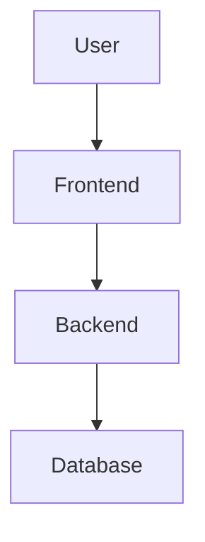

## 什么是可观测性平台？

可观测性（Observability）是现代分布式系统的重要特性，它通过**指标（Metrics）**、**追踪（Traces）**和**日志（Logs）**三大支柱，帮助开发者理解系统的内部状态。SkyWalking作为一款开源的APM（应用性能监控）工具，提供了完整的可观测性解决方案。

:::tip 关键概念
- **指标**：系统性能的量化数据（如CPU使用率、请求延迟）。
- **追踪**：请求在分布式系统中的调用链路。
- **日志**：系统运行时产生的文本记录。
:::

## 为什么选择SkyWalking？

SkyWalking的优势包括：
- 支持多语言（Java、Go、Python等）。
- 低侵入性，通过探针（Agent）自动采集数据。
- 提供可视化UI和强大的分析能力。

## 实战：搭建SkyWalking可观测性平台

### 步骤1：环境准备
假设我们有一个Spring Boot应用，需先部署SkyWalking后端（OAP Server）和UI。

```bash
# 使用Docker快速启动SkyWalking
docker run --name oap -d -p 11800:11800 -p 12800:12800 apache/skywalking-oap-server
docker run --name ui -d -p 8080:8080 --link oap:oap apache/skywalking-ui
```

### 步骤2：集成Java探针
下载SkyWalking Java Agent，并在启动应用时加载：

```bash
java -javaagent:/path/to/skywalking-agent.jar \
     -Dskywalking.agent.service_name=my-service \
     -Dskywalking.collector.backend_service=localhost:11800 \
     -jar my-app.jar
```

### 步骤3：验证数据采集
访问 `http://localhost:8080` 打开SkyWalking UI，查看服务拓扑图和追踪数据：



### 实际案例：电商系统监控
假设一个电商系统包含以下服务：
1. **用户服务**（User-Service）
2. **订单服务**（Order-Service）
3. **支付服务**（Payment-Service）

通过SkyWalking可以：
- 发现订单服务的高延迟问题。
- 追踪支付失败的调用链路。
- 监控各服务的JVM指标。

:::note 示例追踪数据
在UI中看到的追踪信息可能如下：
```
GET /order/create
├── POST /user/check (User-Service, 120ms)
└── POST /payment/process (Payment-Service, 500ms)
```
:::

## 高级功能

### 日志集成
在 `logback-spring.xml` 中添加SkyWalking的日志收集器：
```xml
<appender name="GRPC" class="org.apache.skywalking.apm.toolkit.log.logback.v1.x.log.GRPCLogClientAppender"/>
<root level="INFO">
    <appender-ref ref="GRPC"/>
</root>
```

### 告警配置
在SkyWalking的 `alarm-settings.yml` 中定义规则：
```yaml
rules:
  service_resp_time_rule:
    metrics-name: service_resp_time
    threshold: 1000
    op: ">"
    period: 10
```
当服务响应时间超过1秒时触发告警。

## 总结

通过本教程，你学会了：
1. SkyWalking可观测性平台的核心组件。
2. 如何集成Java应用与SkyWalking Agent。
3. 通过实际案例理解监控数据的价值。

## 延伸学习

- 官方文档：[Apache SkyWalking](https://skywalking.apache.org/)
- 练习：尝试为你的Python或Go项目添加SkyWalking支持。
- 思考：如何利用SkyWalking数据优化服务性能？