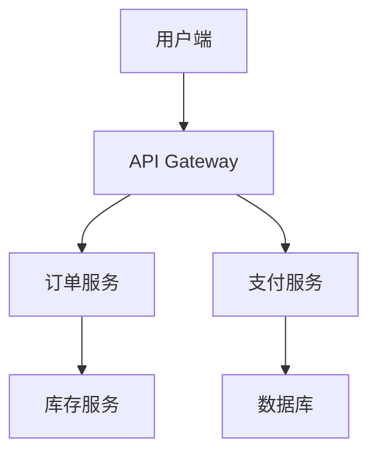

## 介绍

SkyWalking 是一款开源的 **应用性能监控（APM）** 工具，特别适合 **微服务架构** 的分布式系统监控。它能够帮助开发者追踪请求链路、分析性能瓶颈，并提供可视化界面展示服务拓扑、指标数据和告警信息。

在本章节中，我们将学习：
- SkyWalking 在微服务监控中的核心功能
- 如何部署和配置 SkyWalking 监控微服务
- 通过实际案例展示 SkyWalking 的应用

---

## 为什么需要微服务监控？

微服务架构将单体应用拆分为多个小型服务，虽然提高了灵活性和可扩展性，但也带来了以下挑战：
- **请求链路复杂**：一个用户请求可能涉及多个服务调用
- **故障排查困难**：问题可能出现在任何服务节点
- **性能分析复杂**：需要全局视角观察系统表现

SkyWalking 通过 **分布式追踪**、**指标收集** 和 **拓扑分析** 解决这些问题。

---

## SkyWalking 核心概念

### 1. 服务拓扑图

SkyWalking 自动生成服务间调用关系的可视化拓扑图：



### 2. 分布式追踪

记录请求在微服务间的完整路径：

```
用户请求 → API Gateway → 订单服务 → 库存服务 → 数据库
```

### 3. 指标监控

包括：
- 服务响应时间
- 错误率
- JVM/CPU 使用率
- 数据库查询性能

---

## 实战案例：监控Spring Cloud微服务

### 环境准备
1. 已安装 SkyWalking OAP Server 和 UI
2. Spring Cloud 微服务应用

### 步骤1：添加Agent依赖

在Spring Boot应用的启动脚本中添加SkyWalking Java Agent：

```bash
java -javaagent:/path/to/skywalking-agent.jar \
     -Dskywalking.agent.service_name=order-service \
     -Dskywalking.collector.backend_service=localhost:11800 \
     -jar order-service.jar
```

:::tip
`service_name` 需唯一标识你的服务，`backend_service` 指向SkyWalking OAP服务器地址。
:::

### 步骤2：验证数据采集

访问你的微服务，然后检查SkyWalking UI：
1. 在「拓扑图」页面应看到你的服务节点
2. 在「追踪」页面能看到请求链路

### 步骤3：分析性能指标

查看以下关键指标：
- 服务平均响应时间
- 慢查询追踪
- 错误请求统计

---

## 真实案例分析

### 场景：订单提交延迟

**现象**：用户反馈提交订单经常超时

**排查步骤**：
1. 在SkyWalking中查看「拓扑图」，发现订单服务到支付服务的调用链路变红（表示延迟高）
2. 查看「追踪」详情，发现支付服务的数据库查询耗时占80%
3. 优化SQL查询后，监控显示延迟降低60%


---

## 总结

通过本教程，你学会了：
- SkyWalking 如何解决微服务监控难题
- 如何集成SkyWalking到Spring Cloud应用
- 使用SkyWalking分析实际性能问题

---

## 扩展练习

1. 尝试在自己的Spring Cloud项目中集成SkyWalking
2. 模拟一个慢请求，观察SkyWalking如何显示该问题
3. 配置一个当错误率超过5%时的告警规则

---

## 附加资源

- [SkyWalking官方文档](https://skywalking.apache.org/docs/)
- [Spring Cloud与SkyWalking集成指南](https://spring.io/projects/spring-cloud-sleuth)
- [微服务监控最佳实践](https://microservices.io/patterns/observability/)