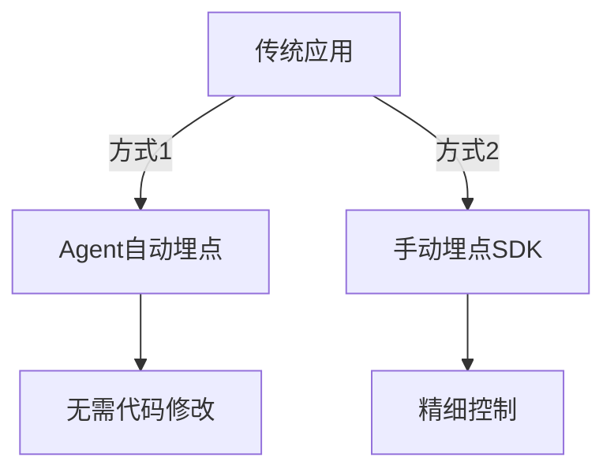

## 概述

SkyWalking作为现代化的APM（应用性能监控）工具，不仅能监控云原生应用，还能通过适当改造接入传统单体应用。本章将演示如何为未使用微服务架构的Java/Python应用添加SkyWalking支持，实现以下目标：

1. 请求链路追踪
2. JVM/运行时指标收集
3. 慢请求自动识别
4. 拓扑依赖关系可视化

:::note 传统应用定义
此处指未采用分布式架构、未设计可观测性的单体应用，通常具有以下特征：
- 直接连接数据库
- 未包含追踪ID传递逻辑
- 使用传统部署方式（如WAR包、物理机部署）
:::

## 改造方案对比

我们有两种主要接入方式：



## 方案一：Java Agent自动接入

### 环境准备

1. 下载SkyWalking Java Agent：
```bash
wget https://archive.apache.org/dist/skywalking/java-agent/8.16.0/apache-skywalking-java-agent-8.16.0.tgz
tar -zxvf apache-skywalking-java-agent-8.16.0.tgz
```

2. 启动参数配置（Tomcat示例）：
```bash
export CATALINA_OPTS="$CATALINA_OPTS -javaagent:/path/to/skywalking-agent/skywalking-agent.jar"
export SW_AGENT_NAME=legacy_order_system
export SW_AGENT_COLLECTOR_BACKEND_SERVICES=127.0.0.1:11800
```

### 效果验证

访问应用后，在SkyWalking UI中应能看到：

- 服务名称：`legacy_order_system`
- 自动捕获的HTTP端点（如`/order/create`）
- JVM指标（堆内存、GC次数等）

:::caution 注意事项
1. 确保Agent版本与OAP Server版本兼容
2. 旧框架（如Struts 1.x）可能需要额外插件
3. 自定义线程池需要特殊处理
:::

## 方案二：Python手动埋点

对于Python等脚本语言，我们使用SDK手动埋点：

```python
from skywalking import agent, config

config.init(
    agent_name='legacy_python_app',
    collector='127.0.0.1:11800',
)

agent.start()

# 关键业务函数监控
from skywalking.trace.context import get_context
from skywalking.trace.tags import Tag

def process_order(order_id):
    context = get_context()
    with context.new_entry_span(op='order_processing') as span:
        span.tag(Tag(key='order_id', val=order_id))
        
        # 原始业务逻辑
        print(f"Processing order {order_id}")
        
        # 数据库调用监控
        with context.new_exit_span(op='mysql_query', peer='mysql://127.0.0.1:3306'):
            execute_mysql_query(order_id)
```

### 监控数据解读

改造后可在SkyWalking看到：

1. **拓扑图**：显示应用与MySQL的关系
2. **追踪详情**：
   ```
   order_processing (200ms)
   └── mysql_query (150ms)
   ```
3. **指标面板**：显示函数调用次数与耗时百分位

## 实战案例：订单系统改造

### 背景

某传统订单系统出现以下问题：
- 无法定位慢查询根源
- 生产环境性能问题难以复现
- 缺少端到端追踪能力

### 改造步骤

1. **基础设施层**：
   ```bash
   # 所有节点添加Agent
   nohup java -javaagent:skywalking-agent.jar -jar order-system.jar &
   ```

2. **代码层增强**：
   ```java
   // 添加自定义追踪点
   @Trace(operationName = "inventory_check")
   public boolean checkInventory(String itemId) {
       ActiveSpan.tag("item_id", itemId);
       // ...原有逻辑
   }
   ```

3. **日志关联**（log4j2配置示例）：
   ```xml
   <PatternLayout pattern="%d [%X{tid}] %-5p %c{1}:%L - %m%n"/>
   ```

### 效果对比

| 指标         | 改造前       | 改造后          |
|--------------|-------------|----------------|
| 故障定位时间 | 4-6小时     | `<30分钟`        |
| 性能优化效率 | 无法量化     | 可精确到方法级  |
| 系统可观测性 | 仅基础指标   | 全链路追踪      |

## 总结与进阶

### 关键收获

- Agent方式适合快速接入现有系统
- SDK方式提供更灵活的监控能力
- 传统应用也能获得云原生级别的可观测性

### 扩展练习

1. 尝试为你的本地Spring Boot应用添加Agent监控
2. 使用`@Trace`注解标记关键业务方法
3. 在SkyWalking中设置针对慢查询的告警规则

### 常见问题解答

:::tip Q: 如何监控非HTTP协议的应用？
A: 可以通过实现`AbstractSpan`接口手动创建追踪上下文，或使用SkyWalking的Service Mesh方案。
:::

:::warning Q: Agent对性能的影响？
A: 生产环境测试表明，Agent会增加约3-5%的CPU开销，内存消耗增加约50MB。
:::