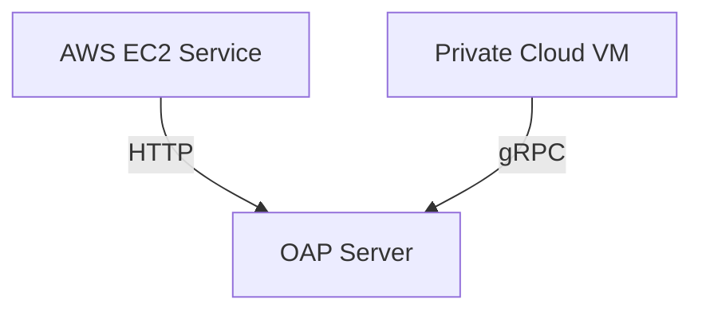

## 介绍

混合云环境结合了公有云和私有云的优势，但也带来了监控复杂性。Apache SkyWalking作为一个开源的APM（应用性能监控）系统，能够无缝监控跨云部署的服务。本章将介绍如何配置SkyWalking来监控混合云环境，并通过实战案例展示其核心功能。

---

## 核心概念

### 1. 混合云监控的挑战
- **网络异构性**：不同云服务商之间的网络延迟和协议差异。
- **数据一致性**：跨云服务的追踪数据需要统一收集和分析。
- **安全策略**：跨云通信需满足各平台的安全合规要求。

### 2. SkyWalking的解决方案
- **服务网格支持**：通过Service Mesh（如Istio）自动采集跨云服务指标。
- **多语言探针**：支持Java、Go、Python等语言的Agent，覆盖异构技术栈。
- **中心化存储**：使用Elasticsearch或H2存储所有环境的监控数据。

---

## 配置步骤

### 1. 安装SkyWalking后端
部署SkyWalking OAP（Observability Analysis Platform）服务器作为中心节点：

```bash
# 使用Docker快速启动OAP
docker run --name oap -e SW_STORAGE=elasticsearch -e SW_STORAGE_ES_CLUSTER_NODES=elasticsearch:9200 -p 11800:11800 -p 12800:12800 apache/skywalking-oap-server:9.4.0
```

### 2. 配置跨云Agent
在公有云（如AWS）和私有云的微服务中安装Agent：

```yaml
# agent.config示例（Java应用）
agent.service_name=public-cloud-service
collector.backend_service=${OAP_SERVER_IP}:11800
```

:::note
确保各云环境的Agent能访问OAP服务器的11800端口（gRPC协议）。
:::

### 3. 验证数据连通性
检查SkyWalking UI的拓扑图是否显示跨云服务：



---

## 实战案例：电商系统监控

### 场景描述
- **公有云**：AWS上的订单服务（Order-Service）
- **私有云**：本地数据中心的库存服务（Inventory-Service）

### 关键配置
1. **AWS Order-Service**：
   ```bash
   -javaagent:/path/skywalking-agent.jar -Dskywalking.agent.service_name=order-service
   ```

2. **私有云 Inventory-Service**：
   ```bash
   -javaagent:/path/skywalking-agent.jar -Dskywalking.agent.service_name=inventory-service
   ```

### 监控效果
在SkyWalking UI中可以看到：
- 跨云服务的调用链路（Trace）
- 各服务的P99延迟、错误率等指标
- 混合云拓扑图自动生成

:::tip
使用`Alarm`功能设置跨云延迟阈值告警：
```yaml
rules:
  - name: cross_cloud_latency
    threshold: "200ms"
    op: ">"
```
:::

---

## 总结

通过SkyWalking实现混合云监控的核心步骤：
1. 统一部署OAP中心节点
2. 在所有云环境中配置Agent
3. 通过Service Mesh或手动埋点采集数据
4. 在UI中分析跨云性能问题

---

## 扩展练习
1. 尝试在GCP和Azure的混合环境中部署SkyWalking
2. 使用`@Trace`注解手动追踪跨云方法调用
3. 配置Elasticsearch索引策略以优化存储成本

## 附加资源
- [SkyWalking官方文档 - 混合云部署](https://skywalking.apache.org/docs/)
- 《分布式系统观测性实战》第5章
