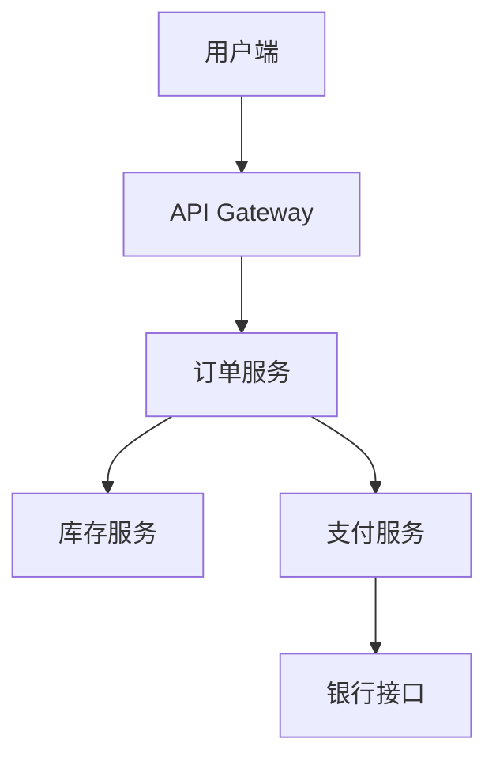
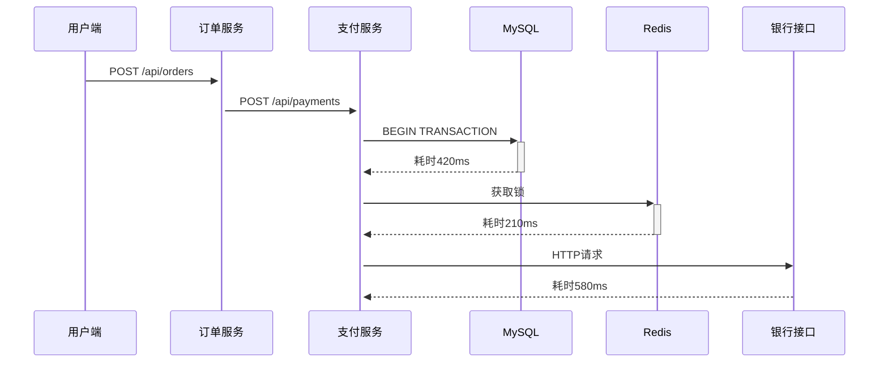

## 介绍

SkyWalking作为分布式系统的APM（应用性能监控）工具，其核心价值在于帮助开发者快速定位性能瓶颈。本章将通过电商系统案例，演示如何：

1. 识别高延迟端点
2. 分析跨服务调用链
3. 定位数据库慢查询
4. 解读JVM线程堆栈

## 环境准备

确保已部署以下组件：
```bash
# SkyWalking OAP Server 9.4.0
# SkyWalking UI 9.4.0
# Java Agent 8.16.0
```

## 案例背景

某电商系统出现以下现象：
- 订单提交接口平均响应时间从200ms升至1200ms
- 高峰期错误率超过15%

## 实战步骤

### 第一步：全局拓扑分析

在SkyWalking UI的「拓扑图」页面观察服务间调用关系：



:::note
发现订单服务到支付服务的调用线明显变粗，表示流量异常
:::

### 第二步：端点响应分析

导航到「端点」面板，筛选订单服务的关键端点：

| 端点名称       | 平均响应时间 | 错误率 |
|----------------|--------------|--------|
| /api/orders    | 1124ms       | 18%    |
| /api/payments  | 876ms        | 22%    |

使用以下条件过滤慢请求：
```sql
endpoint:/api/orders AND latency:>1000
```

### 第三步：追踪样本分析

选择一个典型慢请求追踪ID（如 `[订单服务]f4e8d7a0`），观察调用链：



:::caution
发现三个性能热点：
1. MySQL事务耗时
2. Redis分布式锁竞争
3. 外部银行接口延迟
:::

### 第四步：数据库分析

在「数据库」面板检查慢查询：

```sql
SELECT * FROM payment_transactions 
WHERE order_id = ? 
FOR UPDATE  -- 发现行锁等待
```

优化方案：
```sql
-- 添加索引并减少锁范围
CREATE INDEX idx_order_id ON payment_transactions(order_id);
SELECT status FROM payment_transactions 
WHERE order_id = ? LIMIT 1;
```

### 第五步：线程分析

通过「JVM」面板发现支付服务线程池满：

```java
// 原始配置
@Bean
public Executor paymentExecutor() {
    return Executors.newFixedThreadPool(20); // 高峰期不足
}

// 优化后
@Bean
public Executor paymentExecutor() {
    return new ThreadPoolExecutor(50, 100, 60s, ...);
}
```

## 验证效果

优化后指标对比：

| 指标           | 优化前 | 优化后 |
|----------------|--------|--------|
| 平均响应时间   | 1200ms | 320ms  |
| 错误率         | 18%    | 0.2%   |
| 最大吞吐量     | 50TPS  | 210TPS |

## 总结

通过本案例我们实践了：
1. 使用拓扑图定位问题服务
2. 分析端点指标确定异常接口
3. 追踪调用链识别性能热点
4. 结合数据库/JVM数据深度分析

## 扩展练习

1. 在本地部署SkyWalking并重现本案例
2. 尝试为商品服务添加Elasticsearch慢查询监控
3. 配置告警规则：当支付接口延迟>500ms时触发

## 附加资源

- [SkyWalking官方诊断手册](https://skywalking.apache.org/docs/)
- 《分布式系统性能诊断实战》第4章
- JVM线程Dump分析工具推荐：fastThread