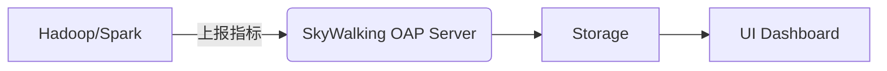
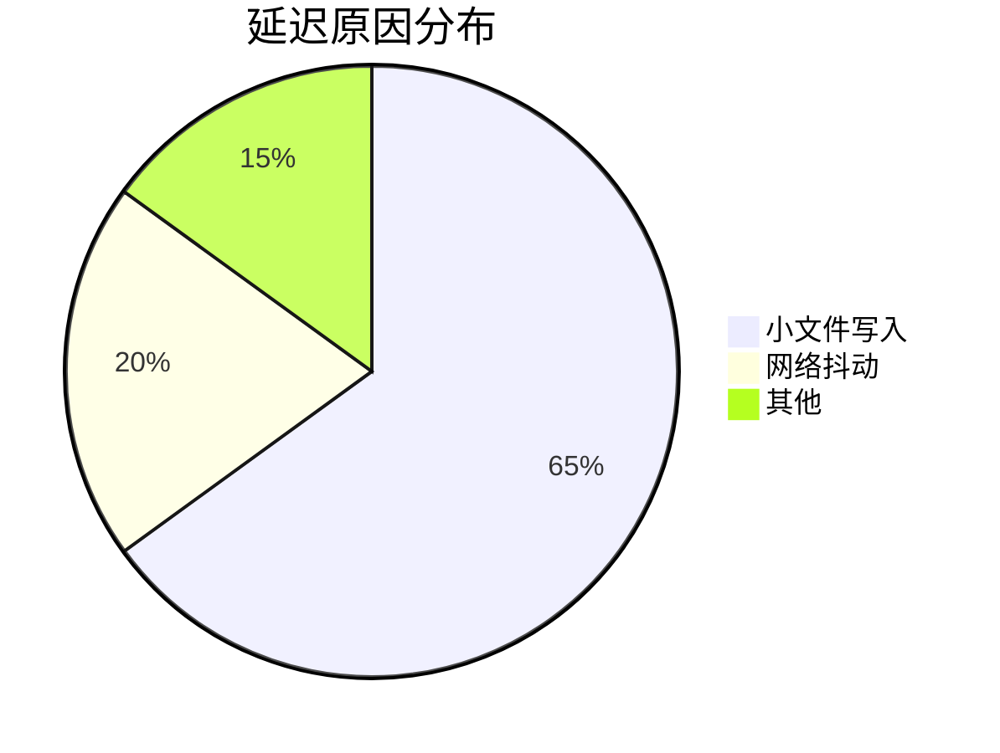

## 概述

SkyWalking作为一款开源的APM（应用性能监控）系统，不仅支持微服务架构的监控，还能扩展至大数据平台的观测。本章将介绍如何利用SkyWalking监控Hadoop、Spark等大数据组件的运行状态，包括指标采集、拓扑分析和告警配置。

:::note
**为什么需要监控大数据平台？**  
大数据组件通常分布式部署，传统日志排查效率低。SkyWalking的分布式追踪和指标聚合能力，能快速定位性能瓶颈。
:::

## 核心概念

### 1. 监控架构



- **数据采集**：通过SkyWalking Agent或OpenTelemetry Collector获取大数据组件的JMX指标。
- **存储分析**：OAP服务器处理指标和链路数据，存储至Elasticsearch/H2。
- **可视化**：通过Web UI展示集群健康状态、慢查询等。

### 2. 关键指标

| 组件       | 监控指标示例                     |
|------------|----------------------------------|
| Hadoop HDFS | 可用空间、DataNode活跃数         |
| Spark      | Executor内存使用、Task失败率     |

## 实战案例：监控Spark作业

### 步骤1：部署SkyWalking Agent

在Spark提交脚本中添加Agent参数：

```bash
spark-submit \
--conf "spark.driver.extraJavaOptions=-javaagent:/path/skywalking-agent.jar" \
--conf "spark.executor.extraJavaOptions=-javaagent:/path/skywalking-agent.jar" \
your_spark_job.py
```

### 步骤2：配置指标采集

修改SkyWalking `application.yml`，启用Spark JMX采集：

```yaml
receiver-jvm:
  default:
    slowSqlThreshold: 1000
    collectMetric: true
```

### 步骤3：查看监控结果

在SkyWalking UI中可观察到：
- **拓扑图**：Spark Driver与Executors的通信关系
- **指标面板**：JVM内存、GC次数、任务耗时百分位

:::tip
使用**Service Instance Dependency**视图，可直观发现Executor节点间的数据倾斜问题。
:::

## 真实场景：HDFS慢操作分析

**问题现象**：某Hadoop集群出现周期性响应延迟。

**排查步骤**：
1. 在SkyWalking中筛选HDFS服务，发现NameNode RPC延迟突增。
2. 追踪关联链路，定位到某Spark作业频繁写入小文件。
3. 通过**Heatmap**功能确认延迟集中在特定时间段。



## 总结与扩展

### 关键收获
- SkyWalking通过JMX/API集成大数据组件监控
- 结合拓扑与指标快速定位分布式问题

### 后续练习
1. 尝试为Flink作业配置SkyWalking监控
2. 设置当HDFS剩余空间低于10%时触发告警

### 扩展阅读
- [SkyWalking官方文档 - JVM监控](https://skywalking.apache.org/docs/)
- 《分布式系统观测实战》第6章