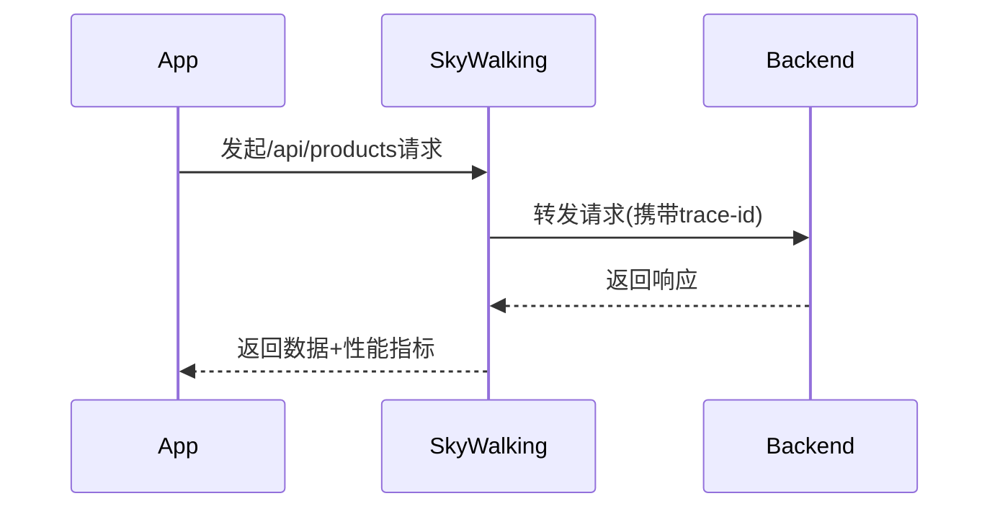

# SkyWalking 移动应用监控

## 介绍

SkyWalking不仅支持后端服务的分布式追踪和监控，还可以用于移动应用程序的性能监控。通过SkyWalking移动端SDK，开发者可以收集移动应用的性能指标（如启动时间、API调用延迟）、崩溃日志以及用户行为数据，帮助优化用户体验并快速定位问题。

:::note
移动监控与后端监控的主要区别：
- 网络环境复杂（蜂窝/Wi-Fi切换）
- 设备碎片化（不同厂商/OS版本）
- 用户交互事件需要特殊采集
:::

## 核心功能

1. **性能指标监控**：
   - 应用启动时间
   - 页面渲染耗时
   - HTTP请求跟踪

2. **异常监控**：
   - 崩溃堆栈收集
   - ANR（Application Not Responding）检测

3. **用户行为分析**：
   - 关键操作路径追踪
   - 自定义事件打点

## 配置指南

### Android集成示例

1. 添加依赖到`build.gradle`：
```groovy
dependencies {
    implementation 'org.apache.skywalking:apm-android-sdk:8.12.0'
    implementation 'org.apache.skywalking:apm-android-plugin:8.12.0'
}
```

2. 初始化SDK（在`Application`类中）：
```kotlin
class MyApp : Application() {
    override fun onCreate() {
        super.onCreate()
        SkyWalking.agent.start(
            Config().apply {
                serviceName = "your-mobile-app"
                collectorUrl = "http://your-skywalking-server:12800"
            }
        )
    }
}
```

### iOS集成示例

1. 添加CocoaPods依赖：
```ruby
pod 'SkyWalkingSDK', '~> 8.12.0'
```

2. Swift初始化代码：
```swift
import SkyWalkingSDK

SkyWalkingAgent.start(
    config: SKConfig(
        serviceName: "ios-weather-app",
        collectorAddress: "http://your-skywalking-server:12800"
    )
)
```

## 实战案例

### 场景：电商APP性能优化

**问题现象**：
- 商品详情页加载缓慢（平均2.8秒）
- 支付流程中30%的用户放弃操作

**SkyWalking解决方案**：

1. 标记关键代码段：
```java
// Android示例
Span span = SkyWalking.agent.tracer()
    .createSpan("ProductDetailRender");
try {
    loadProductData(); // 实际业务逻辑
} finally {
    span.tag("product_id", productId);
    span.finish();
}
```

2. 监控HTTP请求（自动拦截）：


3. 分析结果：
   - 发现图片加载占用65%的渲染时间
   - 支付API平均响应时间达1.2秒

**优化效果**：
- 详情页加载时间降至1.2秒
- 支付完成率提升22%

## 数据可视化

SkyWalking UI中移动监控的关键面板：

1. **设备分布看板**：
   - 按OS版本、厂商、地区的性能对比

2. **慢交互追踪**：
   ```mermaid
   pie title 慢交互原因分布
       "网络延迟" : 45
       "主线程阻塞" : 30
       "图片解码" : 15
       "其他" : 10
   ```

3. **崩溃分析**：
   - 堆栈聚类
   - 发生路径重现

## 最佳实践

:::tip 移动监控建议
1. **采样率控制**：生产环境建议初始采样率10-20%
2. **敏感数据处理**：自动过滤用户密码等敏感字段
3. **离线缓存**：网络不可用时本地存储监控数据
4. **电量优化**：减少高频采集（如每秒位置更新）
:::

## 总结

通过SkyWalking移动应用监控，开发者可以：

- 获得端到端的全链路追踪能力（从移动端到微服务）
- 快速定位性能瓶颈和异常根源
- 基于数据驱动进行用户体验优化

## 扩展学习

1. **进阶主题**：
   - 混合开发框架监控（Flutter/React Native）
   - 与后端trace的关联分析
   - 自定义指标采集

2. **推荐练习**：
   - 在Demo应用中集成SDK并监控启动流程
   - 创建一个显示网络请求延迟的仪表盘
   - 模拟崩溃并分析SkyWalking中的报告格式

3. **问题排查**：
   - 如果数据未上报，检查`collectorUrl`是否可达
   - Android需确保未混淆监控相关类
   - iOS需要正确配置隐私权限