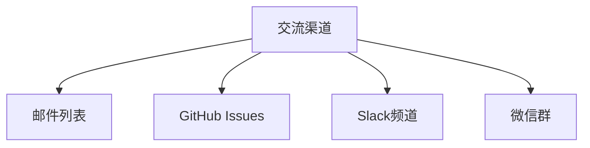
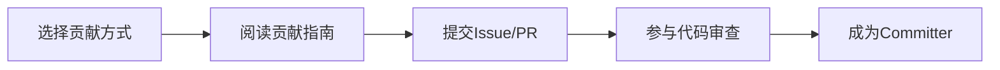

# SkyWalking 社区参与指南

Apache SkyWalking是一个功能强大的应用性能监控(APM)系统，拥有活跃的开源社区。本指南将帮助初学者了解如何参与社区贡献。

## 为什么参与社区？

参与开源社区可以：
- 提升技术能力
- 获得实战经验
- 结识行业专家
- 影响项目发展方向

:::tip
即使你是初学者，也可以通过文档改进、测试反馈等方式做出有价值的贡献！
:::

## 社区参与方式

### 1. 加入交流渠道

SkyWalking社区主要通过以下渠道交流：



- **邮件列表**: 订阅dev@skywalking.apache.org参与技术讨论
- **GitHub Issues**: 报告问题或提出功能建议
- **Slack**: 实时交流（加入链接在官网）

### 2. 提交Issue

遇到问题时，可以按以下格式提交Issue：

```markdown
**环境信息**:
- SkyWalking版本: v9.4.0
- 操作系统: Ubuntu 20.04
- Java版本: OpenJDK 11

**问题描述**:
详细描述你遇到的问题...

**重现步骤**:
1. 第一步操作
2. 第二步操作
3. 出现的问题

**期望行为**:
你认为应该发生什么...

**截图/日志**:
(如有)
```

:::caution
提交Issue前请先搜索是否已有类似问题
:::

### 3. 贡献代码

#### 准备工作

1. Fork项目仓库
2. 克隆到本地：
   ```bash
   git clone https://github.com/<your-username>/skywalking.git
   ```
3. 创建特性分支：
   ```bash
   git checkout -b fix/issue-number
   ```

#### 代码规范

SkyWalking遵循严格的代码规范：
- Java代码需通过Checkstyle检查
- 提交信息遵循[约定式提交](https://www.conventionalcommits.org/)
- 示例：
  ```java
  // 良好注释示例
  public class DemoClass {
      /**
       * 计算两个数的和
       * @param a 第一个加数
       * @param b 第二个加数
       * @return 两数之和
       */
      public int add(int a, int b) {
          return a + b;
      }
  }
  ```

### 4. 文档贡献

文档改进是初学者很好的切入点：
1. 找到文档中的错别字或过时信息
2. 提交Pull Request
3. 示例改进：
   ```diff
   - 旧版本说明...
   + 最新版本(v9.4.0)新增了以下功能...
   ```

## 实际案例

**案例1：文档翻译贡献**

1. 发现中文文档比英文版落后一个版本
2. 提交Issue说明情况
3. 认领翻译任务
4. 提交翻译PR

**案例2：Bug修复**

1. 使用中发现UI图表显示异常
2. 通过调试定位到前端组件问题
3. 提交包含修复代码的PR

## 社区行为准则

SkyWalking遵循Apache行为准则：
- 保持专业和友善
- 尊重不同意见
- 禁止任何形式的骚扰

:::warning
所有社区交流必须使用英文，这是Apache项目的统一要求
:::

## 总结

参与SkyWalking社区的步骤总结：



## 延伸资源

- [官方贡献指南](https://github.com/apache/skywalking/blob/master/docs/en/guides/README.md)
- [Apache贡献者指南](https://www.apache.org/dev/contributors.html)
- [GitHub协作教程](https://docs.github.com/en/get-started/quickstart/contributing-to-projects)

## 练习

1. 在GitHub上找到一个"good first issue"并尝试解决
2. 检查文档中是否有可以改进的部分并提交PR
3. 加入Slack频道并自我介绍

记住：每个贡献者都是从第一个PR开始的，不要害怕迈出第一步！