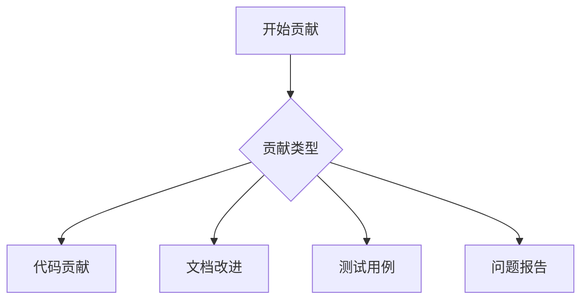

# SkyWalking 贡献流程

## 介绍

欢迎来到SkyWalking社区！作为一款开源的APM（应用性能监控）系统，SkyWalking依赖全球开发者的贡献来持续改进。无论你是想修复bug、添加新功能还是改进文档，参与开源贡献都是提升技能和回馈社区的好方式。本文将详细介绍从零开始参与SkyWalking贡献的完整流程。

:::tip 为什么贡献？
- 获得真实项目开发经验
- 学习顶尖开源项目的架构设计
- 与全球开发者协作
- 提升你的Git和代码评审技能
:::

## 准备工作

### 1. 环境配置
在开始贡献前，你需要：

1. 安装Git并配置账户：
   ```bash
   git config --global user.name "Your Name"
   git config --global user.email "your.email@example.com"
   ```

2. Fork项目仓库：
   - 访问 [SkyWalking GitHub仓库](https://github.com/apache/skywalking)
   - 点击右上角"Fork"按钮创建你的副本

3. 克隆本地仓库：
   ```bash
   git clone https://github.com/your-username/skywalking.git
   cd skywalking
   git remote add upstream https://github.com/apache/skywalking.git
   ```

### 2. 开发环境搭建
根据你要贡献的组件不同，可能需要：

- JDK 8+（核心组件）
- Maven 3.6+
- Node.js（UI组件）
- Docker（集成测试）

## 贡献流程详解

### 1. 选择贡献类型



### 2. 代码贡献步骤

#### 步骤1：创建分支
```bash
git checkout -b feature/your-feature-name
# 或
git checkout -b fix/issue-number
```

#### 步骤2：实现修改
保持代码风格一致，SkyWalking使用：
- Java：遵循Google Java Style
- 前端：遵循ESLint规则

#### 步骤3：提交变更
使用规范的提交信息：
```bash
git commit -m "[Feature] Add new metrics collector for Kafka"
# 前缀类型可以是: Feature, Fix, Docs, UI, Test等
```

#### 步骤4：推送到你的仓库
```bash
git push origin your-branch-name
```

#### 步骤5：创建Pull Request
1. 访问你的GitHub仓库页面
2. 点击"Compare & pull request"
3. 填写PR模板内容

:::warning 重要提示
确保你的分支基于最新的上游main分支：
```bash
git fetch upstream
git rebase upstream/main
```
:::

### 3. 代码审查流程

提交PR后，社区会进行：
1. **CI检查**：自动运行测试和代码质量检查
2. **Committer评审**：资深开发者提出改进建议
3. **迭代修改**：根据反馈更新代码
4. **合并**：通过后由Committer合并到主分支

## 实际案例：修复文档拼写错误

1. 在GitHub上发现文档错别字
2. 创建分支：
   ```bash
   git checkout -b docs/fix-typo
   ```
3. 修改文件并提交：
   ```bash
   git commit -m "[Docs] Fix spelling error in tracing-concepts.md"
   ```
4. 推送到你的仓库并创建PR

## 非代码贡献方式

1. **报告问题**：使用GitHub Issues模板
2. **回答问题**：在[社区论坛](https://github.com/apache/skywalking/discussions)帮助他人
3. **翻译文档**：参与本地化项目
4. **推广项目**：撰写教程或技术文章

## 总结

SkyWalking贡献流程主要步骤：

1. 准备开发环境
2. 选择贡献类型
3. 创建特性分支
4. 实现并提交变更
5. 创建Pull Request
6. 参与代码审查
7. 等待合并

:::note 社区礼仪
- 保持友好专业的沟通
- 及时响应评审意见
- 如果无法继续工作，请告知社区
- 尊重Apache软件基金会的行为准则
:::

## 扩展资源

1. [SkyWalking贡献者指南](https://github.com/apache/skywalking/blob/master/docs/en/guides/README.md)
2. [Apache贡献者手册](https://www.apache.org/dev/contributors.html)
3. [GitHub开源指南](https://opensource.guide/)

**练习建议**：
1. 尝试修复一个标记为"good first issue"的问题
2. 为SkyWalking文档添加一个使用示例
3. 在本地环境构建项目并运行测试套件