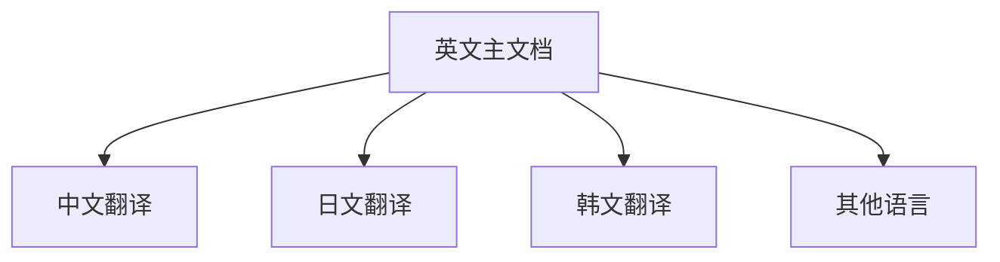

# SkyWalking 国际化支持

## 引言

SkyWalking作为一款全球广泛使用的应用性能监控(APM)工具，其国际化支持是项目成功的关键因素之一。国际化(i18n)不仅体现在界面语言上，更包含文档、社区协作和文化适配等多个维度。本文将带您全面了解SkyWalking如何构建全球化生态系统。

## 核心国际化特性

### 1. 多语言文档体系

SkyWalking官方文档支持多种语言，通过翻译团队维护不同语言版本：



:::tip 文档贡献提示
您可以通过GitHub的`i18n`目录参与翻译工作，每种语言对应独立的Markdown文件
:::

### 2. 本地化社区支持

SkyWalking在全球建立了多个区域社区：

- 中国社区(官方微信群/Slack频道)
- 日本用户组
- 欧洲时区交流群
- 北美Meetup小组

### 3. 国际化代码规范

代码中的日志和错误消息遵循i18n最佳实践：

```java
// 使用资源文件管理多语言消息
public enum ErrorMessages {
    SERVICE_NOT_FOUND("service.not.found", "Service {0} not found");
    
    private final String key;
    private final String template;
    
    // 资源文件示例 messages_zh_CN.properties
    // service.not.found=服务 {0} 未找到
}
```

## 实际应用案例

### 案例：跨国团队协作

某跨国电商公司使用SkyWalking监控其全球服务：
1. 中国团队阅读中文文档快速入门
2. 德国团队通过欧洲时区会议获得支持
3. 所有团队共享相同的监控指标术语体系

:::note 术语统一
SkyWalking维护了多语言的[术语表](https://skywalking.apache.org/docs/terms/)，确保不同语言文档中技术概念的一致性
:::

## 国际化最佳实践

1. **贡献翻译**：
   - 优先翻译README和核心概念文档
   - 保持专业术语的一致性

2. **文化适配**：
   ```python
   # 时间格式本地化示例
   def format_alert_time(alert, locale):
       if locale == 'zh_CN':
           return f"{alert.time:%Y年%m月%d日}"
       else:
           return f"{alert.time:%Y-%m-%d}"
   ```

3. **社区参与**：
   - 加入适合您时区的Slack频道
   - 关注本地化Meetup活动

## 总结

SkyWalking通过以下方式实现卓越的国际化支持：

- 分层级的文档翻译体系
- 区域化社区网络
- 代码级的i18n规范
- 术语一致性管理

## 扩展资源

1. [Apache本地化指南](https://www.apache.org/foundation/marks/pmcs#navigation)
2. [SkyWalking翻译工作流程](https://github.com/apache/skywalking-website/blob/master/docs/contribution/translate.md)
3. [i18n开发最佳实践](https://docs.oracle.com/en/java/javase/17/intl/internationalization.html)

## 练习建议

1. 尝试为SkyWalking文档贡献一个小节的翻译
2. 在本地环境中配置不同语言的SkyWalking UI
3. 查找并报告一个国际化相关的问题或改进建议