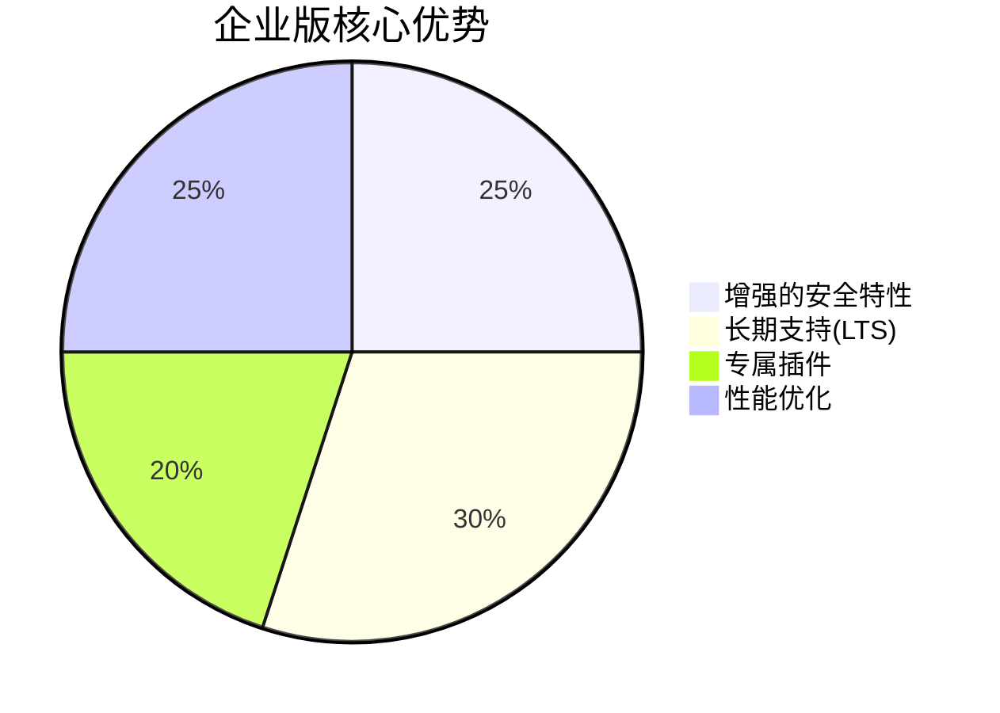

## 概述

Apache SkyWalking作为一款开源的APM（应用性能监控）工具，虽然社区提供了强大的免费支持，但在企业级生产环境中，许多用户可能需要更专业的商业支持。本章将介绍SkyWalking生态中的商业支持选项，帮助初学者理解如何根据需求选择合适的服务。

:::note 什么是商业支持？
商业支持通常包括：
- 专业的技术咨询
- 定制化开发
- 紧急问题响应
- 培训服务
- 托管运维
:::

## 主要商业支持选项

### 1. SkyWalking官方企业版

由SkyWalking核心团队提供的商业版本，提供增强功能和企业级支持：



典型服务包括：
- 7×24小时技术支持
- 定制化探针开发
- 私有化部署指导
- 性能调优服务

### 2. 云托管服务

多家云服务商提供SkyWalking托管方案：

| 提供商       | 服务特点                          | 适用场景              |
|--------------|-----------------------------------|-----------------------|
| 阿里云       | 深度集成ARMS                      | 阿里云生态用户        |
| Tencent Cloud| 与TKE容器服务整合                 | 腾讯云原生环境        |
| AWS          | 通过OpenTelemetry桥接             | 混合云环境            |

### 3. 第三方支持提供商

独立公司提供的支持服务，例如：

```text
示例支持套餐：
1. 基础支持包
   - 工作日8小时响应
   - 每月4小时咨询
   - 版本升级协助

2. 企业高级包
   - 24/7紧急支持
   - 专属技术经理
   - 年度健康检查
```

## 实际案例

### 案例1：电商平台的高可用需求

某跨境电商平台需要：
- 99.99%的监控系统可用性
- 黑色星期五期间的专项保障
- 与现有CI/CD流水线集成

**解决方案**：选择了官方企业版+云托管组合方案，获得：
- 专属的容量规划服务
- 大促期间的临时资源扩容
- 定制化的部署检查清单

### 案例2：金融机构的安全合规

某银行要求：
- 符合金融行业安全标准
- 审计日志保留3年以上
- 私有化部署支持

**解决方案**：采用经认证的第三方提供商，提供：
- FIPS 140-2兼容版本
- 专用存储优化方案
- 年度安全审计服务

## 如何选择适合的方案

考虑以下决策因素：

1. **技术需求**：
   ```mermaid
   graph TD
     A[需要定制功能?] -->|是| B[企业版/第三方]
     A -->|否| C[社区版+基础支持]
   ```

2. **预算范围**：社区版免费，企业版通常按节点/年限计费

3. **服务等级协议(SLA)**：评估所需的响应时间和解决时限

4. **现有技术栈**：检查与云平台或已有系统的兼容性

:::tip 选择建议
对于初学者，建议：
1. 从社区版开始学习
2. 生产环境先尝试基础商业支持
3. 随着业务增长逐步升级
:::

## 总结

SkyWalking的商业支持生态提供了从基础托管到全方位企业服务的多种选择。理解这些选项将帮助您：

- 更有效地规划监控系统架构
- 在关键时刻获得专业支持
- 确保关键业务的可观测性


:::caution 注意
商业支持的具体条款和服务内容可能随时间变化，建议直接联系提供商获取最新信息
:::