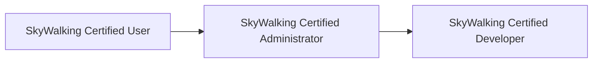

## 介绍

SkyWalking作为一款开源的分布式系统监控工具，拥有活跃的社区和丰富的学习资源。本章节将介绍如何利用官方及第三方培训资源，从入门到进阶系统化学习SkyWalking。

## 官方培训资源

### 1. 文档中心
SkyWalking官方文档是最权威的学习资料：
- **入门指南**：安装、配置和快速启动
- **高级特性**：服务拓扑分析、性能剖析、日志集成
- **API参考**：监控数据采集协议详解

:::tip
访问最新文档时，注意选择与您使用的版本匹配的文档分支。
:::

### 2. 视频教程
Apache SkyWalking官方YouTube频道提供：
- 功能演示（如使用`swctl`命令行工具）：
  ```bash
  # 查询服务响应时间百分位
  swctl --baseUrl=http://localhost:12800/metrics/percentile \
    --service=product-service --percentile=95
  ```
- 架构解析（如OAP集群部署）

## 社区资源

### 1. 在线课程
推荐平台：
- 极客时间《分布式监控实战》
- Udemy《Mastering Apache SkyWalking》

### 2. 技术博客
- SkyWalking PMC成员博客（如吴晟的博客）
- 社区贡献者的实战案例分享

## 认证路径

SkyWalking提供官方认证体系：


认证考试涵盖：
- 基础监控配置
- 自定义探针开发
- 性能调优实战

## 实战案例

### 电商系统监控示例
1. **场景**：追踪订单服务的跨服务调用链
2. **配置**：
   ```yaml
   # agent.config
   agent.service_name=order-service
   collector.backend_service=skywalking-oap:11800
   ```
3. **效果**：
   - 可视化服务依赖拓扑
   - 识别支付服务的性能瓶颈

:::caution
生产环境部署时，建议先在小规模测试环境验证配置。
:::

## 总结

| 资源类型       | 推荐内容                          | 适合阶段       |
|----------------|-----------------------------------|----------------|
| 官方文档       | 架构白皮书、配置手册              | 全阶段         |
| 视频课程       | 功能演示、案例复盘                | 入门到进阶     |
| 社区案例       | 企业落地实践                      | 进阶到专家     |

## 延伸学习

1. **练习建议**：
   - 在本地Docker环境部署SkyWalking + Spring Boot Demo
   - 尝试自定义告警规则
2. **推荐资源**：
   - GitHub `apache/skywalking` 源码学习
   - 每月社区线上Meetup

通过系统化学习这些资源，您将能够：
- 熟练部署和维护SkyWalking监控系统
- 开发定制化探针满足特殊场景需求
- 参与社区贡献成为Committer