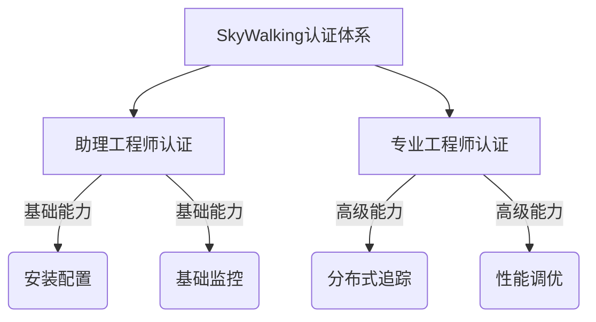

## 介绍

SkyWalking认证计划是由Apache SkyWalking社区推出的官方认证体系，旨在为开发者、运维人员和架构师提供标准化的能力验证途径。通过认证考试，参与者可以证明自己对SkyWalking的核心概念、部署实践以及高级功能的掌握程度。

:::tip 为什么需要认证？
- 为个人职业发展提供权威背书
- 帮助企业识别具备SkyWalking专业能力的人才
- 推动SkyWalking生态的标准化发展
:::

## 认证等级体系

SkyWalking认证目前分为两个级别：



### 1. 助理工程师认证（SWCA）
**目标群体**：初学者和运维人员  
**考核内容**：
- SkyWalking基础架构理解
- OAP Server和UI的部署
- 基础服务监控配置
- 告警规则设置

### 2. 专业工程师认证（SWCP） 
**目标群体**：有经验的开发者和架构师  
**考核内容**：
- 分布式追踪深度配置
- 跨进程/跨线程追踪
- 自定义探针开发
- 性能瓶颈分析

## 认证流程详解

### 报名准备
1. 访问[Apache SkyWalking官网](https://skywalking.apache.org)认证板块
2. 选择考试级别（建议初学者从SWCA开始）
3. 下载官方考试大纲和推荐学习资料

### 考试形式
- **线上考试**：通过指定平台完成
- **实操题占比**：SWCA 40%， SWCP 60%
- **时间限制**：SWCA 90分钟， SWCP 120分钟

## 典型考题示例

### SWCA级别示例
**题目**：配置SkyWalking监控Spring Boot应用  
**解决方案**：
```java
// 在application.properties中添加
skywalking.agent.service_name=your_service_name
skywalking.agent.backend_service=your_oap_server:11800
```

### SWCP级别示例 
**题目**：实现自定义Span标签注入  
**解决方案**：
```java
ContextManager.activeSpan().tag("custom_tag", "value");
```

## 实际应用案例

**场景**：某电商平台通过认证工程师优化SkyWalking部署  
**成果**：
- 追踪采样率从50%提升到80%
- 平均查询响应时间降低40%
- 通过自定义探针发现了支付服务的线程阻塞问题

:::warning 注意事项
- 认证考试需要提前预约
- 两次考试间隔不得少于30天
- 认证有效期2年，到期需重新认证
:::

## 学习路径建议

1. **基础阶段**（1-2周）：
   - 完成官方Quick Start教程
   - 部署单节点SkyWalking环境

2. **进阶阶段**（3-4周）：
   - 研究探针工作原理
   - 实践跨服务追踪配置

3. **冲刺阶段**（1周）：
   - 完成模拟试题
   - 参加社区答疑会

## 总结与资源

SkyWalking认证是进入可观测性领域的重要里程碑。通过系统化的学习和实践，开发者可以：

- 掌握现代APM系统的核心原理
- 获得解决实际监控问题的能力
- 加入全球SkyWalking专业人才网络

**推荐资源**：
- 官方文档：`/docs/en/certification-guide`
- GitHub实战仓库：`skywalking-certification-examples`
- 社区Slack频道：#certification-support

**下一步练习**：
1. 在本地环境完成SWCA模拟实验
2. 尝试为Nginx服务编写自定义探针配置
3. 参与社区认证讨论会