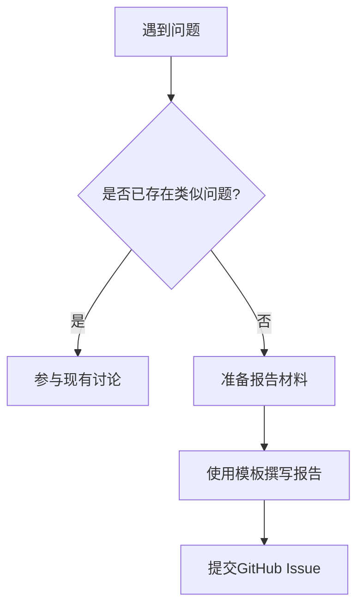

# SkyWalking 问题报告指南

## 引言

在参与开源项目时，遇到问题并不可怕，但如何高效地报告问题却是一门学问。本指南将教你如何向SkyWalking社区提交清晰、完整的问题报告，帮助维护者快速理解和复现问题，从而获得更快的解决方案。

## 为什么需要规范的问题报告？

一个优质的问题报告应该包含：
- **清晰的问题描述**：让他人一眼理解问题本质
- **可复现的环境信息**：包括版本、配置等关键数据
- **必要的日志和截图**：提供问题发生的直接证据
- **预期与实际行为的对比**：明确展示问题现象

:::tip 黄金法则
好的问题报告应该让维护者不需要追问额外信息就能开始排查！
:::

## 报告前的准备工作

1. **搜索现有问题**：在[GitHub Issues](https://github.com/apache/skywalking/issues)中搜索是否已有类似问题
2. **收集必要信息**：
   - SkyWalking版本号
   - 操作系统和环境信息
   - 相关组件的配置
3. **准备最小复现案例**：尝试精简问题场景到最小可复现代码

## 问题报告模板

```markdown
**问题描述**
[清晰简明地描述问题现象]

**环境信息**
- SkyWalking版本: [如8.4.0]
- 操作系统: [如CentOS 7.6]
- Java版本: [如OpenJDK 11]
- 其他相关组件版本: [如Spring Boot 2.5.0]

**复现步骤**
1. 第一步操作
2. 第二步操作
3. 出现问题的操作

**预期行为**
[描述你认为应该发生什么]

**实际行为**
[描述实际发生了什么]

**日志和截图**
[粘贴相关日志片段或上传截图]

**附加信息**
[任何其他可能有帮助的信息]
```

## 实际案例

**不良报告示例**：
```
SkyWalking不好用，我的服务监控不到！
```

**优质报告示例**：
```
**问题描述**
使用SkyWalking 8.4.0监控Spring Boot应用时，/metrics接口数据未上报。

**环境信息**
- SkyWalking版本: 8.4.0
- 操作系统: Ubuntu 20.04
- Java版本: OpenJDK 11.0.11
- Spring Boot版本: 2.5.0

**复现步骤**
1. 按照官方文档配置agent
2. 启动Spring Boot应用
3. 访问应用的/metrics接口
4. SkyWalking UI中无相应指标数据

**预期行为**
应用指标应出现在SkyWalking的Metric菜单中

**实际行为**
Metric菜单显示"No data"

**日志片段**
[这里粘贴agent日志中相关错误片段]

**附加信息**
已确认网络连通性正常，OAP服务日志无报错
```

## 使用GitHub提交问题

1. 访问[SkyWalking GitHub Issues](https://github.com/apache/skywalking/issues)
2. 点击"New issue"按钮
3. 选择问题类型（Bug/Feature/Question）
4. 使用上述模板填写详细信息
5. 提交前再次检查信息完整性



## 问题跟进与沟通

- 及时响应维护者的追问
- 如果问题解决，请关闭issue
- 如果自行解决了问题，分享解决方案
- 保持礼貌和专业的态度

:::caution 注意事项
1. 不要在同一issue中报告多个无关问题
2. 避免贴大段无关日志（只保留关键部分）
3. 不要期望即时响应（开源社区是志愿者驱动的）
:::

## 总结

规范的问题报告能显著提高问题解决效率。记住：
1. 先搜索再提问
2. 提供完整环境信息
3. 描述清晰复现步骤
4. 附上相关证据材料

## 延伸资源

- [SkyWalking官方问题报告指南](https://skywalking.apache.org/zh/contributing/issue-reporting-guide/)
- [如何提问的智慧](https://github.com/ryanhanwu/How-To-Ask-Questions-The-Smart-Way/blob/main/README-zh_CN.md)
- [GitHub Issues最佳实践](https://docs.github.com/en/issues/tracking-your-work-with-issues/creating-an-issue)