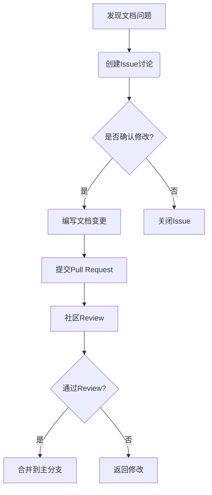

# SkyWalking 文档贡献

## 介绍

SkyWalking 是一个开源的分布式系统性能监控工具，其文档是社区协作的重要成果。文档贡献是新手参与开源项目的绝佳起点，不需要深入的技术背景即可为社区创造价值。本文将详细介绍如何为 SkyWalking 贡献文档。

## 文档结构概述

SkyWalking 文档采用 Markdown 格式编写，主要分为以下部分：

```
docs/
├── en/            # 英文文档
├── zh/            # 中文文档
├── images/        # 共享图片资源
└── config.yaml    # 多语言配置
```

:::tip
文档贡献者应同时更新英文和中文版本，若无法完成双语更新，至少需提供英文版本。
:::

## 贡献流程

### 1. 准备工作

1. 在 GitHub fork [SkyWalking 仓库](https://github.com/apache/skywalking)
2. 克隆仓库到本地：
   ```bash
   git clone https://github.com/<your-username>/skywalking.git
   ```

### 2. 文档编写规范

- 使用 **GFM** (GitHub Flavored Markdown) 语法
- 标题采用 `##` 二级标题开始（一级标题由页面自动生成）
- 代码块标注语言类型：
  ```java
  // 正确示例
  public class Demo {
    public static void main(String[] args) {
      System.out.println("Hello SkyWalking");
    }
  }
  ```

### 3. 提交变更

1. 创建特性分支：
   ```bash
   git checkout -b docs/add-new-feature-description
   ```
2. 提交变更并推送到你的 fork：
   ```bash
   git add docs/en/setup/README.md
   git commit -m "docs: add installation guide for Kubernetes"
   git push origin docs/add-new-feature-description
   ```
3. 在 GitHub 创建 Pull Request

## 实际案例：添加插件文档

假设我们要为新的 `spring-cloud-gateway` 插件添加文档：

1. 在 `docs/en/setup/README.md` 中添加插件说明：
   ```markdown
   ### Spring Cloud Gateway Plugin

   | 配置项 | 描述 | 默认值 |
   |--------|------|--------|
   | plugin.springcloudgateway.trace_headers | 需要跟踪的Header | `[]` |
   ```

2. 在 `docs/en/setup/backend-backend-list.md` 中添加插件支持矩阵：
   ```markdown
   | Spring Cloud Gateway | 3.1.0+ | 支持路由粒度的监控 |
   ```

:::note
所有表格类文档应保持一致的格式，使用 `|` 对齐列内容。
:::

## 文档质量检查

提交前请确保：

1. 执行拼写检查（推荐使用 `vale` 工具）
2. 验证所有链接有效性
3. 确保代码示例可运行（如适用）
4. 遵循 [Apache 写作风格指南](https://apache.org/foundation/marks/style/)



## 总结

通过本文，你已了解：

- SkyWalking 文档的基本结构和规范
- 文档贡献的标准流程
- 实际文档编写的最佳实践
- 质量检查要点

## 延伸资源

1. [SkyWalking 贡献指南](https://github.com/apache/skywalking/blob/master/docs/CONTRIBUTING.md)
2. [Apache 文档风格指南](https://apache.org/dev/contributors.html)
3. [Markdown 官方教程](https://commonmark.org/help/)

**练习建议**：尝试为 SkyWalking 文档中的某个模糊点提交改进建议，或翻译一段中文文档到英文。