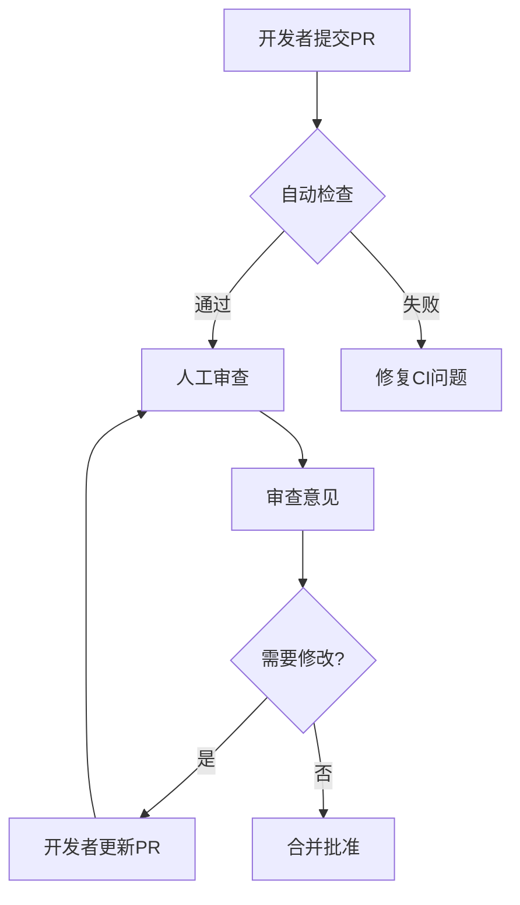

## 什么是代码审查？

代码审查（Code Review）是开源项目中保证代码质量的关键环节。在SkyWalking社区中，每个Pull Request（PR）都需要经过核心维护者的审查才能合并。规范的审查流程能帮助：
- 发现潜在缺陷
- 保持代码风格统一
- 传播项目知识
- 培养开发者协作能力

:::tip 初学者须知
即使你暂时不会参与审查他人代码，了解这些规范也能帮助你更顺利地通过自己PR的审查！
:::

## SkyWalking 审查核心原则

### 1. 基础检查项

```markdown
1. [ ] PR标题符合`[模块] 简短描述`格式（如`[OAP] Fix metrics calculation bug`）
2. [ ] 关联了对应的GitHub Issue
3. [ ] 没有包含无关文件变更
4. [ ] 新增代码覆盖率不低于80%
```

### 2. 代码风格规范

SkyWalking遵循以下编码约定：
- Java代码使用**Google Java Style**（通过`./mvnw checkstyle:check`验证）
- 前端代码使用**Prettier**格式化
- 日志必须使用项目约定的**Logger**对象：

```java
// 正确示例
private static final Logger LOGGER = LoggerFactory.getLogger(MyClass.class);

// 错误示例（直接使用System.out）
System.out.println("Debug info");
```

### 3. 测试要求

所有功能修改必须包含：
- 单元测试（JUnit/TestNG）
- 集成测试（当涉及模块间交互时）
- 更新后的文档测试（若影响配置或API）

```java
// 典型测试示例
@Test
@DisplayName("Should return correct segment duration")
public void testSegmentDurationCalculation() {
    TraceSegment segment = new TraceSegment("test");
    // ... 测试逻辑
    assertThat(segment.getDuration()).isEqualTo(100);
}
```

## 审查流程详解



### 实际案例解析

**场景**：某开发者提交了OAP集群通信的优化PR

```diff
// 修改前
- public void notify(List<RemoteInstance> instances) {
-     // 直接全量更新
-     this.instances = instances;
- }

// 修改后
+ public synchronized void notify(List<RemoteInstance> instances) {
+     // 增量更新逻辑
+     instances.forEach(instance -> {
+         if (!this.instances.contains(instance)) {
+             this.instances.add(instance);
+         }
+     });
+ }
```

**审查要点**：
1. 线程安全：添加了`synchronized`
2. 性能优化：改为增量更新
3. 需要补充：并发测试用例

## 常见审查问题

:::warning 高频问题
1. **资源泄漏**：未关闭的数据库连接、文件流等
2. **魔法数字**：未定义的常量值（如`if (status == 3)`）
3. **过度设计**：引入不必要的复杂模式
4. **测试不足**：边界条件未覆盖
:::

## 如何参与审查

初学者可以：
1. 从`good first issue`标记的PR开始学习
2. 使用`/approve`或`/request-change`评论时：
   ```markdown
   /approve 
   - 性能优化合理
   - 测试覆盖完整
   - 文档更新及时
   ```
3. 关注核心维护者（如@wu-sheng, @kezhenxu94）的审查意见

## 总结与资源

**关键收获**：
- 代码审查是质量保证而非个人批评
- 遵循`STAR`原则：Situation/Task/Action/Result
- 每次审查都是学习机会

**延伸学习**：
- [Google Engineering Practices](https://google.github.io/eng-practices/)
- [SkyWalking贡献指南](https://github.com/apache/skywalking/blob/master/docs/en/guides/README.md)
- [Effective Code Reviews视频教程](https://example.com/link-to-tutorial)

**练习任务**：
1. 在GitHub上找一个SkyWalking的`beginner-friendly`PR，尝试写出三条审查意见
2. 用checkstyle插件检查自己的Java项目
3. 为某个SkyWalking模块设计一个测试用例模板