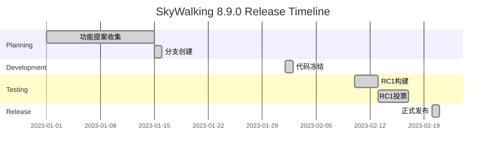

# SkyWalking 版本发布流程

## 介绍

Apache SkyWalking作为一款开源的APM（应用性能监控）系统，其版本发布遵循Apache软件基金会的严格流程规范。本指南将带你了解从版本规划到最终发布的完整生命周期，帮助贡献者理解如何参与版本迭代。

## 版本类型与周期

SkyWalking采用语义化版本控制（SemVer）规范：
- **主版本（MAJOR）**：不兼容的API变更
- **次版本（MINOR）**：向后兼容的功能新增
- **修订版本（PATCH）**：向后兼容的问题修正

典型发布周期为：
- 主版本：6-12个月
- 次版本：2-3个月
- 修订版本：按需发布（通常1-2周）

## 发布流程详解

### 1. 版本规划阶段

在开发者邮件列表发起讨论：
```text
[Discussion] SkyWalking 9.0.0 Release Planning
```

关键活动：
- 确定里程碑日期
- 收集功能提案（通过GitHub Issue标记为`feature-request`）
- 创建版本分支（如`release-v9.0.0`）

### 2. 代码冻结阶段

进入代码冻结后：
- 主分支仅接受严重bug修复
- 新功能合并需PMC（项目管理委员会）特批
- 每日构建验证版本稳定性

:::tip
冻结期通常持续2-4周，期间重点进行：
- 自动化测试（单元测试/集成测试）
- 性能基准测试
- 文档同步更新
:::

### 3. 发布候选（RC）阶段

生成发布候选包：
```bash
# 在发布分支执行
./mvnw clean install -Dcheckstyle.skip -Dmaven.test.skip=true
./mvnw -Prelease release:clean release:prepare
```

每个RC版本需要：
1. 至少72小时的投票期
2. 获得至少3个PMC成员+1票
3. 解决所有阻碍性bug（标记为`blocker`）

投票模板示例：
```text
[VOTE] Release Apache SkyWalking 9.0.0 RC1

+1 (binding)
+0 (non-binding)
-1 (必须说明原因)
```

### 4. 正式发布

通过投票后执行：
```bash
# 生成最终发布包
./mvnw -Prelease release:perform

# 上传至Apache SVN
svn co https://dist.apache.org/repos/dist/release/skywalking/
cp skywalking-9.0.0/* skywalking/
svn commit -m "Release Apache SkyWalking 9.0.0"
```

发布后操作：
- 更新官网下载链接
- 发送公告邮件
- 同步到Maven中央仓库

## 实际案例：8.9.0版本发布

时间线示例：


关键数据：
- 共产生2个RC版本
- 修复了34个JIRA issue
- 投票参与率：8个PMC成员+15个贡献者

## 总结与练习

### 核心要点
- 严格遵守Apache发布政策
- 每个版本必须经过社区投票
- 发布包需包含签名和校验文件

### 实践练习
1. 在本地尝试构建RC包：
   ```bash
   git clone https://github.com/apache/skywalking.git
   git checkout release-v9.0.0
   ./mvnw clean install -DskipTests
   ```
   
2. 验证发布包签名：
   ```bash
   gpg --verify apache-skywalking-9.0.0-src.tar.gz.asc
   ```

### 扩展资源
- [Apache发布指南](https://www.apache.org/dev/release-publishing.html)
- [SkyWalking Release SOP](https://github.com/apache/skywalking/blob/master/docs/en/guides/Release-guide.md)
- [参与投票的邮件列表归档](https://lists.apache.org/list.html?dev@skywalking.apache.org)