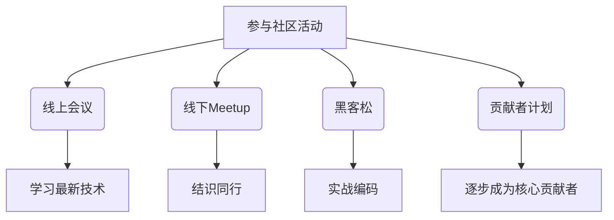

# SkyWalking 社区活动

## 介绍

SkyWalking 是一个开源的 **应用性能监控（APM）** 系统，其社区活动是开发者学习、交流和贡献的重要途径。通过参与社区活动，你可以了解最新动态、结识同行，甚至为项目做出贡献。本章将介绍 SkyWalking 社区的主要活动形式、参与方式以及实际案例。

## 社区活动类型

SkyWalking 社区活动主要包括以下几种形式：

1. **线上会议**：定期举办的开发者会议，讨论项目进展、技术分享等。
2. **线下Meetup**：地区性的技术交流活动，通常由社区成员组织。
3. **黑客松（Hackathon）**：限时编程活动，鼓励开发者提交代码或解决方案。
4. **贡献者计划**：针对新手的引导计划，帮助初学者逐步参与贡献。

:::tip
参与社区活动是快速提升技术能力的有效方式，同时也能扩展你的职业网络。
:::

## 如何参与线上会议

SkyWalking 社区通常通过 **Zoom** 或 **Google Meet** 举办线上会议，会议信息会在以下平台发布：

- [SkyWalking 官方邮件列表](https://lists.apache.org/list.html?dev@skywalking.apache.org)
- [GitHub Discussions](https://github.com/apache/skywalking/discussions)
- [Slack 或钉钉群组](https://skywalking.apache.org/community/)

### 示例：加入会议
1. 在邮件列表中查找会议邀请链接。
2. 点击链接加入会议（可能需要注册）。
3. 参与讨论或旁听。

## 贡献者计划

SkyWalking 提供了 **"Good First Issue"** 标签的任务，适合初学者参与。以下是参与步骤：

1. 访问 [SkyWalking GitHub 仓库](https://github.com/apache/skywalking)。
2. 筛选 `good first issue` 标签的任务。
3. 认领任务并提交 Pull Request（PR）。

### 代码示例：修复文档错别字
假设你发现文档中有一处拼写错误：

```markdown
# 原始文件（docs/README.md）
SkyWalking is a powerfull APM tool.

# 修改后
SkyWalking is a powerful APM tool.
```

提交 PR 后，社区会审核并合并你的修改。

## 实际案例：参与黑客松

2023年，SkyWalking 社区举办了一场以 **"插件开发"** 为主题的黑客松。参与者需要为 SkyWalking 开发一个自定义插件。以下是获胜项目的关键代码片段：

```java
// 示例：自定义 Trace 插件
public class CustomTracePlugin extends AbstractClassEnhancePluginDefine {
    @Override
    protected ClassMatch enhanceClass() {
        return byName("com.example.Service");
    }

    @Override
    public ConstructorInterceptPoint[] getConstructorsInterceptPoints() {
        return new ConstructorInterceptPoint[0];
    }

    @Override
    public InstanceMethodsInterceptPoint[] getInstanceMethodsInterceptPoints() {
        return new InstanceMethodsInterceptPoint[] {
            new InstanceMethodsInterceptPoint() {
                @Override
                public ElementMatcher<MethodDescription> getMethodsMatcher() {
                    return named("execute");
                }
                // 其他方法实现...
            }
        };
    }
}
```

该插件最终被合并到 SkyWalking 主分支，成为官方插件之一。

## 社区资源

- [SkyWalking 官网](https://skywalking.apache.org/)
- [GitHub 仓库](https://github.com/apache/skywalking)
- [Slack 频道](https://skywalking.apache.org/community/)



## 总结

SkyWalking 社区活动是学习和贡献的绝佳机会。无论是通过线上会议、贡献代码，还是参与黑客松，你都能从中获得成长。建议从 `good first issue` 开始，逐步深入项目开发。

## 练习与下一步

1. 订阅 SkyWalking 邮件列表，关注下一次会议时间。
2. 在 GitHub 上找一个 `good first issue` 并尝试解决。
3. 加入 Slack/钉钉群组，向社区成员自我介绍。

:::note
遇到问题时，不要犹豫，直接在社区渠道提问！SkyWalking 社区以友好和开放著称。
:::