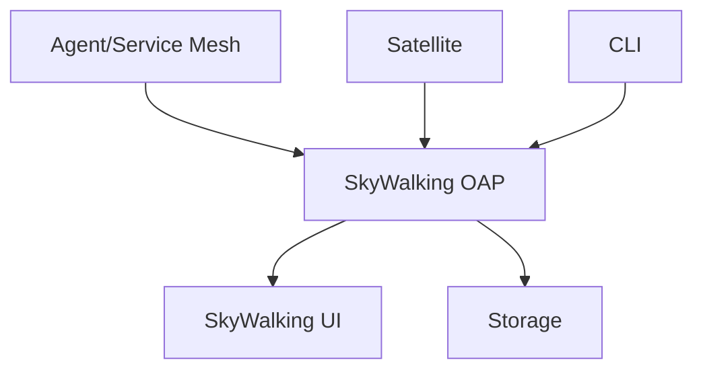
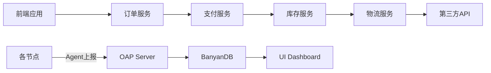

## 引言

Apache SkyWalking 是一个开源的应用程序性能监控（APM）和可观测性分析平台。其生态系统由多个相互关联的子项目组成，共同构建了从数据采集到分析展示的完整解决方案。本章将带您系统认识这些项目及其技术定位。

## 核心项目架构



## 主要生态项目详解

### 1. SkyWalking OAP (Observability Analysis Platform)

分布式系统的核心分析引擎，负责：
- 接收各类遥测数据（Traces, Metrics, Logs）
- 实时流式分析
- 数据持久化存储

:::tip 数据处理示例
当接收Span数据时，OAP会执行以下伪代码逻辑：
```java
public void analyze(Trace trace) {
    // 1. 解析Trace上下文
    ContextCarrier carrier = parse(trace); 
    // 2. 生成拓扑关系
    topologyBuilder.build(carrier); 
    // 3. 指标计算
    metricsAggregator.aggregate(trace);
}
```
:::

### 2. SkyWalking UI

现代可视化界面展示：
- 服务拓扑图
- 性能指标仪表盘
- 分布式追踪详情
- 告警管理

### 3. 探针体系

#### 语言探针
- **Java Agent**：无侵入式的字节码增强
- **其他语言SDK**：Python、Go、Node.js等

示例Java Agent启动命令：
```bash
java -javaagent:/path/skywalking-agent.jar \
     -Dskywalking.agent.service_name=your-service \
     -jar your-app.jar
```

#### Service Mesh探针
- Istio/Envoy数据适配器
- 服务网格拓扑发现

### 4. Satellite项目

轻量级Sidecar组件，用于：
- 边缘计算场景
- 数据预处理和转发
- 协议转换（如Prometheus到SkyWalking协议）

### 5. SkyWalking CLI

开发者工具集，提供：
- OAP数据查询
- 服务管理
- 诊断命令

示例查询服务拓扑：
```bash
swctl graph --service=payment-service --duration=-30m
```

## 生态系统扩展项目

### 1. SkyWalking Rover
eBPF技术实现的网络性能分析器，支持：
- 网络吞吐量监控
- TCP/UDP连接分析
- 无需代码修改的深度观测

### 2. SkyWalking BanyanDB
专为可观测性优化的时序数据库：
- 列式存储
- 高效压缩算法
- 原生支持多维度查询

### 3. SkyWalking Event Exporter
事件导出组件，支持：
- Kafka事件发布
- OpenTelemetry协议转换
- 自定义插件开发

## 实际应用案例

**电商系统监控方案**：
1. Java/Python微服务使用对应探针
2. Istio服务网格通过Adapter接入
3. Satellite聚合边缘设备数据
4. OAP集群处理所有遥测数据
5. UI展示全链路视图和业务指标



## 总结与进阶

SkyWalking生态系统通过模块化设计提供了完整的可观测性解决方案：

- **核心优势**：多语言支持、混合部署能力、高性能分析
- **典型组合**：OAP + UI + 语言探针 + BanyanDB
- **扩展场景**：K8s监控需配合Helm Chart，IoT场景使用Satellite

**推荐练习**：
1. 使用Docker Compose部署完整环境
2. 为Spring Boot应用接入Java Agent
3. 通过CLI查询服务响应时间百分位

**延伸阅读**：
- SkyWalking官方文档的"Architecture"章节
- Apache孵化器项目邮件列表
- 年度社区报告中的技术路线图