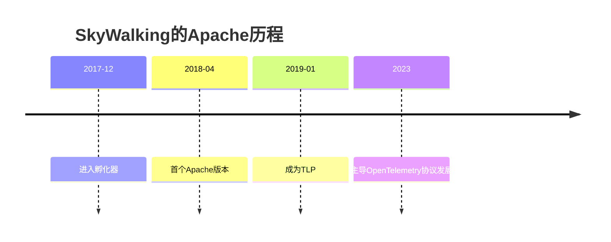

## 介绍

Apache SkyWalking 是一个开源的 **应用性能监控（APM）** 和 **分布式追踪系统**，2019年正式成为 [Apache软件基金会（ASF）](https://apache.org) 的顶级项目（Top-Level Project, TLP）。加入Apache基金会意味着SkyWalking遵循**社区驱动**的开发模式，并受益于基金会的治理框架和全球协作网络。

:::note 关键点
- Apache基金会提供中立的法律和财务支持
- 项目必须遵循「Apache Way」开发原则（社区胜于代码）
- 所有贡献者需签署CLA（贡献者许可协议）
:::

## SkyWalking 加入Apache的历程

### 孵化阶段（2017-2019）
1. **2017年12月**：项目进入Apache孵化器
2. **2018年4月**：发布首个Apache版本 v6.0.0-alpha
3. **2019年1月**：毕业成为顶级项目



## Apache基金会带来的变化

### 1. 开发流程规范化
- 使用 `gitbox` 进行代码管理
- 所有决策通过邮件列表公开讨论（dev@skywalking.apache.org）
- 版本发布需经过**投票流程**（至少3个+1投票）

### 2. 社区扩展
贡献者统计示例（通过GitHub API获取）：
```python
# 示例：获取贡献者统计
import requests
response = requests.get("https://api.github.com/repos/apache/skywalking/contributors")
print(f"当前贡献者数量: {len(response.json())}")
```

:::tip 实际案例
2023年SkyWalking社区：
- 来自12个国家的核心提交者
- 年度新增贡献者47人
- 邮件列表活跃度增长300%
:::

## 技术生态整合

### 与Apache项目的协作
| 关联项目       | 集成方式                     |
|----------------|-----------------------------|
| Apache ShardingSphere | 分布式事务追踪          |
| Apache Dubbo    | RPC调用链可视化             |
| Apache RocketMQ | 消息队列延迟监控            |

## 开发者如何参与

### 贡献流程
1. 签署[ICLA](https://www.apache.org/licenses/contributor-agreements.html)
2. 订阅开发邮件列表
3. 从「good first issue」开始贡献

```bash
# 克隆代码库（注意使用Apache镜像）
git clone https://github.com/apache/skywalking.git
```

## 总结

Apache基金会为SkyWalking提供了：
- 中立的治理结构
- 国际化的协作平台
- 可信的技术品牌背书

## 延伸资源
1. [Apache项目孵化指南](https://incubator.apache.org/)
2. [SkyWalking贡献指南](https://github.com/apache/skywalking/blob/master/docs/en/guides/README.md)
3. [ASF官方博客](https://blogs.apache.org/)

:::caution 注意
所有对Apache项目的贡献必须遵循ASF知识产权政策，代码/文档提交前需确认是否包含专利内容
:::