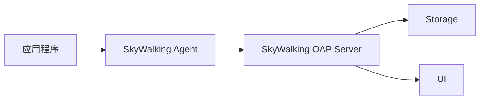

# SkyWalking Agent概述

## 介绍

SkyWalking Agent是Apache SkyWalking项目的核心组件之一，它是一个轻量级的代理（Agent），负责收集应用程序的性能数据并将其发送到SkyWalking后端进行分析和可视化。Agent通常以插件形式嵌入到目标应用中，无需修改应用代码即可实现监控功能。

SkyWalking Agent的主要特点包括：
- **无侵入性**：通过Java Agent技术实现，无需修改应用代码
- **低开销**：对应用性能影响极小（通常`<3%`）
- **多语言支持**：支持Java、.NET、Node.js等多种语言
- **插件化架构**：可根据需要启用或禁用特定插件

## 工作原理

SkyWalking Agent通过Java Agent机制在应用启动时加载，利用字节码增强技术（Bytecode Enhancement）在关键方法中插入监控代码。当这些方法被调用时，Agent会收集调用时间、参数等数据，并通过gRPC协议发送到SkyWalking OAP服务器。



## 核心功能

### 1. 分布式追踪
Agent会自动收集跨服务的调用链信息，帮助开发者理解请求在分布式系统中的流转路径。

### 2. 性能指标监控
收集JVM指标（CPU、内存、线程等）、HTTP请求指标、数据库调用指标等。

### 3. 拓扑分析
自动生成服务间的调用关系图，直观展示系统架构。

### 4. 告警
基于收集的指标数据，可以配置阈值告警规则。

## 安装与配置

### 基本安装
对于Java应用，只需在启动命令中添加Agent参数：

```bash
java -javaagent:/path/to/skywalking-agent.jar -Dskywalking.agent.service_name=your-service-name -jar your-app.jar
```

### 常用配置参数
| 参数 | 说明 | 示例值 |
|------|------|--------|
| `agent.service_name` | 服务名称 | `user-service` |
| `collector.backend_service` | OAP服务器地址 | `127.0.0.1:11800` |
| `logging.level` | 日志级别 | `DEBUG` |

:::tip 配置建议
生产环境建议将日志级别设置为`INFO`或`WARN`以避免过多日志输出影响性能。
:::

## 实际案例

### 案例1：监控Spring Boot应用
假设我们有一个Spring Boot应用，需要监控其HTTP接口性能：

1. 下载SkyWalking Agent包
2. 修改启动脚本：
   ```bash
   java -javaagent:/opt/skywalking/agent/skywalking-agent.jar \
        -Dskywalking.agent.service_name=order-service \
        -Dskywalking.collector.backend_service=skywalking-oap:11800 \
        -jar order-service.jar
   ```
3. 启动应用后，所有Controller方法的调用都将被自动监控

### 案例2：自定义追踪
除了自动监控，你也可以手动添加追踪点：

```java
try (Scope scope = ContextManager.createLocalSpan("validateOrder")) {
    // 业务逻辑
    ContextManager.activeSpan().tag("orderId", orderId);
} catch (Exception e) {
    ContextManager.activeSpan().errorOccurred().log(e);
}
```

## 性能考虑

虽然SkyWalking Agent设计为低开销，但仍需注意：
- 避免在高频方法上添加过多追踪点
- 合理设置采样率（通过`agent.sample_n_per_3_secs`配置）
- 定期检查Agent日志中的性能警告

:::caution 注意事项
在极端性能敏感场景下，建议先在测试环境评估Agent对应用性能的影响。
:::

## 总结

SkyWalking Agent作为分布式系统监控的关键组件，提供了强大而轻量级的监控能力。通过无侵入式的数据收集，开发者可以快速获得应用性能的全面视图，而无需修改业务代码。

## 扩展学习

- 官方文档：[SkyWalking Agent配置手册](https://skywalking.apache.org/docs/)
- 进阶主题：自定义插件开发
- 性能调优：采样策略与缓冲区配置

## 练习

1. 尝试在你的本地Java应用中集成SkyWalking Agent
2. 配置一个自定义标签（Tag）并观察其在UI中的展示
3. 实验不同的采样率设置，观察对性能和数据量的影响