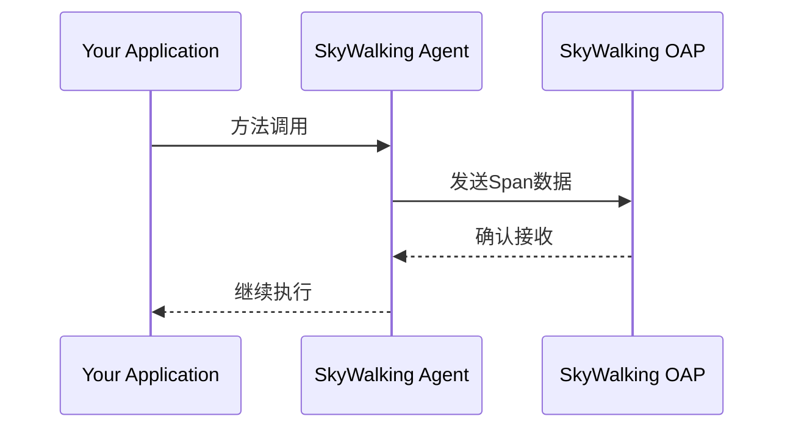

## 介绍

SkyWalking Java Agent是一种无侵入式的探针，通过字节码增强技术（Bytecode Enhancement）自动收集Java应用程序的性能数据和分布式追踪信息。它不需要修改源代码，只需在JVM启动时通过`-javaagent`参数加载即可生效。本章将详细介绍安装和配置过程。

:::note 核心特点
- **零代码侵入**：无需修改业务代码
- **低性能损耗**：通常增加小于3%的资源开销
- **多协议支持**：支持HTTP/gRPC上报数据
- **动态配置**：部分参数支持运行时热更新
:::

## 前置准备

在开始安装前，请确保：
1. 已安装JDK 8/11/17
2. 应用程序运行环境支持添加JVM参数
3. 已部署SkyWalking OAP服务（版本需与Agent匹配）

## 安装步骤

### 步骤1：下载Agent包

从[Apache SkyWalking官网](https://skywalking.apache.org/downloads/)下载对应版本的二进制包：

```bash
wget https://archive.apache.org/dist/skywalking/java-agent/{version}/apache-skywalking-java-agent-{version}.tgz
tar -zxvf apache-skywalking-java-agent-{version}.tgz
```

### 步骤2：配置Agent

解压后目录结构如下：
```
skywalking-agent/
├── config/
│   └── agent.config  # 主配置文件
├── plugins/         # 各种插件
└── optional-plugins/ # 可选插件
```

编辑`config/agent.config`关键配置：

```properties
# 服务名称（在UI中显示）
agent.service_name=${SW_AGENT_NAME:Your_ApplicationName}

# OAP服务器地址
collector.backend_service=${SW_AGENT_COLLECTOR_BACKEND_SERVICES:127.0.0.1:11800}

# 采样率（100%表示采集所有请求）
agent.sample_n_per_3_secs=${SW_AGENT_SAMPLE:-1}
```

### 步骤3：启动应用程序时加载Agent

在JVM启动参数中添加`-javaagent`：

```bash
java -javaagent:/path/to/skywalking-agent/skywalking-agent.jar \
     -Dskywalking.agent.service_name=your_service_name \
     -jar your_application.jar
```

:::tip 最佳实践
推荐通过环境变量配置参数，便于不同环境切换：
```bash
export SW_AGENT_NAME=inventory-service
export SW_AGENT_COLLECTOR_BACKEND_SERVICES=oap:11800
java -javaagent:/agent/skywalking-agent.jar -jar app.jar
```
:::

## 配置详解

### 常用配置项

| 配置项 | 说明 | 示例值 |
|-------|------|--------|
| `agent.namespace` | 数据隔离命名空间 | `prod-cluster` |
| `agent.instance_name` | 实例标识 | `host1@inventory` |
| `logging.level` | 日志级别 | `DEBUG` |
| `plugin.jdbc.trace_sql_parameters` | 记录SQL参数 | `true` |

### 插件管理

- **禁用插件**：重命名或移出`plugins/`目录
- **启用可选插件**：将`optional-plugins/`下的jar移动到`plugins/`

例如启用Kafka插件：
```bash
mv optional-plugins/kafka-plugin.jar plugins/
```

## 实际案例

### Spring Boot应用集成

`application.yml`配置示例：
```yaml
spring:
  application:
    name: order-service
```

启动命令：
```bash
java -javaagent:./skywalking-agent/skywalking-agent.jar \
     -Dskywalking.agent.service_name=${spring.application.name} \
     -jar order-service-1.0.0.jar
```

### Tomcat应用集成

修改`catalina.sh`：
```bash
CATALINA_OPTS="$CATALINA_OPTS -javaagent:/opt/skywalking-agent/skywalking-agent.jar"
export CATALINA_OPTS
```

## 验证安装

1. 检查应用日志是否有SkyWalking启动信息
2. 在SkyWalking UI查看服务是否注册
3. 发送测试请求后检查是否有追踪数据



## 常见问题

:::caution 注意事项
1. **版本兼容性**：确保Agent与OAP版本匹配
2. **插件冲突**：某些框架可能需要排除自带插件（如Spring Cloud Sleuth）
3. **双份数据**：避免同时使用多个APM探针
:::

## 总结

通过本指南，您已经学会：
- 下载和配置SkyWalking Java Agent
- 通过JVM参数集成Agent
- 关键配置项的调优方法
- 常见应用的集成方案

## 扩展学习

1. [官方Agent配置文档](https://skywalking.apache.org/docs/skywalking-java/latest/en/setup/service-agent/java-agent/configurations/)
2. 尝试修改采样率观察数据变化
3. 实验不同插件对监控数据的影响