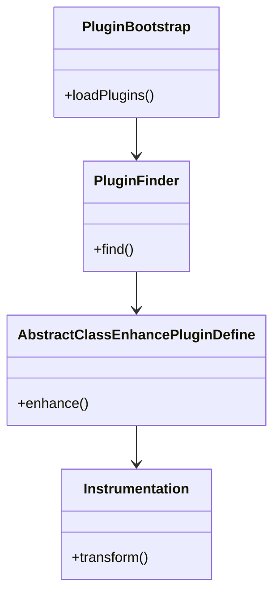

## 介绍

SkyWalking Agent的插件机制是其架构设计的核心特性之一，它允许开发者在不修改Agent核心代码的情况下，通过插件方式扩展监控能力。插件机制采用Java SPI（Service Provider Interface）规范实现，提供了高度的灵活性和可扩展性。

:::tip 为什么需要插件机制？
- 支持对不同框架/中间件的自动埋点
- 允许社区贡献监控能力而无需修改核心代码
- 实现运行时动态加载，满足不同业务场景需求
:::

## 插件机制架构



上图展示了插件机制的核心组件关系：

1. **PluginBootstrap**：负责插件初始化
2. **PluginFinder**：定位和加载插件
3. **AbstractClassEnhancePluginDefine**：插件基类，定义增强逻辑
4. **Instrumentation**：实际执行字节码增强

## 插件开发基础

### 1. 插件目录结构

标准插件目录结构示例：
```
resources/
  ├── META-INF/
  │   └── services/
  │       └── org.apache.skywalking.apm.agent.core.plugin.interceptor.enhance.InstMethodsInter
  └── skywalking-plugin.def
```

### 2. 插件定义文件

每个插件必须包含 `skywalking-plugin.def` 文件，示例内容：
```properties
tomcat-7.x/8.x=org.apache.skywalking.apm.plugin.tomcat78x.define.TomcatInstrumentation
```

### 3. 实现插件类

基本插件实现模板：
```java
public class CustomPlugin extends AbstractClassEnhancePluginDefine {
    @Override
    protected ClassMatch enhanceClass() {
        return byName("com.example.TargetClass");
    }

    @Override
    public ConstructorInterceptPoint[] getConstructorsInterceptPoints() {
        return new ConstructorInterceptPoint[0];
    }

    @Override
    public InstanceMethodsInterceptPoint[] getInstanceMethodsInterceptPoints() {
        return new InstanceMethodsInterceptPoint[] {
            new InstanceMethodsInterceptPoint() {
                @Override
                public ElementMatcher<MethodDescription> getMethodsMatcher() {
                    return named("targetMethod");
                }
                // 其他必要方法实现...
            }
        };
    }
}
```

## 实际案例：开发MySQL监控插件

### 1. 定义插件

`skywalking-plugin.def` 内容：
```properties
mysql=org.apache.skywalking.apm.plugin.jdbc.mysql.define.MySQLInstrumentation
```

### 2. 实现字节码增强

```java
public class MySQLInstrumentation extends AbstractClassEnhancePluginDefine {
    private static final String ENHANCE_CLASS = "com.mysql.jdbc.ConnectionImpl";
    private static final String INTERCEPT_CLASS = "org.apache.skywalking.apm.plugin.jdbc.mysql.MySQLInterceptor";
    
    @Override protected ClassMatch enhanceClass() {
        return byName(ENHANCE_CLASS);
    }
    
    @Override public InstanceMethodsInterceptPoint[] getInstanceMethodsInterceptPoints() {
        return new InstanceMethodsInterceptPoint[] {
            new InstanceMethodsInterceptPoint() {
                @Override public ElementMatcher<MethodDescription> getMethodsMatcher() {
                    return named("prepareStatement")
                           .or(named("prepareCall"))
                           .or(named("createStatement"));
                }
                @Override public String getMethodsInterceptor() {
                    return INTERCEPT_CLASS;
                }
            }
        };
    }
}
```

### 3. 实现拦截器

```java
public class MySQLInterceptor implements InstanceMethodsAroundInterceptor {
    @Override
    public void beforeMethod(EnhancedInstance objInst, Method method, 
                           Object[] allArguments, Class<?>[] parameterTypes,
                           MethodInterceptResult result) {
        // 记录SQL执行前的时间戳
        ContextManager.createLocalSpan("MySQL/execute");
    }
    
    @Override public Object afterMethod(EnhancedInstance objInst, Method method,
                                      Object[] allArguments, Class<?>[] parameterTypes,
                                      Object ret) {
        // 记录SQL执行耗时和结果
        ContextManager.stopSpan();
        return ret;
    }
    
    @Override public void handleMethodException(EnhancedInstance objInst, 
                                              Method method, Object[] allArguments,
                                              Class<?>[] parameterTypes, Throwable t) {
        ContextManager.activeSpan().log(t);
    }
}
```

## 插件加载流程

1. **发现阶段**：Agent启动时扫描 `plugins` 和 `activations` 目录
2. **解析阶段**：读取 `skywalking-plugin.def` 文件
3. **注册阶段**：将插件注册到ByteBuddy转换器
4. **增强阶段**：匹配类加载时执行字节码增强

:::caution 注意事项
- 插件命名必须唯一，避免冲突
- 插件加载顺序会影响拦截器执行顺序
- 生产环境建议只启用必要的插件以减少性能开销
:::

## 常见问题解决

**Q：插件未生效怎么办？**
1. 检查插件是否在 `agent.config` 中启用
2. 确认目标类名和方法名匹配正确
3. 查看Agent日志中的插件加载记录

**Q：如何调试自定义插件？**
添加JVM参数：
```bash
-Dskywalking.agent.is_open_debugging_class=true
```

## 总结

SkyWalking Agent的插件机制通过SPI和字节码增强技术，实现了高度灵活的可扩展架构。关键要点：

- 插件机制基于Java SPI规范实现
- 通过定义文件和拦截器实现功能扩展
- 支持对各类框架的无侵入式监控
- 合理的插件设计能显著降低性能开销

## 延伸学习

推荐练习：
1. 尝试开发一个简单的REST API监控插件
2. 比较不同插件的性能开销
3. 研究插件与OAP服务器的数据上报机制

官方资源：
- [SkyWalking插件开发指南](https://skywalking.apache.org/docs/)
- [ByteBuddy官方文档](https://bytebuddy.net/)
- [Java SPI机制详解](https://docs.oracle.com/javase/tutorial/ext/basics/spi.html)