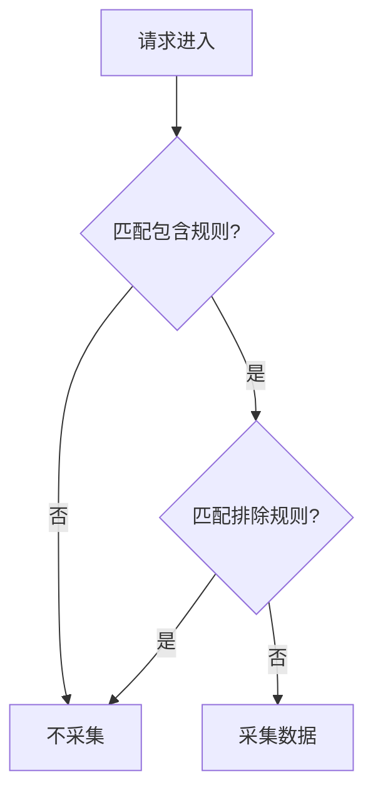

# SkyWalking Agent过滤器配置

## 介绍

SkyWalking Agent过滤器是用于控制哪些请求或方法需要被追踪、采样或忽略的配置组件。通过合理的过滤器配置，您可以：

1. 减少不必要的追踪数据，降低存储开销
2. 提高监控系统的性能
3. 聚焦于关键业务逻辑的监控
4. 避免敏感数据的采集

过滤器配置主要作用于Agent端，在数据采集的源头进行控制，是SkyWalking监控调优的重要手段。

## 基本配置结构

SkyWalking Agent的过滤器配置主要在 `agent.config` 文件中完成。主要配置项包括：

```properties
# 启用/禁用过滤器
agent.filter.enable=true

# 包含规则（只采集这些匹配的请求）
agent.filter.include=com.example.service.*

# 排除规则（不采集这些匹配的请求）
agent.filter.exclude=com.example.util.*,org.apache.*

# 路径过滤器（针对HTTP请求）
agent.filter.path_include=/api/*
agent.filter.path_exclude=/health,/static/*
```

## 过滤器类型详解

### 1. 类/方法过滤器

通过包名和类名模式匹配来控制哪些Java方法需要被监控：

```properties
# 包含所有service包下的类
agent.filter.include=com.yourcompany.service.*

# 排除所有util包下的类和特定类
agent.filter.exclude=com.yourcompany.util.*,com.yourcompany.config.DatabaseConfig
```

#### 匹配规则：
- `*` 匹配任意数量字符
- `?` 匹配单个字符
- `**` 匹配多级路径

### 2. 路径过滤器（HTTP请求）

针对Web应用的URL路径进行过滤：

```properties
# 只监控/api开头的路径
agent.filter.path_include=/api/**

# 排除健康检查接口和静态资源
agent.filter.path_exclude=/health,/static/**,/favicon.ico
```

### 3. 参数过滤器

可以过滤掉某些含有敏感参数的请求：

```properties
# 排除包含password参数的请求
agent.filter.parameter_exclude=password,token,secret
```

## 实际案例

### 案例1：电商应用监控优化

```properties
# 监控核心业务服务
agent.filter.include=com.ecommerce.order.*,com.ecommerce.payment.*

# 排除工具类和第三方库
agent.filter.exclude=com.ecommerce.util.*,org.apache.*

# 重点监控API接口
agent.filter.path_include=/api/order/**,/api/payment/**

# 排除管理接口和静态资源
agent.filter.path_exclude=/admin/**,/static/**,/health
```

### 案例2：微服务架构中的敏感数据过滤

```properties
# 包含所有服务
agent.filter.include=com.microservice.*

# 排除配置类和工具类
agent.filter.exclude=com.microservice.config.*,com.microservice.util.*

# 过滤掉含有敏感参数的请求
agent.filter.parameter_exclude=password,creditCard,ssn

# 排除健康检查端点
agent.filter.path_exclude=/actuator/health,/actuator/info
```

## 高级配置

### 1. 正则表达式过滤

对于更复杂的匹配需求，可以使用正则表达式：

```properties
agent.filter.include_regex=com\\.example\\.service\\..*Service
agent.filter.exclude_regex=com\\.example\\.util\\..*Utils
```

### 2. 采样率控制

可以结合采样率配置，进一步控制数据量：

```properties
# 对特定路径设置不同的采样率
agent.sample_n_per_3_secs=/api/order=10, /api/payment=5, default=3
```

### 3. 动态配置

通过结合配置中心，可以实现过滤器的动态更新：

```properties
agent.config_backend_service=http://config-server:8080
agent.backend_service_resync_period=60
```

## 配置验证

配置完成后，可以通过以下方式验证：

1. 检查Agent启动日志，确认过滤器配置已加载
2. 使用SkyWalking UI查看采集到的数据是否符合预期
3. 通过调试接口验证过滤效果：

```bash
curl http://localhost:12800/agent/configuration -s | grep filter
```

## 性能考虑

:::tip 最佳实践
- 尽量在包含规则中使用具体路径而非通配符
- 排除规则应放在包含规则之后处理
- 对于高频但不需要监控的方法，优先使用排除规则
- 定期审查过滤规则，确保其符合当前业务需求
:::



## 总结

SkyWalking Agent过滤器是监控系统中非常关键的配置组件，合理的过滤器配置可以：
- 显著降低系统开销
- 提高监控数据的质量
- 保护敏感信息安全
- 使监控系统更加聚焦于核心业务

## 进一步学习

1. 尝试在自己的开发环境中配置不同的过滤规则
2. 使用采样率配置与过滤器结合，观察效果差异
3. 研究如何通过API动态更新过滤规则
4. 分析过滤规则对系统性能的实际影响

:::note 练习建议
1. 为你的应用设计一套过滤器配置方案
2. 对比配置前后的监控数据量和系统负载
3. 尝试排除某个特定方法的监控，验证效果
:::