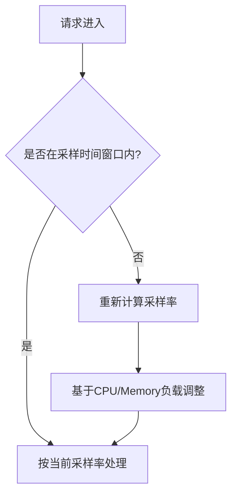

# SkyWalking Agent采样策略

## 介绍

在分布式系统监控中，**采样策略**是SkyWalking Agent的核心功能之一。它决定了哪些请求会被收集并上报到SkyWalking后端，帮助平衡监控精度与系统开销。对于初学者来说，理解采样策略能有效避免"全量采集"导致的性能问题。

采样策略通过以下方式优化监控：
- 减少网络传输和存储压力
- 降低Agent对业务系统的性能影响
- 保持对关键请求的监控覆盖率

## 采样策略类型

SkyWalking Agent提供三种主要采样策略：

### 1. 固定速率采样（Fixed Rate）

最简单的采样方式，按固定比例采集请求：

```properties
# agent/config/agent.config
agent.sample_n_per_3_secs=${SW_AGENT_SAMPLE:1}
```

:::tip 配置说明
- `${SW_AGENT_SAMPLE:1}` 表示每3秒采样1个请求
- 可通过环境变量`SW_AGENT_SAMPLE`修改采样率
:::

### 2. 动态采样（Dynamic）

根据系统负载自动调整采样率：

```properties
agent.sample_rate=${SW_AGENT_SAMPLE_RATE:10000}
agent.sample_error_per_3_secs=${SW_AGENT_SAMPLE_ERROR:1}
```

:::note 动态逻辑
- 默认采样率是1/10000（0.01%）
- 当发生错误时，3秒内至少采样1个错误请求
:::

### 3. 自适应采样（Adaptive）



配置示例：
```properties
agent.adaptive_sampling.enabled=true
agent.adaptive_sampling.target_sample_count=100
```

## 实际应用案例

### 电商系统场景

假设有一个促销活动，请求量突增10倍：

1. **初始状态**：固定采样率1%
2. **问题**：产生大量监控数据，存储压力大
3. **解决方案**：切换为自适应采样
   ```properties
   agent.sample_n_per_3_secs=-1  # 禁用固定采样
   agent.adaptive_sampling.enabled=true
   ```

### 错误监控优先

确保错误请求100%采样：
```properties
agent.sample_error_per_3_secs=0  # 0表示采样所有错误
```

## 配置最佳实践

1. **开发环境**：使用高采样率（如100%）
   ```properties
   agent.sample_n_per_3_secs=1000
   ```

2. **生产环境**：推荐组合策略
   ```properties
   agent.sample_n_per_3_secs=5      # 基础采样
   agent.sample_error_per_3_secs=0  # 全量错误采样
   agent.adaptive_sampling.enabled=true
   ```

3. **关键业务**：使用特定采样规则
   ```java
   // 通过@Trace注解强制采样
   @Trace(operationName = "checkout", tags = {"sampling_force", "true"})
   public void processPayment() {...}
   ```

## 总结与练习

### 关键点总结
- 固定采样适合负载稳定的系统
- 动态采样平衡监控与资源消耗
- 自适应采样应对流量波动最有效
- 错误采样应单独配置

### 动手练习
1. 在本地环境配置固定采样率为50%
2. 使用JMeter模拟流量，观察采样效果
3. 尝试切换为自适应采样，比较数据差异

### 扩展学习
- 官方文档：[Sampling Strategies](https://skywalking.apache.org/docs/)
- 源码分析：`SamplingService`类实现
- 性能测试：不同采样率对CPU的影响
``` 

注意：实际使用时请移除最外层的