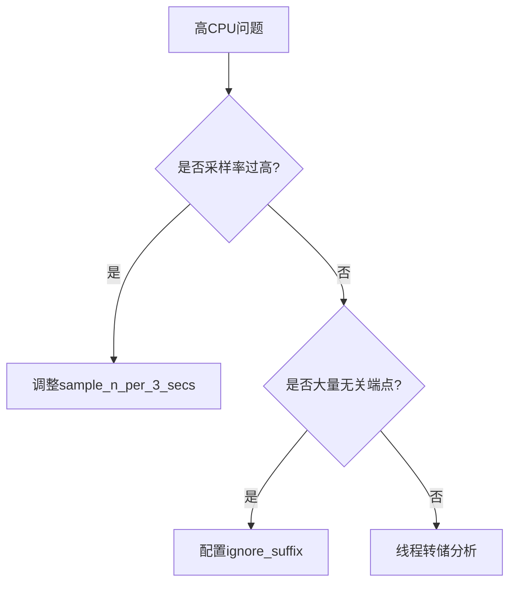

# SkyWalking Agent排错指南

## 介绍
SkyWalking Agent是Apache SkyWalking的探针组件，负责自动采集应用性能数据并上报至后端服务。当Agent运行异常时，可能导致监控数据丢失或应用性能下降。本指南将系统性地介绍常见问题的诊断与解决方法。

## 基础检查步骤

### 1. 验证Agent加载状态
在应用启动日志中搜索以下关键词确认Agent是否正常加载：
```bash
[main] INFO org.apache.skywalking.apm.agent.SkyWalkingAgent - SkyWalking agent started...
```

:::caution 常见问题
若未找到该日志，可能是：
- JVM参数未正确配置
- Agent jar包路径错误
- 权限问题导致无法读取Agent
:::

### 2. 检查网络连通性
Agent需要与OAP Server通信，使用以下命令测试网络：
```bash
telnet <oap-server-host> 11800  # 测试gRPC端口
telnet <oap-server-host> 12800  # 测试HTTP端口
```

## 典型问题分析

### 案例1：Agent未上报数据
**现象**：UI界面无数据，但应用日志显示Agent已启动。

**诊断步骤**：
1. 检查Agent配置：
```properties
# agent.config
agent.service_name=your-service-name
collector.backend_service=<oap-server-host>:11800
```

2. 开启调试日志：
```properties
logging.level.org.apache.skywalking.apm=DEBUG
```

3. 查看网络包：
```bash
tcpdump -i any port 11800 -w agent_network.pcap
```

### 案例2：高CPU占用
**现象**：应用CPU使用率异常升高。

**解决方案**：
1. 限制采样率：
```properties
agent.sample_n_per_3_secs=10  # 默认-1表示全采样
```

2. 排除特定端点：
```properties
agent.ignore_suffix=.jpg,.jpeg,.png,.css,.js
```



## 高级调试技巧

### 1. 远程调试
在JVM参数中添加：
```bash
-agentlib:jdwp=transport=dt_socket,server=y,suspend=n,address=5005
```

然后使用IDE附加到5005端口进行调试。

### 2. 指标导出
通过JMX暴露内部指标：
```properties
agent.jmx_config=org.apache.skywalking.apm.agent.core.jmx.JMXConfig
```

## 常见错误代码

| 错误码 | 含义 | 解决方案 |
|--------|------|----------|
| 40001 | 网络不可达 | 检查防火墙/网络策略 |
| 40002 | 认证失败 | 验证agent.authentication配置 |
| 40003 | 数据格式错误 | 升级Agent版本 |

## 总结与练习

### 关键点总结
1. 始终先验证Agent基础状态
2. 网络问题是最高频故障源
3. 合理配置采样可降低性能影响

### 练习任务
1. 故意配置错误的backend_service地址，观察Agent行为
2. 使用jstack分析高CPU场景下的线程状态
3. 尝试通过JMX获取Agent内部指标

## 扩展资源
- [官方故障排除文档](https://skywalking.apache.org/docs/)
- [GitHub Issue模板](https://github.com/apache/skywalking/issues/new/choose)
- [性能调优指南](https://skywalking.apache.org/blog/)