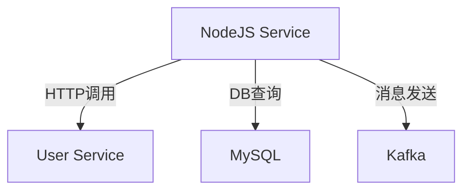

# SkyWalking NodeJS Agent配置

## 介绍

SkyWalking NodeJS Agent是Apache SkyWalking生态系统中用于Node.js应用的探针（Agent），它能够自动收集应用的性能指标、分布式追踪数据，并将这些信息发送到SkyWalking后端进行分析和可视化。对于Node.js开发者来说，这是监控微服务性能的强大工具。

:::note 为什么需要NodeJS Agent？
在分布式系统中，Node.js应用往往与其他服务交互。当出现性能问题时，没有分布式追踪工具很难定位问题源头。SkyWalking NodeJS Agent能帮你：
- 追踪跨服务的请求链路
- 监控应用性能指标（如响应时间、吞吐量）
- 识别慢查询和性能瓶颈
:::

## 安装与基础配置

### 1. 安装Agent包

通过npm安装SkyWalking NodeJS Agent：

```bash
npm install skywalking-backend-js --save
```

### 2. 基础配置

在你的Node.js应用入口文件（通常是`app.js`或`server.js`）顶部添加以下代码：

```javascript
const agent = require('skywalking-backend-js').start({
  serviceName: 'your-nodejs-service',
  serviceInstance: 'instance-1',
  collectorAddress: '127.0.0.1:11800', // SkyWalking OAP服务器地址
  disablePlugins: 'mongodb', // 可选：禁用不需要的插件
});
```

:::tip 配置说明
- `serviceName`: 你的服务名称（会在SkyWalking UI中显示）
- `serviceInstance`: 服务实例标识（通常用主机名+端口）
- `collectorAddress`: SkyWalking OAP服务器地址（默认端口11800）
:::

## 高级配置选项

### 1. 自定义采样率

控制发送到后端的追踪数据量：

```javascript
agent.start({
  // ...其他配置
  sampleRate: 5000, // 每5000个请求采样1个
});
```

### 2. 日志配置

```javascript
agent.start({
  // ...其他配置
  loggerLevel: 'DEBUG', // 可选：DEBUG, INFO, WARN, ERROR
});
```

### 3. 跨进程传播配置

当你的Node.js服务调用其他服务时：

```javascript
const http = require('http');
const agent = require('skywalking-backend-js');

agent.start({ /* 配置 */ });

http.createServer((req, res) => {
  // 自动传播追踪上下文
  agent.context.propagate().inject(req.headers);
  
  // 你的业务逻辑...
});
```

## 实际应用案例

### 案例1：Express应用监控

```javascript
const express = require('express');
const agent = require('skywalking-backend-js');

agent.start({
  serviceName: 'express-demo',
  collectorAddress: '127.0.0.1:11800',
});

const app = express();

app.get('/api/users', (req, res) => {
  // 自动被Agent监控
  res.json([{id: 1, name: 'John'}]);
});

app.listen(3000);
```

### 案例2：Kafka消费者监控

```javascript
const { Kafka } = require('kafkajs');
const agent = require('skywalking-backend-js');

agent.start({ /* 配置 */ });

const kafka = new Kafka({
  clientId: 'my-app',
  brokers: ['kafka1:9092'],
});

const consumer = kafka.consumer({ groupId: 'test-group' });

await consumer.connect();
await consumer.subscribe({ topic: 'test-topic' });

await consumer.run({
  eachMessage: async ({ topic, partition, message }) => {
    // 消息处理会自动被追踪
    console.log(message.value.toString());
  },
});
```

## 监控数据可视化

配置成功后，你可以在SkyWalking UI中看到：



## 常见问题解决

:::caution 问题排查
1. **数据未显示**：检查OAP服务器地址是否正确，网络是否连通
2. **高CPU使用率**：降低采样率(`sampleRate`)
3. **插件冲突**：使用`disablePlugins`禁用不需要的插件
:::

## 总结

通过配置SkyWalking NodeJS Agent，你可以：
- 自动收集Node.js应用的性能数据
- 追踪分布式请求链路
- 识别性能瓶颈
- 可视化服务依赖关系

## 扩展学习

1. 尝试将Agent集成到你的现有Node.js项目中
2. 实验不同的采样率对性能的影响
3. 探索SkyWalking UI中的各种监控图表

如需进一步学习，参考：
- [SkyWalking官方NodeJS Agent文档](https://skywalking.apache.org/)
- [NodeJS Agent GitHub仓库](https://github.com/apache/skywalking-nodejs)